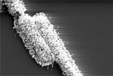

Las bacterias están siendo asimiladas por científicos nanotecnológicos.

Por primera vez se combina un microbio y una máquina. Esta hazaña tecnológica realizada por científicos de la universidad de Nebraska les permitió crear una bacteria cubierta de oro y plata que puede sensar la humedad. Este primer "CellBorg" es una prueba de concepto de lo que puede ser un arreglo de dispositivo que puedad sensar gases peligrosos u otras sustancias peligrosas.

# Cómo lo hicieron

Los científicos primero cubrieron un chip de silicio con una capa de bacterias vivas de "bacilus cereus ". Alguns de las bacterias se "engancharon" entre dos electrodos del dentro de la superficie del chip formando un puente. El chip fue bañado posteriorment conuna solución que contení pequeñas partículas de oro, cada una de unos 30 nanometros de largo. Las nanopartículas se adosaron a las proteinas largas sobre la superficie de la bacteria, transformandose en puentes de oro-plata que completaron el circuito. Estas proteinas son denominadas moléculas acido teicoicas. Tienen carga negativa y proveen una superficie de acople para las nanopartículas de oro de carga positiva. Sin las proteinas las nanoparticulas de oro se repelerían unas de otras, y no se podría formar el puente entre los electrodos. Al enroscarse alrededor de las nanoparticulas, las moleculas teicoicas actuan como un aislante, creando lo que se denomina una barrera dieléctrica. “Para cualquier electrónico esto es una maravilla, te puedes enloquecer con esto", dice Ravi Saraf, un ingeniero químico de la Universidad de Nebraska que lideró el descubrimiento. El sensor cellborg es extemadamente sensible,  una caida de humedad desde el 20 por ciento a 0 resulta en una disminución de 40 veces en el flujo de corriente. Los sensores electrónicos puros sólo experimentan una caida de 10 veces.

Lo malo para la bacteria asimilada es que esta puede sobrevivir unos 2 dias en este ambiente. Pero estando muerta, su cuerpo puede responder a cambios en la humedad y se puede trabajar con ella por meses. Si los científicos son capaces de recubrir a las bacterias sin tener que matarlas, entonces podrían permitir a los cellborg suministrar potencia a un circuito, en vez de servir de conductor para completarlo.

Fuente: [Live Science](http://replay.waybackmachine.org/20060211180339/http://www.livescience.com/technology/051027_cellborg_sensor.html)
