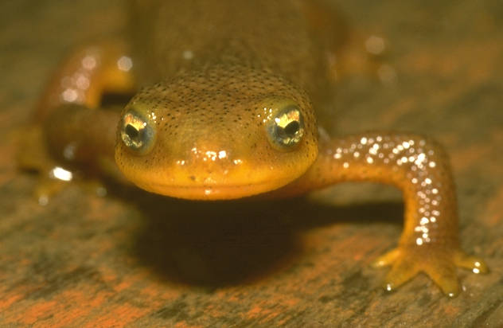
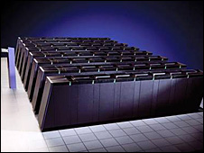

Mi abuela materna, recientemente fallecida, padecía
de [Alzheimer](http://es.wikipedia.org/wiki/Alzheimer). Cuando yo supe
que ella lo tenía me preocupé porque asumí que era un condición
genética, y por lo tanto, tendría una posibilidad de padecer lo mismo.
Con el cáncer me pasó lo mismo, pues mi padre y abuela paterna murieron
cerca de los 40 de esta enfermedad. Ahora sé que estadísticamente hay un
1 por ciento de probabilidades de que  llegue a desarrollar el cáncer,
pero además sé que el tipo de cáncer en cuestión
es tratable actualmente, y tiene muy bien pronóstico si se diagnostica a
tiempo, entonces debo controlar mi salud con cierta periodicidad, lo
malo es que el examen es bastante desagradable. Pero en el caso del
Alzheimer la probabilidad no es clara. La verdad es que las hijas de mi
abuela tienen una probabilidad de 50% de desarrollar alzheimer, pero
deben poseer además ciertas mutaciones a nivel del los cromosomas 1, 14,
y 21. En mi caso y de mis hermanos las posibilidades bajan a un 25%.

Actualmente hay un examen que busca la presencia del gen APOE
(Apolipoproteina E) mediante el análisis de los alelos del APOE,
especialmente la variedad del APOE e4. Cómo todos heredamos los alelos
APOE de cada uno de nuestros padres, la presencia de 2 copias de APOE e4
en nuestros genes significa un alto factor de riesgo.

## La tortura de saber

¿Se haría usted el test del APOE e4?

Yo personalmente no. Una razón es que a pesar de ser un factor de
riesgo, hay personas que tienen 2 copias de e4 en su sangre y nunca
desarrollan alzheimer. La segunda razón es porque no sabemos aún con
certeza que gatilla el alzheimer. Se sabe que grandes sufrimientos
gatillan el alzheimer, y la estabilidad emocional es un mecanismo de
prevención eficaz.

### Política y biotecnología

Pero que pasa si un gobierno decide que el costo de mantener a una
población con alzheimer no vale la pena, y hace que el examen sea
obligatorio. ¿Cuanta gente podría ser marcada como paría por tener 2
copias del alelo e4 en su sangre?

Por otra parte, el saber cuantos pueden llegar a tener alzheimer es un
dato importante, puesto que se estima que un 8% de la población padecerá
esta enfermedad. Para las compañias de seguro y las administradores de
salud privados y públicos esta información es valiosisima. Para el
gobierno el dato tampoco es menor, si consideramos que en nuestro país
la [pirámide etárea se está invirtiendo](http://www.censo2000.cl/), lo
que significa que la población en riesgo aumenta día a día, cosa que
también pasa en Europa.

Este es uno de los temas de los que tiene que preocuparse 
[la política del futuro](http://www.ricardodiaz.org/archives/2005/11/futuro_politico.html),
sobre la cual escribe Sebastían Escobar, en el 
[blog de mi Hermano](http://www.ricardodiaz.org/). 
La película Gattaca
nos muestra un mundo terrorífico en que la excelencia genética es el fin
último. De otra forma, y antes del descubrimiento del ADN Aldous Huxley
lo planteó también en [Un Mundo Feliz](http://www.amazon.com/exec/obidos/redirect?link_code=ur2&tag=lanaturaledel-20&camp=1789&creative=9325&path=http://www.amazon.com/gp/product/9871138512?v=glance%26n=283155%26n=507846%26s=books%26v=glance).

## Entendiendo la Evolución 

Estas pesadillas distópicas tienen su origen en que la mayoría de las personas
consideran a la evolución como un mecanismo de progreso. Cuando en
realidad la evolución es un mecanismo de adaptación. No somos mejores
que una salamandra, como se podría deducir del final del [artículo del
señor Escobar](http://www.ricardodiaz.org/archives/2005/11/futuro_politico.html).

La diferencia evolutiva entre la salamandra y el hombre no es mayor que
entre una mosca y un cienpiés. Cada uno está adaptado a su nicho
ecológico, y por algo están en donde están. Las salamandras son
cordados, igual que nosotros, pero estamos en ramas distintas de la
evolución.

Tenemos un genoma distinto, y aunque podemos definir el nivel de
diferencia entre nuestro genóma y el de las salamandras, cada especie
aporta al pool genético la naturaleza. De hecho las capacidades
regenerativas de las células madres de las salamandras pueden ayudar a
la lucha contra el [Alzheimer y el Parkinson](http://www.astroseti.org/vernew.php?codigo=208).

Cuando uno corta la pata de cierta clase de salamandra, esta regenera el
miembro perdido completamente. Este tipo de recuperación se debe a la
particularidad de las células madre con que cuenta esta salamandra en
particular.

Puede que en el misterio de la regeneración de las patas de la
salamandra esté la respuesta a la regeneración de tejidos, como el
neuronal, que lleve a encontrar cura al Alzheimer, Parkinson, y tantas
enfermedades que asolan sobre todo a nuestra población mayor.

## Sobrevivencia

La manipulación genética es tan antigua como el hombre, o al menos
apareció incluso en nuestra época de nómade. El lobo fue manipulado
genéticamente por selección artificial y pudimos crear esos fieles
amigos que son los perros. El maiz, el trigo, las vacas, son todas 
frutos de manipulación genética y de selección artificial.

El hombre siempre ha querido mejorar a la naturaleza, para poder vivir
mejor, para luchar contra la muerte.

En la naturaleza los más débiles son dejados aparte, el pequeño
cervatillo herido es dejado por el resto de la manada y es devorado por
las hienas.

Pero nosotros no abandonamos a nuestra gente porque tiene defectos, o por lo
menos no lo hemos hecho  hasta ahora. Una de las personas más brillantes
de la actualidad sufre de una terrible enfermedad degenarativa de su
sistema nervioso, me refiero a Stephen Hawking.
Un hombre que nos dice que Dios es probable que no hubiera tenido
opciones al principio del universo, con lo que remece todas las bases de
muchas religiones.

¿Por qué no abandonamos a nuestros enfermos? Incluso cuando puedan ser
tan "impertinentes" y "peligrosos" como este celebrado
físico. Porque como especie sabemos que nuestra sobrevivencia viene de
las capacidades de nuestro cerebro, y hemos decidido que aunque uno de
los nuestros no esté físicamente apto, su mente es valiosa para todo el
grupo. En suma, sabemos instintivamente que una persona, por muy 
postrada que esté, tiene en si un valor intrínseco que podemos llamar
alma, o mente, que es muy importante para nuestra sobre vivencia.

Es por eso que hemos cuidado de nuestros ancianos, porque recurrimos a
ellos por la experiencia que han adquirido. Esa experiencia, esa
Inteligencia Potencial, como la llamo yo, es valiosa y está depositada
en ellos. Por eso que cuando uno de nuestros ancianos se enferma de
Alzheimer es un desastre para todos. Porque no sólo perdemos el contacto
con un alma, sino que desde un punto de vista más frío si se quiere,
perdemos inteligencia potencial.

### El software genético

En nuestra lucha por sobrevivir como especie, hemos investigado el
código genético. Hoy sabemos que el genoma es una pieza más de software.

Efectivamente, el código genético puede codificarse como un lenguaje en
base 4, y desde ahí en adelante es pan comido para nosotros los
informáticos. Cosa que recién están entendiendo los biólogos y que ha
abierto una nueva rama de investigación la llamada bio informática.

Hoy en día el mayor supercomputador del mundo, Blue Gene, está diseñado
específicamente para entender los mecanismos de sintesis de proteinas.
Es la máquina de cálculo más rápida jamás creada.

Pero la pregunta para un desarrollador de software es obvia, estos
mecanismos usados actualmente en la bio informáticas están basados en
algoritmos de fuerza bruta. Claramente las células lo hacen mucho mejor
y de forma más eficiente. Entonces, ¿cuales son esos algoritmos ocultos
en las mitocondrías y demás organelos celulares? Este es el problema de
la **ontogénesis**, y es uno de los grandes desafios de la biología y de
la informática.

## Enhancement

El camino es obvio, en la medida que nuestro conocimiento de los
procesos biológicos sea más profundo, tendremos la habilidad de mejorar
nuestras capacidades. Es lo que se llama el Enhancement.

La evolución dará un salto impresionante, los mecanismos de selección
natural serán desplazados por mecanismos arbitrarios dictados por
nuestros deseos. Podremos evolucionar en nuevas especies que se adapten
a las condiciones en otros planetas, por ejemplo.

Eso sería, un mecanismo distinto al planteado por la teoría de la
evolución, y para desgracia de los creacionistas, este sí que sería un
mecanismo de "diseño inteligente".

¿Seguirán habiendo humanos?

Depende. Si los cambios son drásticos, esta especie de diseño
inteligente puede crear una especie totalmente incompatible con la
nuestra.

Serán una nueva especie, distinta, no mejor ni peor. Una nueva rama del
genero Homo, pero creada en forma artificial.

Esto parece ciencia ficción, pero sabemos que es posible. ¿Es bueno, es
malo?

Yo no tengo respuestas, pero si encontré una visión esperanzadora en una
extraordinaria saga de 4 libros llamada "Los cantos de Hyperión", en
donde las nuevas especies de humanos y la nuestra logran aceptarse
mutuamente en gracias a la intervención de a esa gran fuerza que liga
todo en el universo\...
