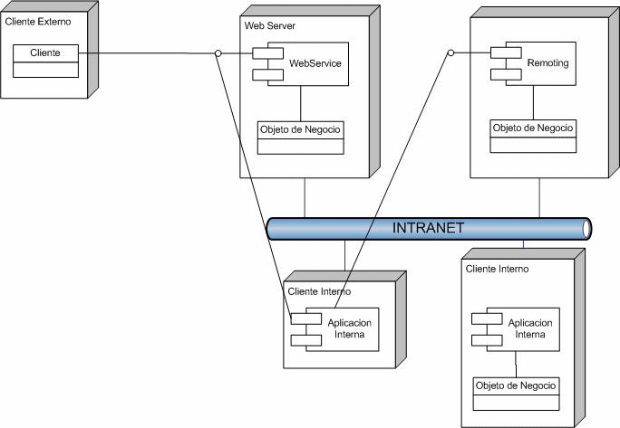

Hace un tiempo publique en [Netveloper](http://www.netveloper.com/) un
artículo sobre web services y object remoting. Puedes leer el
[artículo](http://www.netveloper.com/contenido.aspx?IDP=0&IDC=195), pero
también he decidido guardar una copia en este blog.

Sigue leyendo\...

**Conceptualmente Web Service y Remoting son lo mismo, objetos
distribuidos. La diferencia principal es el protocolo.**

En Remoting puedes usar protocolos no estándares. 
En [Web Services](https://en.wikipedia.org/wiki/Web_service) 
usa SOAP, o [RPC](https://en.wikipedia.org/wiki/Remote_procedure_call)-[XML](https://en.wikipedia.org/wiki/XML), en general estándares abiertos, sobre
[HTTP](http://en.wikipedia.org/wiki/Hypertext_Transfer_Protocol).

-   Si quieres publicar a la web tus servicios, entonces debes usar Web
    Services, porque tus clientes pueden estar usando otro ambiente,
    como [Java](https://java.sun.com), PHP, etc, y lo que importa es la
    interoperabilidad.

-   Si es para manejo interno, el remoting puede tener mejor performance
    si usas como otros protocolos, que usen TCP y manejen binarios, en
    vez de soap, de todas maneras remoting se puede hacer con soap pero
    es lo mismo que web services, si lo usas sobre IIS.

-   Tu puedes tener remoting sin tener que instalarlos en el IIS. Eso
    puede tener ventajas también en el performance, pero tienes que
    preocuparte de blindarlo de todas las otras caracteristicas que te
    agrega IIS, como SSL, logging, seguridad, etc. En el fondo, es como
    que tuvieras que construir tu propio web server. Por eso que se
    recomienda usar remoting en la intranet, donde normalmente la
    seguridad no es tan crítica porque se supone que todos los
    computadores son confiables (se supone).

-   Probablemente, has visto mejor performance debido a la
    serialización. Los web services usan XMLSerializer, mientras que en
    remoting se usa SOAPFormatter o BinaryFormatter, que generan
    mensajes más comprimidos y se generan más rápido, además mandar un
    mensaje binario es más rápido que un XML, por ponerlo de algún modo.
    Además hay algunos detalles técnicos con respecto a la cantidad de
    conexiones que permite IIS sobre remoting, pero no creo que sea el
    caso.

## **¿Cómo decidir?**

En Microsoft hay un artículo al respecto: 
[ASP.NET Web Services or .NET Remoting: How to Choose](http://msdn.microsoft.com/library/default.asp?url=/library/en-us/dnbda/html/bdadotnetarch16.asp)

Otro artículo interesante está en 
[Fuzzy Boundaries: Objects, Components, and Web Services.](http://www.acmqueue.org/modules.php?name=Content&pa=showpage&pid=246)

En mi experiencia:

Si voy a interoperar con agentes externos, que no controlo, uso Web
Services, porque es un estándar abierto.
Sólo uso object remoting en aplicaciones dentro de una intranet, porque
muchas veces no puedes controlar los firewalls, routers, etc.
Sólo tiene sentido usar webservice u object remoting si los servicios
van a ser usados entre máquinas distintas. Si no hay que usar objetos
comunes y corrientes.
Object Remoting y Web services deben ser una interfaz a objetos de
negocios internos, es decir, la lógica de negocios no debe estar en
ellos, sino que en clases internas que se exponen usando estos
mecanismos. Esto es conocido como el patrón Adapter o Wrapper, que sería
más o menos como muestra la siguiente imagen:

Abusando de la notación UML, lo que la Figura muestra son algunas
posibles configuraciones.

Tenemos:

- Objeto de Negocio que implementa la lógica de negocios

- Un WebService, que publica los servicios del objeto de negocios al mundo
exterior.

- Un Objeto Remoting que publica lo mismo para el mundo interior, usando
object remoting.

- Tenemos un cliente interno que podría usar web services o remoting.

- Un cliente interno que usa directamente el objeto de negocios.

En este patrón usamos el web service y el remoting como un Wrapper, para
publicar la funcionalidad, que la realiza el objeto de negocios, eso nos
da flexibilidad, y re utilización de lógica.
