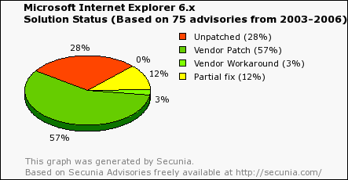
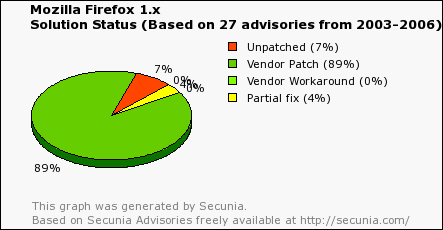
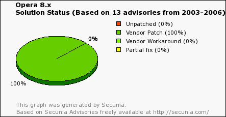

¿Como juzgar a los browsers, de una manera más objetiva?

Afortunadamente, [Secunia](http://replay.waybackmachine.org/20060211180559/http://secunia.com/) nos puede ayudar, los siguientes gráficos muestran la cantidad de fallas y el porcentaje de reparación de los problemas informados, para Internet Explorer 6, Firefox, y Opera.
(Estos gráficos pueden cambiar en el tiempo)

