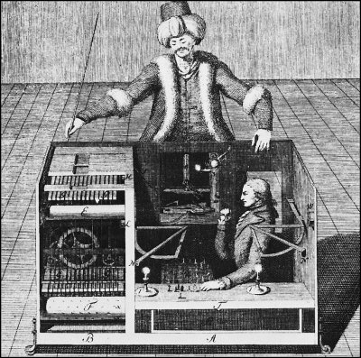

Hay una famosa historia sobre un robot con forma de turco que jugaba
ajedrez a fines del siglo 18[^1].
La verdad es que detrás del robot había una persona que era quien
realmente jugaba.

Esa idea es la que inspira el nombre del nuevo proyecto de Amazon:

[Amazon Mechanical Turk: Artifical Artifical Inteligence](https://www.mturk.com/mturk/welcome)

La idea es que Amazon pagará por tareas que sólo los humanos pueden
realizar, los denominados HIT (Human Intelligence Task).

Cosas tan simples como:, ¿Cuantos tableros de ajedrez ve usted en esta
imagen?

Una nueva manera de ganar algunos centavos mejorando la información que
maneja Amazon.\
Miles de personas trabajando detrás creando la ilusión de que hay una
gran inteligencia artificial.\
Interesante modelo, recordemos que el valor de los negocios de
información estará dado por la 
[relevancia de la misma](/blog/lnds/2005/11/03/importa-si-el-software-es-abierto), y
cómo aún no tenemos inteligencia artificial, podemos simularla.

Astutos\....

## Fortune or Glory 

De hecho, un HIT puede ser transcribir o resumir un libro, o traducirlo.

Uno de los fundamentos de lo que se viene llamando la web 2.0 es darle
poder y participación al usuario, y este es uno de los ejemplos más
potentes.

Quiere hacer negocios innovadores en la web 2.0? Haga que sus usuarios
participen, intégrelos a su negocio motivándolos para que participen, ya
sea por fortuna (como Amazon), o por gloria (cómo Wikipedia).

[^1]: Sobre la historia del turco mecánico sugiero leer 
[El Robot Ajedrecista](https://www.portalajedrez.com/anecdotas/turco.php)
