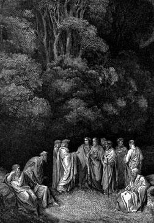

Fue un engaño de Virgilio? Recordemos que Dante descendió al Infierno,
pasó por el Limbo, luego estuvo en el Purgatorio y su querida Beatriz lo
guió hasta el Paraiso.

*La imagen que acompaña esta nota es uno de los hermosos dibujos de Doré
para ilustrar la Divina Comedia. En esta se ve a Dante, Virgilio y
varios personajes de la antigüedad, como Homero, Horacio y Ovidio.*

Pero ahora resulta que el Vaticano [anuncia que el Limbo no
existe](http://eltiempo.terra.com.co/vidadehoy/30denoviembrede2005/ARTICULO-WEB-_NOTA_INTERIOR-2634981.html).

Lo bueno es que todos los niños que estaban en el Limbo pasaron al
Cielo.

Pero, esperen, ¿qué pasa con Virgilio? se fue al infierno? ¿se lo
merecerá por engañar a Dante?.

Mmmmm, y ¿ todos los que no conocieron a Cristo, que no eran niños al
morir? ¿en donde quedaron?

Que bueno que no me dediqué a la Teología\....

Sin embargo el problema de los antiguos parece que no ha sido resuelto.\
Hay una
[entrevista](http://news.bbc.co.uk/hi/spanish/misc/newsid_4486000/4486152.stm)
en BBCMundo al padre Samuel Fernández, decano de la Pontificia
Universidad Católica de Chile.

El Limbo nunca fue establecido como un dogma por la doctrina católica,
este concepto es parte de la tradición, igual que los 3 reyes magos, por
ejemplo (en la biblia no se especifica cuantos eran ni tampoco salen sus
nombres).

Transcribo algunas preguntas\
\...

**También se dice que Juan Pablo II empezó por desmontar la visión
tradicional del cielo, el infierno y el purgatorio, que no son lugares
físicos sino estados de ánimo. El cielo es la presencia de Dios, el
infierno es su ausencia.**

**¿Quiere decir esto que podemos cada día, por nuestros estados de
ánimo, estar más de una vez en el cielo y en el infierno?**

No son estados de ánimo sino estados del alma. Es que nosotros como
seres humanos nos creamos una representación mental, pensamos con
categorías espacio temporales. Lo que dijo Juan Pablo II fue que no
debemos identificar el cielo con la forma en que imaginamos el cielo.

Recuerdo que cuando salieron esas catequesis hubo mucho revuelo, pero no
hay en realidad ninguna novedad teológica.

**Si el cielo es la comunión plena con Dios, parecería que no es
necesaria la muerte para esa comunión. Que puede llegarse al cielo en la
vida del día a día, en esta Tierra.**

La plenitud total sólo se da después de la muerte, pero nosotros aquí
experimentamos atisbos de esa comunión plena a través de nuestras
experiencias humanas: el amor, un logro, la comprensión más profunda de
las cosas.\
Todas esas experiencias positivas son una chispa, una preparación para
la comunión plena.

La doctrina de la iglesia reconoce la libertad del ser humano. Si una
persona actúa de una manera íntegra, de acuerdo a su corazón, aún cuando
no exprese profesar ninguna fe, ¿no es este un camino hacia la comunión
plena? ¿No hay, más allá de los sacramentos, otros caminos de salvación?

**Por la encarnación, Cristo se ha unido a cada ser humano, hay una
orientación de la humanidad hacia Cristo, aún inconscientemente. Está el
bautismo de deseo, y finalmente el mismo Santo Tomás de Aquino dice que
la gracia no está encadenada a los sacramentos.**

Dios tiene la capacidad de actuar de la manera que quiera. Naturalmente
que la misericordia de Dios llega mucho más lejos de lo que llegan
nuestras ideas.

Para finalizar, ¿si Dios llega mucho mas lejos de lo que llegan nuestras
ideas, porque La Iglesia se siente con el derecho de interpretar y
explicarnos como es el más allá?
