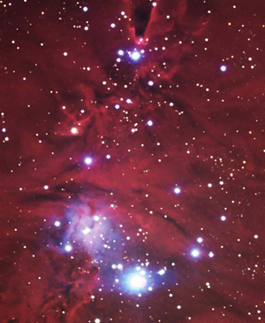

La verdad es que no puse un saludo de Navidad, porque esperaba poder publicar algo más importante, lamentablemente aun no está listo.
Pero, un regalo inesperado cayó gracias a blogmemes, y es esta imagen del Arbol de Navidad de Herschell. Está situado en la constelación de Monoceros (el unicornio) y se encuentra a unos 2.600 años luz de la Tierra.

Gracias a blogmemes supe de NeoFronteras que tenía esta imagen, una de las satisfacciones de este tipo de proyectos.
