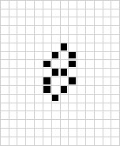

Cuando publiqué mi primer artículo sobre [las máquinas del fin del mundo](/2006/04/las-maquinas-del-fin-del-mundo.html) fue excusa para hablar sobre Inteligencia Artificial (IA).

He recibido buenos comentarios, algunos en el blog y otros privados. Así que gracias a todos.

Vamos a continuar con el tema, pero les advierto que esta es una serie laaaaarga.

Por razones de tiempo este post será cortito, pero es fundamental para lo que sigue, y si me demoro en publicar tengan paciencia, que hay que trabajar para poder pagar el host del blog.

## ¿Qué es la vida?

Ante la incapacidad de los científicos de ponerse de acuerdo en "qué es la vida", algunos han adoptado una definición operacional:

Un ser vivo se caracterizará por:

  1. Su capacidad de preservarse, es decir, mantenerse vivo, operativo, funcional, el máximo tiempo posible.

	
  2. Su capacidad para reproducirse, debido a que hay límites (las leyes de la termodinámica, por ejemplo), no podemos pensar que un ser vivo vivirá para siempre, así que los seres vivos se reproducen como una forma de preservarse en el tiempo.

	
  3. Su capacidad para evolucionar. Evolucionar es adaptarse, el que no se adapta a los cambios del entorno muere.

Esta es una definición operacional, esto quiere decir que si una entidad cumple con estas funciones la vamos a considerar viva.

Es controversial, es discutible, podemos filosofar todo lo que queramos, pero si queremos explorar si es posible construir una IA, debemos partir desde alguna parte. Si llegamos a un punto muerto, entonces buscamos otro punto de partida.

El primer camino que tomaremos es el de los proponentes de la Vida Artificial. Según esta escuela, si uno reproduce el camino de la evolución eventualmente va a llegar a entidades vivas, artificiales, pero inteligentes.

Surgen cuestiones importantes:

	
  * ¿Es necesaria la vida para que surja una entidad inteligente?

	
  * ¿Es la autoconciencia una necesidad para ser inteligente?

	
  * Tenemos una definición operacional de vida, pero debemos elaborar una definición operacional de qué es auto conciente, y de que significa ser inteligente.

Esos son los problemas que exploraremos. Hay muchas posturas, pero en el próximo post exploraremos la Vida Artificial, y como esta ha sido usada para tratar de crear inteligencia artificial.

Pero les dejo planteado un _pequeño ejercicio_, dada la definición operacional de arriba, ¿podemos decir que Internet es un ser vivo?
