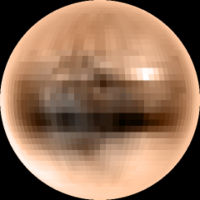

Resulta que los astrónomos no son diferentes al resto de
los *usuarios*, *"cuando el sistema está estable introducen nuevos
requerimientos, y hay que realizar cambios"*.

Me refiero a la reciente reclasificación
de [Plutón](http://es.wikipedia.org/wiki/Plut%C3%B3n_%28astronom%C3%ADa%29),
bajo la cual este cuerpo celeste deja de ser planeta, para convertirse
en un "planeta enano".

La razón es que la nueva defiinición exige que un planeta ha de tener
una fuerza tal en su campo gravitatorio que le permita despejar de
cuerpos celestes el vecindario en torno a su órbita.

### Ventajas del cambio 

Ahora los planetas son 8, lo que nos ayuda a los padres cuando tengamos
que hacer las tareas respecto al sistema solar. Las maquetitas van a ser
más simples. El tiempo que invertiremos ayudando a memorizar el orden de
los planetas, se reduce en un 11%.

### Desventajas del cambio

Puede que los profesores decidan agregar los planetas enanos, con lo que
las maquetitas se compliquen harto más. O se les ocurra agregar los
[plutinos](http://es.wikipedia.org/wiki/Plutino), y ahí si que estudiar
el sistema solar se pone complicado.

### Curiosidades e Impactos culturales

El personaje de Disney, Pluto (Plutón en Inglés) fue nombrado debido al
descubrimiento de este planeta, este personaje apareció por primera vez
en una caricatura de 1930.

Los astrólogos no se han pronunciado respecto al tema, así que yo
desconfiaría de cualquier carta astral que incluya a plutón :).

Impacto mitológico: resulta que los hermanos de Plutón, Júpiter y
Neptuno tienen unos enormes planetas que los representan, pero Plutón
está quedando aún más relegado. No creo que a los neo paganos y
mitólogos les gusté mucho.

Resulta que el nombre Plutón fue sugerido por [Venetia Burney](http://replay.web.archive.org/20071028181216/http://en.wikipedia.org/wiki/Venetia_Burney),
quien a los 11 años se lo propuso a su abuelo. El nombre tiene la
particularidad que sus dos primeras letras PL,evocan las iniciales del
descubridor del planeta, don [Percival Lowell](http://en.wikipedia.org/wiki/Percival_Lowell) (*vanidad mi pecado favorito*).

[Venetia tiene en la actualidad 87 años](http://news.bbc.co.uk/1/hi/sci/tech/4596246.stm).

## Eppur si muove 

Recordemos que hasta 1930 no se conocía a Plutón, y que cada año nuestra
visión del sistema solar cambia. De hecho si tuvieramos que hacer una
maqueta completa sería un trabajo de envergadura.

Yo recuerdo que cuando era chico Júpiter sólo tenía 12 lunas, y el único
planeta con anillos era Saturno. Hoy sabemos que Júpiter tiene 63 lunas,
que los [planetas jovian](http://en.wikipedia.org/wiki/Jovian_planet)os
tienen anillos.

### La historia de los descubrimientos

Este cambio, que viene del avance de la ciencia puede ser constrastado
con el cambio teológico que significó la 
[eliminación del Limbo](/blog/2005/12/dante-se-equivocaba-el-limbo-no-existe.html). 

Son cambios paradigmáticos, la visión del mundo cambia, pero a partir de un
cambio en las definiciones que establecemos del mismo. Yo considero
estos cambios desafiantes, porque al fin y al cabo significa que el
conocimiento "si muove".
