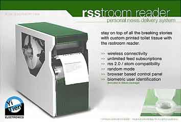

De todos los usos del papel, este parece el más extraño.The RSStroom Reader es "un dispensador de papel higienico que te va sirviendo el papel en el cual hay impresos post aleatorios desdeRSS, con lo que antes de usar el papel puedes leer un poco y estar enterado de todo." Así lo describe el "[blog de Mardito: Los Links del Día](http://replay.web.archive.org/20071011063529/http://www.mardito.com/weblog/?p=1766)"

La verdad es que este es un [producto ficticio,](http://replay.web.archive.org/20071011063529/http://www.djspyhunter.com/blog/2005/12/05/rsstroom-reader-toilet-paper-printer/) creado por un bloguero con mucha imaginación.

En todo caso la idea permitiría optimizar el uso de papel, por lo menos.

## Los Vales y el vuelto en el TranSantiago

Con bombos y platillos se anuncia la nueva tarjeta BIP, con un [piloto en que 1.000 usuarios](http://replay.web.archive.org/20071011063529/http://forum.skyscraperpage.com/showthread.php?t=114247)usarán esta tarjeta se avanza en la implantación del [transantiago](http://replay.web.archive.org/20071011063529/http://www.transantiago.cl/).

En televisión el el ministro explica a los periodistas el funcionamiento del sistema, bastará con acercar la tarjeta a un sensor, sonará un bip ("de ahí el nombre") y el usuario (ya no son pasajeros) podrá ingresar al bus.

Extraordinario!

Pero el periodista, astuto él, ya tiene lista la pillería, "pero señor ministro, ¿si sube un inspector, cómo puede demostrar el pasajero de que usó su tarjeta?"

cric, cric, cric...

El silencio del ministro es decidor, parece que a nadie se le ocurrió la situación.
Punto para el periodista.

Pero el ministro se repone, y le replica al periodista que tenga paciencia, "vamos paso a paso", el transantiago es un tema complejo, y para "eso tenemos esta marcha blanca, para afinar estos detallitos".

Estoy seguro que se le pedirá al proveedor de que se incorpore una impresora para emitir vales.

## Usa la tarjeta, o paga las consecuencias

De acuerdo a una nota de "La Revista del Transporte", suplemento de Las Ultimas Noticias:

> El equipamento de los buses se está desarrollando dependencias del Mercado de Santiago (Mersan), a cargo de de 340 operarios y técnicos de Sonda. Cada bus lleva en su interior equipos con un costo de 18 mil dolares (unos 10 millone de pesos). Entre los elementos incorporados se encuentran dos validadores que descuentan la tarifa desde la tarjeta sin contacto, que puede ser tanto la BIP (escolar) como la Multivía, ambas con tecnologías homologables. Sólo la mitad de los buses dispondrán de un dispositivo de pago exacto con monedas, que no dará vuelto, pues la idea es incentivar el uso de la tarjeta y castigar el pago con sencillo

¿Qué les parece ?

