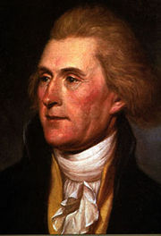

Thomas Jefferson, como todo ser humano, tenía contradicciones, algunas de las cuales han sido fuertemente criticadas por sus conciudadanos. Cómo es posible que el hombre que "escribió todos los hombres son creados iguales", tuviera esclavos, y además fuera racista. Para los interesados en las contradicciones de Jefferson, [este artículo](http://memory.loc.gov/ammem/collections/jefferson_papers/mtjessay1.html) (está en inglés) puede ser muy educativo.

A mí muchas de sus ideas me parecen muy similares a las sostenidas por los proto socialistas ingleses de los que nos habla Isaiah Berlin en "El Sentido de la Realidad" (Editorial Taurus,Alfaguara 1998). Al final Jefferson aspiraba al fin del estado regulador o interventor y aspiraba a la libertad absoluta de los ciudadanos. Dificilmente se le puede tildar de ser un capitalista duro, como se nos presenta en el artículo de Galli. La ideas políticas de Jefferson son poco profundas, John Adams y James Madison varias veces trataron de decirle que sus esfuerzos en filosofía política eran superficiales y pecaban de una ingenuidad muy juvenil (ver [The Contradictions of Thomas Jefferson](http://memory.loc.gov/ammem/collections/jefferson_papers/mtjessay1.html))

Ricado Galli me responde en un comentario a mi anterior artículo:

> "Jefferson sí [1] se opuso a la inclusión del copyright en la constitución, y se opuso a la enmienda de la constitución. Y como dije varias veces, dejaron la potestad al congreso."
> [1][http://onlinebooks.library.upenn.edu/webbin/bparchive?year=1999&post=1999-0](http://onlinebooks.library.upenn.edu/webbin/bparchive?year=1999&post=1999-0)

Shopenahuer dice "que la gente se lo toma a mal cuando no estamos de acuerdo con ellos, cuando deberían preocuparse de presentar sus argumentos de una mejor manera" (cito de memoria).

O que yo critico es la falta de rigurosidad, parece que la gente se está olvidando que existen libros, documentos, que no están indexados por Google, y que la cita de oscuros sitios en la red constituyen una prueba suficiente.

Ya dije, que la carta citada no tiene que ver con la discusión de la constitución, porque fue escrita varios años después, pero además Jefferson no participó de la asamblea constituyente de los Estados Unidos, por encontrarse en esa época en Francia.

Las citas del enlace otorgado por Ricardo Galli corresponden a cartas entre Jefferson y Madison, en que discuten sobre lo que actualmente llamamos copyrights. Recordemos que Jefferson termina aceptando el texto sobre la protección de los derechos sobre los escritos, los inventos y los descubrimientos, pero logra imponer varios de sus criterios, bastante razonables por supuesto, como el hecho de que estos derechos sean limitados en el tiempo, y la potestad del congreso sobre estas materias. Posteriormente se asegura de redactar la primera ley de patentes para poder incluir mucho de su pensamiento.

La famosa carta de Jefferson a Isaac McPherson parte discutiendo las provisiones que se tomaron en cuenta cuando se le otorgó la nueva patente a Mr. Evans. El nucleo de la carta, que es una joya de redacción, es la que incluye esta hermosa frase: _"he who lights his taper at mine, receives light without darkening me."_.

En este núcleo de la carta Jefferson plantea claramente sus ideas con respecto a la propiedad sobre las ideas, y establece el famoso argumento de la diferencia entre la propiedad de lo físico versus la propiedad sobre las ideas.

El texto es elocuente, elegante y bien escrito. Dificil es la tarea que tendríamos si quisieramos oponernos a este argumento.

Sólo voy a aventurar que no puede ser aplicable estos criterios tan fácilmente, porque en la época de Thomas Jefferson no existía el software, ni la manipulación de la información tal como lo podemos hacer ahora. Las ideas son libres, pero no debemos confundir las ideas con la información que son cosas de distinta naturaleza.

Pero dejemos a Jefferson en paz, el al final de su carta a McPherson pide:

> "Con la franqueza conque me he expresado a usted, confío en que tomará este asunto con honor y sinceridad, de modo de no usar mi carta de manera que pueda causarme algún grado de intranquilidad."
