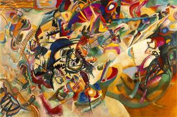

Cuando por primera vez uno se acerca a una de obra de arte abstracto, como ésta hermosa pintura de Kandinsky, lo primero que solemos preguntarnos es **"¿qué es esto?"**, o también **¿qué quizo expresar el pintor?**.

Algunos se aproximan de forma ingenua, algunos rechazan este tipo de arte.

Otros renuncian a las preguntas y se dedican a apreciarlo estéticamente.

Para Kandinsky una obra de arte era efectiva _si surgía de una necesidad interna del artista y i el impulso original del artista es evocado en el espectador por medio del trabajo artístico y la recepción del mismo_.

La pregunta que le habría gustado escuchar a Kandinsky es: **¿qué me evoca esta pintura?**.

> "La música es la máxima maestra"

Aspirar a la naturaleza evocadora de la música, la más suprema de las artes, era en el fondo la ambición del pintor ruso.

Si escuchamos una melodía, es muy difícil que nos preguntemos algo, la música va a provocar en nosotros sentimientos, traerá recuerdos, evocará emociones.

## Las preguntas funcionales

A diferencia de una pintura, cuando nos enfrentamos al software lo primero que preguntamos es ¿para qué sirve?, o en forma equivalente ¿qué hace este programa?

Es raro que preguntemos para qué sirve una obra de arte, a menos que seamos sicólogos :smile:.

Cuando vamos a desarrollar un software, los profesionales del área lo primero que hacemos es el _análisis de requerimientos_. Lo que tratamos de buscar es para qué va a ser usado el software. A partir de eso se elabora _el diseño funcional del sistema_, es decir, definimos los dominio de las entradas y las salidas, junto con las funciones que transforman estas entradas en las salidas deseadas.

Este es esencialmente el **argumento funcional** que nos sirve para explicar por qué el software es distinto de otras creaciones intelectuales.

Es uno de los muchos argumentos para demostrar que la **Naturaleza del Software** es tan distinta a cualquier otra cosa que haya creado el ser humano jamás en su historia.

En un [reciente artículo](http://replay.waybackmachine.org/20081014084254/http://www.quemarlasnaves.net/2006/11/21/propiedad-intelectual-o-derecho-de-autor-parte-dos/) de Claudio Ruiz, se nos plantea que toda la creación intelectual está sujeta al derecho de autor.

Sin embargo, esta noción es incorrecta, y no puede ser aplicada tan directamente al software, porque éste es es **esencialmente distinto**, y no puede ser igualado a una obra de arte, y menos a un trabajo literario, tal como plantea el Convenio de Berna, y nos recuerda _Raspu_

Las legislaciones deberían empezar a recoger la naturaleza esencialmente distinta del software.

Otra razón para replantear las nociones de propiedad intelectual.
