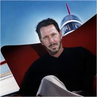

> "El Open Source no es algo a lo cual temer. El Open source es algo que debe
ser explicado. El Open source gana no porque sea abierto, ni porque sea
gratis. El Open source gana sólo cuando es mejor"
> -- [Larry Ellison](http://replay.waybackmachine.org/20071027054538/http://www.oracle.com/corporate/pressroom/html/ellisonl.html), CEO de [Oracle](http://replay.waybackmachine.org/20071027054538/http://www.oracle.com/)

Oracle está abriendo varias plazas de trabajo TI en nuestro país, esa es
una excelente noticia. Su CEO, el famoso Larry Ellison, ha manifestado
sus ideas sobre el open source y el software libre varias veces, pero
rescato [esta entrevista](http://replay.waybackmachine.org/20071027054538/http://www.haaretz.com/hasen/spages/893074.html),
de la cual extraje la cita del encabezado.

# La web 2.0 y Oracle 

Le preguntan a Ellison si considera a la Web 2.0 como una simple
fluctuación o una tecnología que cambiará la manera de hacer negocios,
ante lo cual responde: "¿Sí pienso que la Web 2.0 esté sobre evaluada?
Creo que cada generación piense que sus innovaciones rápidamente
reemplazarán todo lo que se ha desarrollado antes."

"Creo que la Web 2.0 es una innovación extremadamente importante. Creo
que constantemente vienen nuecas tecnologías. Pero a esas nuevas
tecnologías les toma un largo tiempo desplazar a las tecnologías que
llegaron antes. "

"Oracle ha invertido fuertemente en la Web 2.0. Nuestro futuro
middleware, Fusion, está basado en la Web 2.0. Nuestro nuevo conjunto de
herramientas y aplicaciones están basados en la Web 2.0"

¿Qué significa todo esto? Es algo que tendremos que ver. Pero Oracle
siempre ha sido eficaz en detectar estas "fluctuaciones" de la
tecnología y subirse a las olas adecuadas.

Lo ha hecho con la web, con java, y con el software libre en el pasado,
así que las palabras de Ellison no son puro marketing, si dice que están
integrando la web 2.0 en sus tecnologías, yo les creo.

# El costo del software libre

El servidor web Apache es el producto open source más exitoso en el
mundo, "apache" desplazó al IIS de Microsoft no porque fuera
gratuito y no porque su código fuera abierto, sino porque era más seguro
y rápido, y más confiable", dice Ellison.

Ellison considera que Linux lo ha hecho bien compitiendo contra Windows
de Microsoft, pero que hay confusión por el hecho de que al ser el
software gratuito o libre desplazará al software propietario.

*"El precio de compra del software representa sólo el 10 por ciente del
costo total de propiedad del software. Así que, aún si el software fuera
gratis, a lo más vas a ahorrar un diez por ciento. Ahora la pregunta es,
cuales son los otros costos asociados al desarrollo del software, o en
mantener corriendo las aplicaciones diariamente, o de resolver los
problemas cuando ocurren? Creemos que Oracle es absolutamente
competitivo con el open source."*

*"Siempre que el open source lo haga mejor que nosotros, como en el
caso de Apache y Linux, entonces simplemente lo adoptamos, lo
distribuimos y lo soportamos."*

Ahí está la clave de la sustentabilidad del software libre y open
source, programar paga bien, pero desarrollar software de clase mundial
paga mejor, como 
[dice Linus Torvalds](/2007/08/las-motivaciones-comerciales-de-linus-to.html),
y Oracle es uno de los que entiende el valor del software de calidad, y
lo apoya y soporta económicamente.
