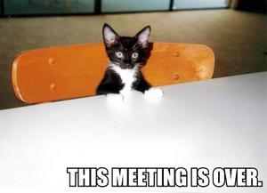
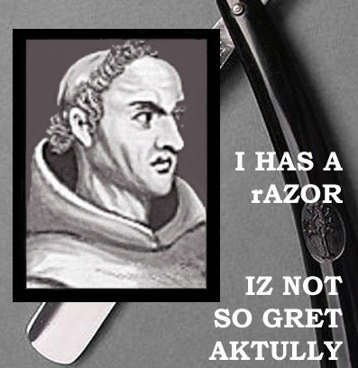

Eric Nakagawa se encontraba sin trabajo, cuando en enero pasado se
encontró con esta fotografía, con un extraño texto lleno de faltas
ortgráficas y gramaticales:

Con un amigo formaron el sitio [I Can Has Cheesburger](http://replay.web.archive.org/20071017000912/http://icanhascheezburger.com/),
algo así como "puedo tener mi hamburguesa con queso?". Al tiempo
empezó a tener visitas, y el fenómeno de los lolcats empezó, y el
Nakagawa empezó su nuevo trabajo.

Hoy su sitio tiene más de 200.000 visitas diarias, y los ingresos por
concepto de publicidad "alcanzan para pagar todas mis facturas",
declara el ex programador.

La idea es muy simple, sacarle una foto a una mascota, de preferencia un
gato, y ponerle un texto cómico, escrito sin mucho respeto por las
reglas de la ortografía.

Algo que no requiere ser un experto en photoshop.

El fenómeno se da en otros campos, y ya existe la moda de
los [FiLOLsofos](http://replay.web.archive.org/20071017000912/http://www.flickr.com/groups/philolsophers/pool/):

El término [LOL](https://es.wikipedia.org/wiki/Lol)
es un acrónimo en inglés para: "laugh out loud", risa ruidosa;
carcajada.
