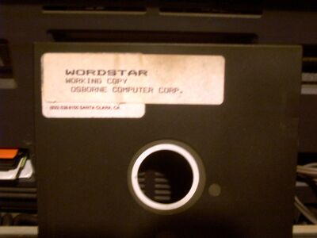

Se ha hecho pública una [carta](http://replay.web.archive.org/20071017000912/http://www.elfrancotirador.cl/archivos/082707_dcc_responde_quepasa.pd) fenviada por algunos académicos del [DCC](http://replay.web.archive.org/20071017000912/http://dcc.uchile.clde/) la Universidad de Chile, donde tuve [el privilegio de estudiar](http://replay.web.archive.org/20071017000912/http://www.dcc8090.cl/).

El grupo de académicos que firma la carta es distinguido, y esta carta anula esos argumentos de aquellos que dicen que los que reclaman contra el acuerdo MS-Gobierno son todos ignorantes, y no saben de lo que hablan.

Apoyo la intención de la carta, y estoy de acuerdo con ella. Es más, el anexo de la carta es muy esclarecedor con respecto a los compromisos del gobierno. Si yo fuera Microsoft exigiría una explicación al gobierno, porque se compromete y después dice públicamente que este acuerdo no significa ningún compromiso.

Ahora los empresarios van a tener que estar más alertas, cuando firmen compromisos con el gobierno....

Pero me gustaría hacer una precisión.

No podemos acusar a Microsoft de haber tenido siempre una estrategia orientada a impedir la interoperabilidad. Sostener eso es ignorar la historia del desarrollo del PC, y de la ofimática.

En los 80 yo hice mis primeros pesitos enseñando a usar [Wordstar](http://replay.web.archive.org/20071017000912/http://es.wikipedia.org/wiki/WordStar), y [DisplayWrite](http://replay.web.archive.org/20071017000912/http://en.wikipedia.org/wiki/IBM_DisplayWrite), uno de los tantos procesadores de texto de esa época, en que a los PC se les llamaba Micro Procesadores.

Eran los tiempos en que llevaba en mi mochila mis disquetes con mis copias de Wordstar, WordPerfect, y Display Write. Porque nadie se preocupaba de la interoperabilidad, y la verdad era divertido usar diversos programas.

La historia de cómo llegó Office a convertirse en la suite de ofimática dominante tiene que ver más con una estrategia hábil de negocios, que no requirió de trucos sucios, como se acostumbra ahora. Microsoft vió como sus rivales se destruían entre ellos, y sólo tuvo que evitar cometer los mismos errores.

El [caso Borland vs Lotus](http://replay.web.archive.org/20071017000912/http://en.wikipedia.org/wiki/Lotus_v._Borland) es un claro ejemplo de lo que digo.

Hoy los tiempos son distintos, el hecho de que estemos exigiendo interoperabilidad es una buena señal, pero la razón por la que exigimos interoperabilidad no es por fanatismo, ni porque consideremos que Microsoft es la raiz de todos los males.

La razón por la que exigimos interoperabilidad es que necesitamos asegurar la comunicación, distribución y sobre todo asegurar "la continuidad en el tiempo" de nuestros documentos.

Hoy no puedo leer documentos escritos en DisplayWrite porque no tengo acceso a ese programa, no es que me esté perdiendo nada importante, pero imaginen que pasaría si el día de mañana no pueden leer sus documentos word porque Microsoft ha quebrado (¡¿?!), ha decidido descontinuar ese software, o simplemente porque no pueden pagar la licencia.

Lo que me lleva a la siguiente reflexión: "más importante de que el software sea libre, lo que realmente importa es que la información sea libre".

