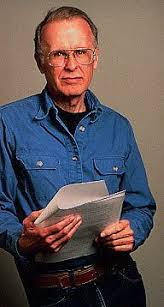

Aprendí Fortran en la Universidad de Chile, cuando era mechón. Aunque
normalmente el curso se hacía con Ratfor, y al año después se empezó a
hacer con Pascal, a mi, por razones que no recuerdo, me tocó hacer
Fortran.

Acostumbrado a programar en Basic, no fue dificil para mi aprender este
venerable lenguaje de programación.Hoy [leí una
reseña](http://linuxandcomputerscience.blogspot.com/2007/12/50-aos-con-fortran.html)
que en realidad nos muestra un Fortran bastante más moderno del que me
tocó, [Watfor-77](http://csg.uwaterloo.ca/sdtp/watfor.html).

Ahora se cumplen 50 años de Fortran, en el mismo año que su creador
falleción, [John Backus](http://en.wikipedia.org/wiki/John_Backus).

Backus además inventó la forma Backus-Naur, que es el formato en que se
describen los lenguajes formales, en particular los lenguajes de
programación.

No se cuantos programadores pueden decir que han inventado su propio
lenguaje de programación, pero yo he inventado varios, y en los 90,
junto con [Marco Zúñiga](http://blog.maz.cl/) alcanzamos a vender
licencias y hacer cursos de un pequeño lenguaje de programación,
inventado por él, y que después expandí, se trataba **Sanscript**.

Trabajamos por lo menos 2 años con este lenguaje, en diversos proyectos
de telecomunicaciones, y tuvo un éxito modesto dentro de la industria
nacional, tenía su propia máquina virtual, y correspondería a lo que hoy
llaman lenguajes de dominio específico (DSL).

Algo de Fortran había en ese mini lenguaje, así que puede que sin
Fortran no podría haber habido sanscript, y tampoco un memorable momento
de mi vida.

