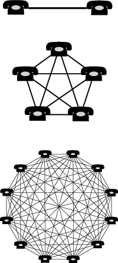

[Bob Metcalfe](http://www.ibiblio.org/pioneers/metcalfe.html) es uno de mis emprendedores favoritos,y me parece que sus ideas sobre cómo emprender negocios de tecnología son de las mejores que he leido.
Metcalfe es uno de los creadores de [Ethernet](http://portal.acm.org/citation.cfm?id=358015), la tecnología usada en las redes de área local. Si tu computador está conectado mediante un cable a la red lo hace usando una tarjeta Ethernet, así de importante es este caballero.

Ethernet, también conocido como IEE 802.3, es el estándar que prevaleció al final de los 80 como la manera de conectar computadores a una LAN, hoy pocos se acuerdan de [Token Ring](http://en.wikipedia.org/wiki/Token_ring), por ejemplo, a pesar de lo ingenioso de sus diseño.

Claro que Robert Metcalfe se ha mandado numeritos bastante impresentables, como por ejemplo predecir el total colapso de Internet en 1995. Finalmente Metcalfe tuvo que tragarse sus palabras ([literalmente](http://www.merit.edu/mail.archives/nanog/1997-04/msg00192.html)).

Uno de los términos famosos acuñados por Metcalfe es el de [El Efecto Red](http://en.wikipedia.org/wiki/Network_effect) (Network Effect).

Esencialmente lo que dice este concepto es que si bien el costo de una red es proporcional a la cantidad de nodos que la componen (N) el valor de la red es proporcional al cuadrado de la cantidad de nodos (N^2).

El efecto red causa que un bien o servicio tenga un valor para un cliente potencial que depende de la cantidad de otros clientes que tengan. En otras palabras, el numero de personas que han adoptado antes un servicio es un factor del valor disponible para el proximo adoptante.

Una consecuencia es que la compra de un bien por parte de un individuo beneficia indirectamente a los otros que ya tienen ese bien. Por ejemplo, cuando una persona compra un teléfono hace que más útiles a los demás teléfonos (y por lo tanto el servicio telefónico se hace más valioso).

Microsoft Office es un ejemplo de cómo un producto se beneficia del efecto red.

> 

> 
> Para muchas personas que están eligiendo una suite de ofimática, una de las primeras consideraciones es cuan valioso será haber aprendido a usar Office para sus potenciales empleadores, además de cuan bien interoperar el software con otros usuarios. Dado que aprender a usar una suite ofimática toma varias horas, tenderán a invertir su tiempo en la suite que sea más atractiva para un potencial empleador (o para sus clientes, amigos, etc), además del hecho de que quieren ser capaces de compartir sus documentos.
> 
> 

> 

> 
> Lo mismo pasa con los empleadores, quienes necesitan tener empleados entrenados en la suite ofimática que ellos han decidido estandarizar.
> 
> 

Esta combinación de factores lleva a la larga que una suite ofimática como Office termine controlando casi el 100% del mercado.

De hecho, [la historia](http://www.lnds.net/2007/08/compromisos_precisiones_y_la_libertad_de.html) de cómo llegamos a esta situación en que Windows y Office son el monopolio ti
ene que ver con un habil manejo del efecto red.

Pero este tipo de cosas no se entienden, hay personas que [aún creen que la gente usa Office porque son flojos o estúpidos](http://www.elfrancotirador.cl/2008/01/14/ooxml-en-chile-la-delgada-linea-roja#comment-56802). No es así, hay bastante racionalidad y juicio práctico que definen el comportamiento y la adopción de este producto.

Cuando hay una red que soporta un servicio o producto se hace muy dificil para los competidores entrar o crear una nueva red que entregue los mismos beneficios.

¿Qué valor me aporta el hecho cambiarme a ODF? Creo que ese es el tipo de preguntas que se deben hacer los que promueven su uso, no se trata de ser voluntarista, ni mucho menos de insultar a los que no lo usan, un estándar termina adoptándose porque es valioso, y el sentido de valor es algo que no necesariemente tiene que ver con la calidad (por paradójico que suene).

Por eso que [hay analistas](http://xml.sys-con.com/read/485296.htm) que sostienen que a [pesar de los esfuerzos de los usuarios que respalden ODF](http://www.elfrancotirador.cl/2008/01/14/ooxml-en-chile-la-delgada-linea-roja), al final,**OOXML se impondrá**, es muy dificil neutralizar el efecto red.

Aunque también se predice que este tipo de formatos quedarán en desuso por la adopción de los estándares W3C, el uso de XML, CSS, y la adopción de aplicaciones que se encontrarán distribuidas en "la nube".

Si tuvieran que apostar, ¿pondrían sus fichas en ODF?
