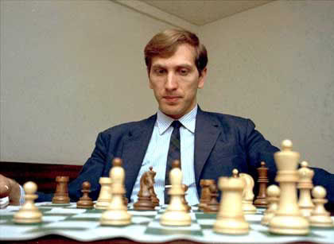
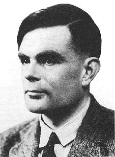
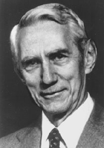
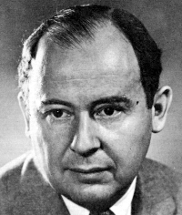
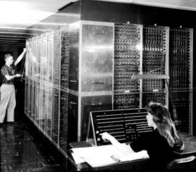
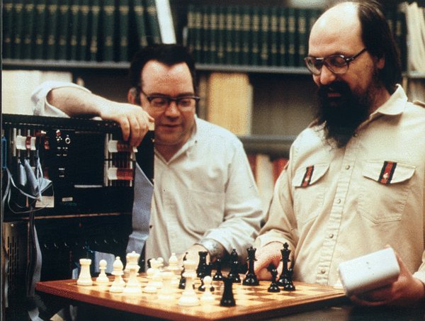

Hoy falleció [Bobby Fischer](https://www.elmundo.es/elmundodeporte/2008/01/18/masdeporte/1200654941.html),
personaje del ajedrez. Una figura interesante, con una vida que da para
novela o una buena película.

El ajedrez se ha convertido en un problema completamente solucionado
desde el punto de vista computacional. En 1997 Deep Blue derrota a
Kasparov y se demuestra que es posible construir una máquina que supera
al mejor de los jugadores de este deporte.

La historia del ajedrez jugado por una máquina es de larga data, famosa
es la historia del
[turco](/blog/lnds/2005/11/04/inteligencia-artificial-artificial)
[mecánico](https://www.portalajedrez.com/anecdotas/turco.php), una
máquina con aspecto de turco que se dice derrotó incluso a Napoleón
Bonaparte, en realidad no había ningún mecanismo, sino que en su
interior era operada por el campeón austriaco de ajedrez Johann
Allgaier.

Lo interesante es que los grandes pioneros de la computación han
participado, en algún momento de su carrera, en este desafío de
construir una máquina capaz de jugar ajedrez tan bien como un humano.

Alan Turing, el verdadero padre de la computación, Claude Shanon,
creador de la teoría de la información, John Von Neuman en primer
diseñador del computador programable y del modelo de casi todos los
computadores modernos, y Ken Thompson, el creador de UNIX. Todos ellos
han jugado ajedrez a otro nivel, construyendo programas o máquinas que
jugaban ajedrez.

## **Turing**

Alan Turing, al
final de la segunda guerra mundial diseñó las instrucciones para una
máquina capaz de jugar ajedrez. Como no habían máquinas en ese tiempo
que pudieran ejecutar las instrucciones que el escribió decidió actuar
el mismo como una "CPU humana", cosa que le tomaba aproximadamente una
hora y media por jugada. Esta "máquina de papel" de Turing fue probada
y tenemos el registro de una de sus partidas, en que la máquina de papel
de Turing pierde ante uno de sus colegas:

> Partida de Ajedrez entre la máquina de papel de Turing\'s versun Alick
> Glennie, en Manchester 1952:
>
> 1.e4 e5 2.Nc3 Nf6 3.d4 Bb4 4.Nf3 d6 5.Bd2 Nc6 6.d5 Nd4 7.h4 Bg4 8.a4
> Nxf3+ 9.gxf3 Bh5 10.Bb5+ c6 11.dxc6 0-0 12.cxb7 Rb8 13.Ba6 Qa5 14.Qe2
> Nd7 15.Rg1 Nc5 16.Rg5 Bg6 17.Bb5 Nxb7 18.0-0-0 Nc5 19.Bc6 Rfc8 20.Bd5
> Bxc3 21.Bxc3 Qxa4 22.Kd2? \[22.h5 podría haber tomado al alfil\]
> 22\...Ne6 23.Rg4 Nd4? \[23\...Rxb2! 24.Bxb2 Rxc2+\] 24.Qd3 Nb5 25.Bb3
> Qa6 26.Bc4 Bh5 27.Rg3 Qa4 28.Bxb5 Qxb5 29.Qxd6 Rd8 0-1.

## **Shanon**

Claude Shannon,
creador de la teoría de la información, analizó el problema en 1950 y
consideró dos tipos de estrategias, una de fuerza bruta (Tipo A) y otra
más selectiva (Tipo B). Y aunque Shanon consideró que los algoritmos de
Tipo B son más eficientes, porque consumen menos recursos y toman menos
tiempo. Sin embargo los mejores programas de ajedrez son del Tipo A,
porque en la práctica el problema de seleccionar las jugada más
plausibles en un momento dado es un problema muy complicado, y los
adelantos en el hardware han permitido superar algunas de las objeciones
en cuanto al tiempo de ejecución que planteó Shannon en su estudio.

## **John von Neumann**

Durante el desarrollo de la bomba atómica uno de los problemas
complicados eran los cálculos de la forma correcta que deberían tener
las cargas de implosión que gatilan la reacción en cadena. La
contrucción de un computador que hiciera estos cálculos fue encomendada
a John von Neumman.

En 1950 el trabajo de von Neumann se reflejó en una gigantesca máquina llamada
MANIAC I. Compuesta por miles de tubos de vacío y relés era capaz de
ejecutar 10.000 instrucciones por segundo y además era programable
(recordemos que el modelo de von Neumann es el estandar en casi todos
los computadores modernos).

En vez de empezar a trabajar de inmediato en las bombas atómicas los
científicos decidieron darle un uso más interesante a esta máquina, y lo
primero que hicieron fue escribir un programa que jugaba ajedrez. Claro
que una clase especial de ajedrez, donde el tablero tenía 6×6 casillas,
sin alfiles. COn estas restricciones el programa era capaz de analizar
jugadas hasta 4 niveles de profundidad y se tomaba unos 12 minutos en
esta tarea (si se hubieran incluido los alfiles la tarea habría tomado
tres horas).

Se hicieron 3 juegos a mediados de los 50 con este programa, el primero
jugando contra si mismo, en que ganaron las blancas, el segundo contra
un jugador experto, que tomó 10 horas para finalmente perder, y el
tercero contra una joven voluntaria (que había aprendido a jugar una
semana antes), en este caso el humano perdió en menos de media hora, y
también tenemos registro de esa partida (recuerden que es un tablero de
6×6 y no hay alfiles):

> MANIAC 1 - Human, Los Alamos 1956: 1.d3 b4 2.Nf3 d4 3.b3 e4 4.Ne1 a4
> 5.bxa4? \[5.Nd2 and 6.Nd2-c4+ Nbcxc4 7.b3xc4 con un buen juego\]
> 5\...Nxa4 6.Kd2? Nc3 7.Nxc3 bxc3+ 8.Kd1 f4 9.a3 Rb6 10.a4 Ra6 11.a5
> Kd5 12.Qa3 Qb5 13.Qa2+ Ke5 14.Rb1 Rxa5 15.Rxb5 Rxa2 16.Rb1 \[para
> pevenir 16\...Ra1 mate!\] 16\...Ra5 17.f3 Ra4 18.fxe4 c4 19.Nf3+ Kd6
> 20.e5+ Kd5 21.exf6Q Nc5 22.Qf6xd4+ Kc6 23.Nf3-e5 mate.

Esta partida corresponde a la primera vez que una computadora derrota a
un humano.

## **Ken Thompson**

El último pionero de
la informática que participó en esta carrera de desarrollar una máquina
capaz de derrotar al ser humano es Ken Thompson, quien junto a Dennis
Ritchie crearon el sistema operativo UNIX.

A principios de los 80 Thpomson y algunos colegas en Bell Labs
construyeron una máquina con un diseño específico para jugar ajedrez. De
hecho fue la primera máquina en alcanzar el nivel de maestro en 1983.

Esta máquina, afectuosamente llamada Belle, costó unos 20.000 dolares y
era capaz de analizar 180.000 posiciones por segundo (los super
computadores de la época sólo eran capaces de hacer 5000 posiciones).

Era tan poderosa que fue confiscada por el departamento de defensa
norteamericano cuando el equipo trataba de llevarla a un torneo en la
Unión Sovietica en 1982.

Belle fue la campeona imbatible en casi todos los torneos entre
computadores entre 1980 y 1983, hasta que fue derrotado por la
supercomputadora Cray XMP, que costaba mil veces más.

Fuentes:

-   [A short history of computer chess](https://www.chessbase.com/columns/column.asp?pid=102)
-   [KEN, UNIX, AND GAMES](https://cm.bell-labs.com/cm/cs/who/dmr/ken-games.html)
