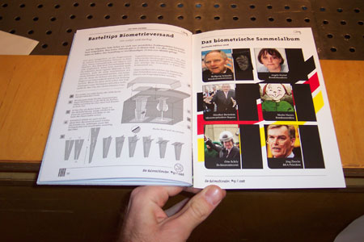

Aunque ya no estoy trabajando en biometría, me gustaría comentar sobre [este hack político](http://www.theregister.co.uk/2008/03/30/german_interior_minister_fingerprint_appropriated/) que sucedió en Alemania.

La cosa es más o menos así, el [Computer Chaos Club](http://www.ccc.de/), famoso club germano de hackers (sobre los que sería buena idea publicar algo un día de estos), publica en su [revista](http://ds.ccc.de/) una cinta plástica con el patrón de la huella digital del ministro del interior alemán, con esta uno puede construir una huella de goma y reemplazar al ministro, en cualquier sistema biométrico que verifique su huella digital. Es más, el procedimiento completo está descrito en [esta página del CCC](http://www.ccc.de/biometrie/fingerabdruck_kopieren?language=en), donde explican cómo hacer huellas falsas, a partir del rastro dejado en un vaso (lo que técnicamente se llama huella latente).

La verdad es que hacer "huellas digitales de goma" es relativamente fácil, y bastante entretenido en realidad ;). Pero eso no demuestra que la biometría sea insegura, o inutil, como se nos trata de hacer creer con estas demostraciones.

Porque en realidad, la biometría es un medio de verificación de identidad que debe ser aplicado en ciertos contextos, y en condiciones adecuadas.

Voy a citar a [Bruce Schneier](http://www.schneier.com/), quién, a pesar de que no le gusta la biometría es [bien claro respecto a los alcances de esta tecnología](http://www.schneier.com/crypto-gram-9808.html#biometrics):

> La moraleja es que la biometría funciona grandiosamente sólo si el que verifica puede verificar dos cosas: una, que la biometría venga de la persona en el momento de la verificación, y dos, que la biometría corresponde con la biometría maestra almacenada. Si el sistema no puede hacer eso, entonces no funciona. **La biometría proporciona identificadores únicos, pero estos no son secretos** (repita esa sentencia hasta que encaje en su cabeza).

> The moral is that biometrics work great only if the verifier can verify two things: one, that the biometric came from the person at the time of verification, and two, that the biometric matches the master biometric on file. If the system can't do that, it can't work. Biometrics are unique identifiers, but they are not secrets. (Repeat that sentence until it sinks in.)

La verdad es que hay modelos estudiados de cómo construir aplicaciones biométricas seguras, y que hacen que este hack sólo sea un impactante acto político, pero de nula efectividad en la práctica.

Lamentablemente, hay muchos auto proclamados expertos en biometría que no saben de esto, y llenan el mercado de malas implementaciones, que pueden ser atacadas con estos trucos.

La biometría no es insegura, y un experto en el tema sabe que las huellas no son secretas, y cómo construir un modelo de seguridad que toma en cuenta este hecho.

