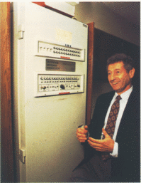

Esta fotografía corresponde a Leonard Kleinrock, al lado del IMP1,
Interface Message Processor, uno de los nodos de packet switching usados
en ARPANET, la antecesora de Internet.

> \"La historia cuenta que el pequeño Len Kleinrock recibió un ejemplar
> del comic de Superman, en el cual encuentra las instrucciones para
> construir una \"radio de cristal\". Todo lo que necesitaba el niño era
> una hoja de afeitar usada de su papá, una poco de grafito (de lapiz),
> un rollo de papel higiénico vació, alambre, todos lo cual ya estaba en
> su casa. Incluso pudo conseguir unos viejos audífonos, pero faltaba un
> \"condensador variable\". Para conseguirlo convenció a su madre de
> viajar al centro de Manhattan a una tienda de radio y electrónica.
>
> Al llegar a la tienda un muy seguro niño, ¡de 6 años de edad!, se
> acercó al mesón de atención y pidió un condensador variable, ante lo
> cual el dependiente constestó con una pregunta inesperada, \"¿de qué
> tamaño lo quieres?\", el niño y tuvo que confesar que no tenía idea,
> de hecho no había visto nunca uno de estas partes. Después de
> explicarle al vendedor para qué lo quería, le vendieron lo que
> necesitaba. Kleinrock construyó su radio de cristal, y quedó
> totalmente fascinado cuando pudo oir cómo surgía música de sus
> audífonos, sin baterías, sin necesidad de energía, todo totalmente
> grátis. Había nacido un ingeniero.\".

[Leonard Kleinrock](http://www.lk.cs.ucla.edu/) estableció las bases
teóricas del [packet
switching](http://en.wikipedia.org/wiki/Packet_switching), es decir, las
bases de varios protocolos de comunicaciones de redes, y de la internet,
en su tesis doctoral en el MIT: [Information Flow in Large Communication
Nets](http://www.lk.cs.ucla.edu/LK/Bib/REPORT/PhD/proposal.html), en
1961, y posteriormente su libro \"Communication Nets\" convenció a
varios de la viabilidad del proyecto ARPANET.

Como Kleinrock trabajaba en la UCLA en 1969, se decidió, dado su gran
aporte, que el primer nodo de ARPANET estaría en el laboratorio de
Kleinrock en la UCLA. El 29 de octubre de 1969 el laboratorio de
Kleinrock estableció el primer enlace con el laboratorio de Douglas
Engelbart, en el SRI (Stanfords Research Institute). Ese día nació la
que llegaría a ser internet, y se demostró que las teorías de Kleinrock
funcionaban.

Yo agradezco a los padres de Kleinrock, que promovieron y apoyaron su
curiosidad e inventiva cuando niño. ¿Cuanto de la actual infraestructura
le debemos a ese viaje en metro al centro de Manhattan, y a un página de
una revista de historietas?
