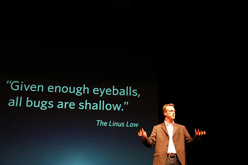
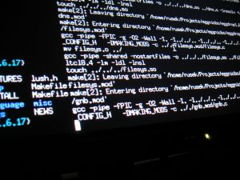

Estoy batallando con el filtro spam de mi blog, y me he dado cuenta que me ha dejado oculto varios comentarios interesantes.

Uno de los que he rescatado fue enviado por [Micronauta](http://twitter.com/micronauta), y como él escribe uno de mis [blogs favoritos](http://blog.canal.cl/), creo que se merece una respuesta destacada (además que aprovecho de pedirle las disculpas por no haber publicado su comentario).

Veamos, el comentario está en mi articulo sobre el [fallo en Debian, encontrado por Luciano Bello :wink:](/2008/05/luciano_bello_encuentra_bug_de_seguridad.html) Tengo que confesar que no he quedado satisfecho con la nota tan breve y seudo humorística que hice y creo que en algún momento escribiré sobre las lecciones que nos entrega ese caso, pero vamos al [comentario de Ignacio](http://www.lnds.net/2008/05/luciano_bello_encuentra_bug_de_seguridad.html#comment-65935).

La primera parte del comentario dice:

> Tu frase "también demuestra que tampoco es cierta la mal llamada Ley de Linus", tendría que ser soportada con estadísticas. Yo sostengo la hipótesis de que Torvalds tiene razón. No porque haya alguien por ahí que pilló un bug, se demuestra que dicha ley no es cierta.

Bueno, primero hay que aclarar que la Ley de Linus fue formulada por [Eric Raymond](http://catb.org/~esr/), en su clásico ensayo [La Catedral y el Bazar](http://biblioweb.sindominio.net/telematica/catedral.html), y dice así:

> "given enough eyeballs, all bugs are shallow" (con muchas miradas, todos los errores saltarán a la vista).

Incluso hay una versión más formal de esta ley:

> "Given a large enough beta-tester and co-developer base, almost every problem will be characterized quickly and the fix will be obvious to someone." (Dada una base suficiente de desarrolladores asistentes y beta-testers, casi cualquier problema puede ser caracterizado rápidamente, y su solución ser obvia al menos para alguien).

Basta un contra ejemplo para derrumbar este enunciado de Raymond, y muchas críticas a este enunciado parten de este hecho.

Un contra ejemplo es el fallo de Debian, porque no era obvio en el código las consecuencias de eliminar una línea, a pesar de que el caso fue sometido y comentado por la comunidad antes de realizar el cambio que llevó al desastre.

Insisto que el tema merece un análisis más profundo, que daría para un ensayo sobre ingeniería de software, pero creo que queda claro, que tal como está planteada, la Ley de Linus no puede ser considerada una ley, y a lo más una declaración de intenciones.

Pero es más, el mismo Raymond reconoce el error de su formulación original, en la respuesta a un mensaje a la lista e-mac-devel, respondiendo un mensaje de Stephen J. Turnbull, que dice:

> It is not true that to "many eyes, all bugs are shallow". What is true is that (1) with many eyes, shallow bugs get caught very quickly, and (2) that the more eyes there are, the more likely it is that some member of the group has sufficiently penetrating vision to catch the deeper-swimming bugs.

> No es cierto que "para muchos ojos los fallos son obvios". Lo que es cierto es que (1) con muchos ojos, los fallos obvios son atrapados muy rápidamente, y (2) que mientras más ojos hay, lo más probable es que algún miembro del grupo tenga la visión suficientemente penetrante para atrapar los fallos más profundos.

A lo que Eric Raymond responde:

> As I observed recently on the Open-Source list, one of the advantages of being me is that I'm not required to believe the popular oversimplifications of my thinking. Congratulations: you have captured my **actual** view of the many-eyeballs effect rather exactly!

> Como he observado en la lista Open-Source recientemente, una de las ventajas de ser yo es que no estoy obligado a creer las sobresimplificaciones populares de mi pensamiento. ¡Felicitaciones: has capturado mi **real** visión del efecto de los muchos ojos de una manera exacta!

Lamentablemente, es la formulación original la que ha quedado, y nadie toma en cuenta que es una ley errónea, que lleva a consecuencias desastrosas, como han escrito varios autores más autorizados que yo.

Ahora, el segundo párrafo del comentario de Ignacio:

> Debe ser más probable que se pillen bugs en software de código abierto que en software de código cerrado, simple economía de la atención, por lo tanto como resultado debe ser estadísticamente más seguro usar soluciones basadas en código abierto. Sentido común.

Esto merece mayor atención, y dudo que alguien tenga las cifras para demostrarlo en un sentido u otro, pero vamos a intentar una respuesta, usando el sentido común, al que apela mi comentarista.

Sabemos que la observación de un bug, por parte del usuario, o de un beta-tester, no es suficiente para determinar la causa del bug. De hecho, muchas veces la causa de un bug es la cosa menos obvia, y puede tener origen en una componente muy profunda del sistema, o ser el resultado de un efecto lateral que no es una consecuencia directa del código.

Por lo tanto, el tener una base grande de usuarios nos permite encontrar bugs más rápidos, porque esta base de usuarios aporta con datos, y la información es la mejor herramienta que tenemos para encontrar un fallo. Pero esta ventaja aplica tanto para código abierto y cerrado, y de hecho sabemos que Microsoft recolecta bastas cantidades de información de errores generados por millones de usarios en miles de configuraciones distintas.

Por otro lado, está el tema de los muchos ojos, pues bien, esos ojos no sólo deben estar observando el código, sino que estar motivados, capacitados y preparados para observar ese código.

Tener un ambiente de desarrollo adecuado para compilar, y depurar el código de OpenSSL es un trabajo de preparación no menor ( de hecho el bug de Debian nació de la necesidades de uno de estos ambientes de desarrollo).

La consecuencia de lo que estoy diciendo, es que no hay suficientes ojos observando el código, y de los ojos que están observandolo no todos estan preparados, de hecho, toman decisiones que son catastróficas que toman años corregir (el caso de Debian no es el único).

La ley de los grandes números, uno de los fundamentos del análisis estadístico, requiere de, bueno, grandes números, y la Ley de Linus es una ley de este tipo.

Estos grandes números se dan en algunos proyectos, donde además hay grandes inversionistas pagando a los ojos para que pongan atención al código, pero eso no pasa en la mayoría, y es precisamente lo que pasa en OpenSSL, donde sus propios desarrolladores reconocen que no hay tiempos ni recursos para hacer una adecuada mantención a este código.

Por otro lado, el software cerrado tiene la cantidad ojos que necesita, ojos preparados, motivados (esperamos) y pagados para observar ese código.

La diferencia fundamental está en que, en el caso del código abierto, una vez identificado un fallo, un externo puede entrar y realizar la corrección.

La ventaja del código abierto está en que el tiempo de respuesta es muchas veces superior al del código cerrado, porque, "**una vez identificado un error, muchos ojos tornan su atención al código**", y esa sí sería una hermosa ley, más precisa y realista, y que aplica a código abierto y cerrado. El corolario es obvio, la cantidad de ojos que tornan sus ojos al código abierto es mayor, y por ende suben las probabilidades de encontrar la solución en menor tiempo.

(Fotografía original [desde Flickr](http://www.flickr.com/photos/maqroll/243526959/) tomada por [maqroll](http://www.flickr.com/photos/maqroll/), bajo licencia CC)

