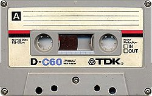

Del COPYRIGHT al COPY & PASTE (*)

Por Eduardo Rodriguez:

Hoy existe gran preocupación en la industria de medios porque Internet se ha transformado en una plataforma para copiar contenidos: libros, música, películas, etc. Gran parte del problema, en mi opinión, radica en que la industria no ha reconocido que el mundo cambió, y hay que adaptar los negocios a este nuevo escenario.

Hasta hace unos años, los medios de comunicación nos entregaban diversos contenidos para nuestro consumo, sin que pudieramos quedarnos con una copia de ese material, salvo los medios impresos que nos dejaban una copia del material publicado (de diversa calidad, dependiendo del tipo de papel), el resto de los medios, tales como la radio, la TV, el cine, nos entregaban una reproducción intangible.

Eso fue así hasta que la tecnología cambió...

El cambio empezó con la llegada del casette, la fotocopia y las cámaras fotográfícas. Todo cuarentón(a) que se precie de tal, debe recordar con una sonrisa en sus labios, sus gastados cassettes que guardaban horas de canciones capturadas de la radio; y esas eternas esperas con el botón de pausa apretado, esperando el preciso momento en que empezara la canción que uno buscaba; o los recortes de revistas que adornaron su pieza. O las fotocopias anilladas de ese libro tan importante en su momento, que hoy reposa inmaculado, junto a varios kilos de polvo, en un rincón de nuestro librero.

Y luego llegó Internet...

Y la llegada de Internet trajo también la posibilidad de copiar casi profesionalmente los medios. Dvd, mp3, avi, jpeg, iso, you name it!. Todo se puede copiar. Tiene protección?, crack!. Tiene clave?, crack!. Todo se puede copiar.

¿Y qué hay de malo con copiar?, bueno, depende de a quién se le dirija la pregunta. Hay opiniones para todos los gustos. Pero remitamonos a la realidad, y dejemos las opiniones para el final: la realidad es que hoy se copia mucho a través de Internet. Practicamente nada se resiste a la copia, desde programas de televisión hasta juegos de computador, pasando por libros e imágenes. En Chile, un senador copió una ley textual de Internet, con faltas de ortografía incluidas y luego la firmó como propia.

Ahora bien, si el lector lo piensa bien, Internet es en esencia, una red de copiado de información. Yo escribo un mail, aprieto enviar, y el mail se copia a la casilla del destinatario. Yo abro una página web, y copio el contenido a mi computador para que mi browser lo despliegue. Prendo mi computador y mis datos se copian a otros computadores para poder quedar conectado a la red. Aprieto una tecla, y esa letra se copia en el messenger de la persona con quien estoy chateando.

Copiar es inherente a Internet. Y uno se acostumbra. O más bien, le pierde el miedo a la copia.

Y aquí empieza el problema de la industria de medios, que reacciona contratando un batallón de abogados que persiguen a los que infringen la ley.

¿Han tenido éxito hasta hoy?. Nope. La copia galopa a paso firme.

¿Por qué no cambiar entonces el punto de vista del problema?, porque seamos sinceros, ¿cuál es el problema?. Un grupo de empresas (la industria) no está recibiendo los ingresos que "debería" percibir por una transacción comercial que no se hace. Ese es el problema. Nadie está matando la música, ni a los autores. Los que pierden dinero en realidad, son las grandes compañías.

Si en vez de comprar un juego de computador, yo lo copio de Internet, la empresa que lo produce deja de percibir una cierta cantidad de dinero. ¿Pero qué pasaría si la industria desarrollara ese mismo juego, sabiendo -- y asumiendo -- que se lo van a copiar, pero cobrara al jugador por otro concepto? (como lo hace hoy día cuando cobra por jugar en red, por ejemplo?)

¿No será tiempo que la industria de medios, asimile el hecho de que la copia va a seguir, y que busque maneras inteligentes de hacer negocios?

Las oportunidades existen para quienes las saben aprovechar.

(*) Este artículo pertenece a Eduardo Rodriguez, a quien agradezco su autorización para publicarlo en mi blog, y con este artículo inauguro la sección de Villanos Invitados.  
Las imagenes las puse yo (Eduardo Díaz) y fueron extraidas desde [stock.xchng](http://www.sxc.hu/index.phtml).

