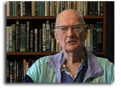

> "Toda tecnología suficientemente avanzada es indistinguible de la magia"

Arthur Clarke, el último de los "tres grandes"[^1], falleció hoy a los 90 años, en Sri Lanka, donde fijó su residencia hace muchos años atrás.

Aparte de escritor de ciencia ficción y futurista, Arthur Clarke era inventor, y fue uno de los principales impulsores del satélite geo estacionario, de hecho, la órbita de un satélite geoestacionario se llama la "Orbita de Clarke".

## **2001**

Muchos conocen a Clarke por su trabajo con el director de cine Stanley Kubrick en el filme 2001, basado en un cuento de Clarke: El Centinela.

Aunque mi novela favorita de Clarke es "El Fin de la Infancia", reconozco que 2001 y su colaboración con Kubrik (no exenta de problemas) es impresionante, y ha creado una de las imagenes más potentes que haya podido crear la ciencia ficción. Esa es una película que vale la pena ver varias veces. La influencia de Clarke es notable, un ejemplo es esa memorable escena en que HAL es desactivado.

## **El Elevador Espacial**

Otra idea notable promovida por Clarke (pero ya esbozada por el gran [Konstantin Tsiolkovsky](http://en.wikipedia.org/wiki/Konstantin_Tsiolkovsky)) es el concepto del[ascensor espacial](http://www.lnds.net/2005/08/parece_que_estan_dejando_de_re.html), tal como dijo él una vez:

> "El elevador espacial se construirá 50 años despues que todos dejen de reirse"

Como varias de sus ideas, aparte de aportar con algún trabajo científico sobre cada concepto, Clarke escribía una novela relacionada al tema, y en el caso del ascensor espacial esta novela es _"Las Fuentes del Paraiso"_.

## **Las leyes de Clarke**

A lo largo de su extenso trabajo como ensayista, y divulgador científico, Sir Arthur Clarke estableció varias frases celebres, tres de las cuales han sido destacadas como las "Leyes de Clarke", citadas por diversos autores, las leyes de Clarke son:

> 1. Cuando un anciano y distinguido científico afirma que algo es posible, probablemente está en lo correcto. Cuando afirma que algo es imposible, probablemente está equivocado.

> 2. La única manera de descubrir los límites de lo posible es aventurarse hacia lo imposible.

> 3. Cualquier tecnología lo suficientemente avanzada es indistinguible de la magia

Clarke ha emprendido su "Cita con Rama" y el mundo ha perdido una mente llena de imaginación y fe en el futuro de la humanidad, quizás es tiempo de releer sus obras, y si tú no has leido nunca nada de Clarke, quizás sea el momento adecuado para conocerlo, te invito a leerle.

[^1]: Los Tres Grandes de la Ciencia Ficción: Isaac Asimov, Robert Heinlein, Arthur Clarke

