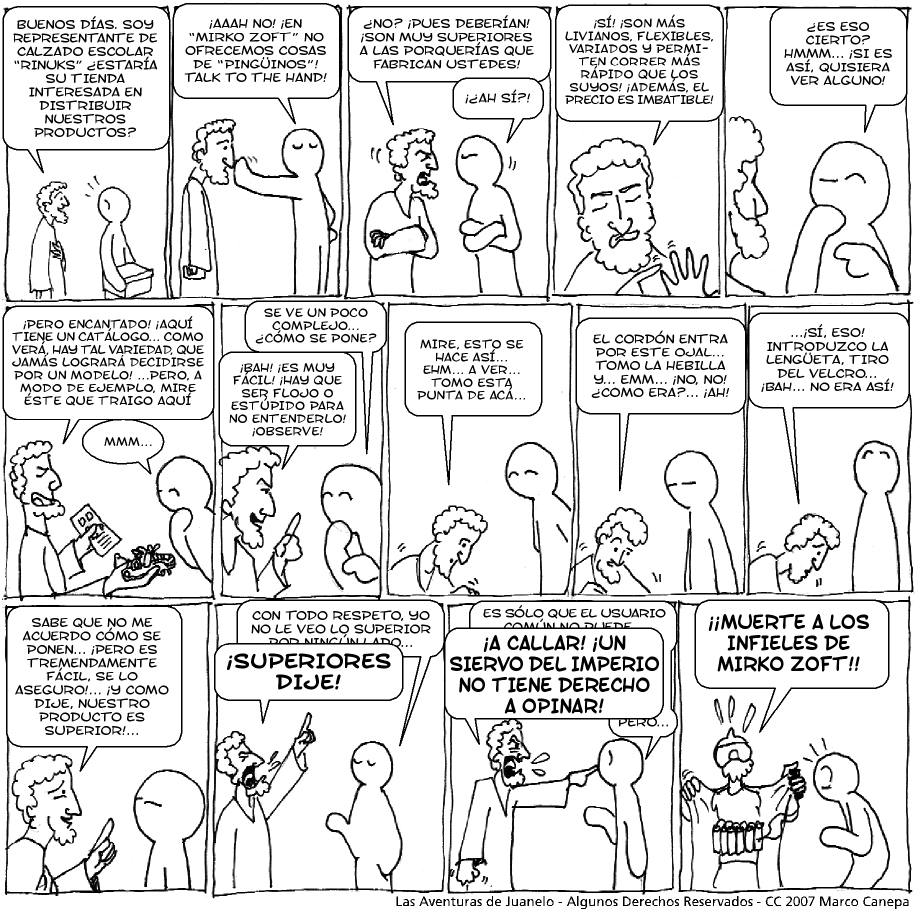

Instalé mi primer distro linux en 1993, no recuerdo bien los detalles, pero algunos de mis amigos que aún trabajaba en el DCC me pasó unos disquettes con Linux para poder instalarlo en mi PC. Después de instalarlo y configurarlo adecuadamente lo primero que hice fue conseguir e instalar X, aparte de usar Xeyes, mi objetivo era poder emular el ambiente de múltples ventanas de las Workstation Sun que usaba en la facultad. Al final, todo lo que quería tener eran múltiples instancias de Xterm.

Hoy le pregunté a mi hija por qué no cambia el sistema operativo de su viejo PC a Linux, estaba pensando en [Ubuntu](http://www.ubuntu.org/), por supuesto (probablemente [XUbuntu](http://www.xubuntu.org/para) aprovechar mejor el hardware limitado de ese pc), después de discutirlo por algunos minutos me quedó claro que las necesidades de mi hija no son satisfechas por Ubuntu, aún. Siendo no menor el aspecto estético, algo que suele ser olvidado por varias distros de linux.

**It's not about quality it's about freedom**

Sabemos que para Stallman lo más importante es la libertad, por otro lado, algunos usuarios han manifestado que lo de la libertad no es lo más importante: [la libertad es un plus](http://www.elfrancotirador.cl/2008/03/20/rompiendo-la-maldicion-del-pinguino/) nos dice [Christian](http://www.elfrancotirador.cl/).

Creo que cuando Stallman habla de usuarios no está pensando en lo que entendemos normalmente, en su chascona cabeza el usuario común y corriente es un hacker. Pero también hace rato que Stallman dejó de desarrollar seriamente, y cualquier que haya usado Emacs se dará cuenta que la usabilidad no está dentro de sus prioridades.

¡No más excusas!

Muchos de los desarrolladores de software libre hoy día viven de eso, _de escribir software libre_. Por ejemplo, el 75% de los desarrolladores que contribuyeron para la versión 2.6 del kernel linux [recibieron un sueldo por dedicarse exclusivamente a esta labor](http://lwn.net/Articles/222773/), y dado que un porcentaje de los desarrolladores tiene origen desconocido, se especula que esa cifra puede subir al 85%.

Gnome es soportado por Novell, y MySQL, bueno, es una empresa en si misma, y ha sido absorbida por SUN justamente para poder aumentar su participación de mercado y potenciarlo como producto.

**La usabilidad importa.**

El software libre no es una cosa de aficionados, no es desarrollado por chascones, hippies, o desarrolladores con mucho tiempo libre en sus manos, el software libre es financiado, y se ha convertido en una empresa auto sustentable económicamente.

Entonces es justo pedir que el foco esté en la calidad del producto para el usuario final, es importante, no sólo los aspectos estéticos, sino que en forma más importante, la usabilidad se ha vuelto prioritaria.

No podemos aceptar la excusa de "que hay que conformarse con el software libre como es, porque después de todo es construido por voluntarios buena onda", eso ya no es cierto.

Lamentablemente cuando se discuten estas cosas en vez de ofrecernos una solución, o ponerse a escribir un parche, o una mejora, los hackers de linux adoptan una posición extremista que no construye nada. Yo creo que es algo tí
pico del fenómeno del recién converso. Algo que fue muy bien reflejado con esta [historieta de juanelo](http://juaneloonline.blogspot.com/2007/03/las-aventuras-de-juanelo-346.html):

Ahora bien, la calidad no tiene por que sacrificarse por la libertad, esa es otra falacia inaceptable.  
La libertad no es un plus, pero tampoco es una excusa para justificar un producto de calidad mediocre.

