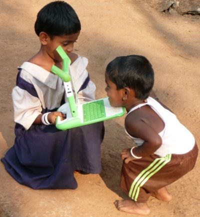

[Ver imagen](625016_mac.jpg)

Un [nuevo estudio](http://www.columbia.edu/~cp2124/papers/computer.pdf), avalado con credenciales bastante respetables "demuestra" que los computadores para los niños en el hogar tienen efectos negativos en la educación de los niños, y que es cuestionable la utilidad de esfuerzo a gran escala para darle acceso a computadores a niños en situación precaria, si es que no se pone atención en la forma en que los padres controlan el uso del computador.

La historia es así, en el año 2005 el gobierno rumano decide entregar un voucher para que los niños y jóvenes de menores recursos pudieran adquirir un computador para el hogar. Como parte del programa, el gobierno rumano puso a disposición de los interesados sobre 500 paquetes educativos, los que debían ser instalados sin costo por las empresas retail que vendieran los computadores.

El año 2007 se realiza una encuesta para investigar el impacto de esta medida en Rumania, y se encuentra que muy pocos computadores tenían instalados los paquetes educativos, que los resultados fueron negativos en cuanto al desempeño escolar. Finalmente sólo disminuyó la cantidad de horas viendo televisión, las que fueron reemplazadas por horas usando el computador, y en general los niños con computador presentaron un peor rendimiento escolar. Sólo en los casos en que había una figura de autoridad en la casa (normalmente la madre), que vigilara el uso del PC los jóvenes tuvieron un mejor rendimiento.

Pero, ¿que pasó? ¿que fue lo que estuvo mal con el proyecto rumano?

  
Primero, parece que en su afán de probar que es malo entregar computadores a los niños estos investigadores descuidan gravemente sus matemáticas. El modelo propuesto está mal aplicado, como [demuestra Tony Forster](http://tonyforster.blogspot.com/2008/06/home-pcs-lower-education-results.html).

Pero la verdad es que ignoran varios hechos de sentido común, que Ivan Krstic se [encarga de aclarar.](http://radian.org/notebook/distraction-machine)

Primero, el voucher sólo cubría la compra de un computador, no existía un incentivo para cubrir los costos de internet, en esencia la mayoría de los computadores estaban desconectados.

En segundo lugar, la elección del hardware no es la adecuada, tal como apunta Krstic, el hardware a usar en este tipo de programas debe tener las siguientes características:

**Propiedad**, tiene que ser algo que los niños puedan poseer, porque un computador compartido en la sala de clases sólo opera en las aulas y cuando hay profesores, y cuando no hay otros niños compitiendo el tiempo en el computador.

**Portabilidad**, los chicos deben ser capaces de llevar el dispositivo junto con ellos, porque en muchos casos los dispositivos de este tipo substituirán a los libros. La idea es tener un dispositivo que permita estar siempre aprendiendo, convirtiéndose en una extensión de su mente, que les permita experimentar cuando están interesado en algo, así que debe ser un dispositivo que esté con ellos una considerable cantidad de tiempo. Los computadores de escritorio son pesados, e inmóviles, no sirven para desarrollar estos potenciales.

**Interacción humana apropiada**, el dispositivo debe permitir una interacción rica y prolongada. Necesita de dispositivos de entrada sensilbles, lo que deja fuera a la mayoría de lo teléfonos celulares, porque imaginen que pasaría cuando los chicos quieran escribir una composición, o una historia. Incluso la pantalla del iPhone es insuficiente para poder escribir, y leer libros, o navegar en la web. Como dice Krstic, "cualquier cosa con una pantalla bajo las 6-8 pulgadas en diagona es sospechosa", algo a tomar en cuenta cuando se considera alternativas como [tener Sugar corriendo en los móviles iPhone](http://luisramirez.cl/blog/?p=1135).

**Compatibilidad con la infraestructura y las condiciones externas**, el dispositivo necesita ser compatible con las realidades de infraestructura disponible en cada país. En muchos países no hay agua potable, menos electricidad, o redes inalámbricas. Hay que manejar condiciones hostiles, como la arena de los desiertos, lugares con lluvia incesante como en la selva peruana, o el calor extremo de muchos paises africanos. Además debe ser capaz de sobrevivir el (ab)uso que le darán los niños, debe ser un equipo resistente.

Claramente, con estos antecedentes la elección de PC de escritorios, y la modalidad de entregar un voucher es la receta para un desastre. Incluso, entregando software educativo opcional tampoco se logra nada. Porque, conocen a un niño que va a voluntariamente usar su computador, en su tiempo libre, para otra cosa que no sea divertirse?

Cómo dije antes, si entregamos comput
adores a los niños, y estos no los incorporamos en el proceso educativo, entonces mejor entreguemos vouchers para comprar una playstation.

El gobierno rumano, y los investigadores esperaban que mágicamente, por el hecho de tener un computador en casa, los chicos se dedicarían a realizar más tareas.

Esperemos que estas lecciones nos sirvan como país, cuando pensemos en la manera de implantar un programa del tipo[un computador por niño](http://www.ucpn.cl/).

