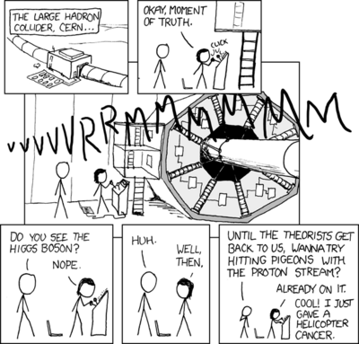

Este año se acaba el mundo (otra vez).

Bueno, ya hemos hablado sobre [el fin del mundo](/2006/04/las_maquinas_del_fin_del_mundo.html) por culpa de la tecnología. Pero esta nueva "amenaza" es bastante interesante.

La causa sería la activación del Large Hadron Collider, el acelerador de partículas más grande construido hasta ahora. El LHC es el proyecto más importante de la Organización Europea para la Investigación Nuclear (CERN).

En el CERN es donde nació la Web, que fue un proyecto propuesto por Tim Berners Lee con el fin de compartir el trabajo de los investigadores a través del mundo usando internet, pero esa es otra historia.

El CERN es el mayor centro de investigación en física nuclear del mundo, y el LHC es el experimiento más importante en ejecución en este momento.

En esencia el LHC es un muy frio tunel (a 2 grados Kelvin, 271 grados centigrados bajo cero) de unos 27 kilómetros de circunferencia, donde colisionarán protones a muy altas energías.

## **¿Para qué?**

Con el fin de encontrar y observar por primera vez una partícula predicha, pero aún no observada por el modelo estándar de las partículas elementales. Se trata del **"[Bosón de Higg](http://es.wikipedia.org/wiki/Bos%C3%B3n_de_Higgs)".**

El experimento permitirá confirmar la existencia de esta partícula elemental, y con esto saber por qué todos los cuerpos tienen masa. Por que sabemos que todos los cuerpos tienen masa, y que esta es equivalente a la energía, pero no sabemos en realidad qué es la masa, y cómo los cuerpos la adquieren.

Por esta razón que incluso un permio Nobel llegó a denominarla la "Partícula de Dios".

En realidad el LHC es una máquina extraordinaria, y peligrosa, pero no en el sentido de poder destruir el mundo. Efectivamente, la energía interior es enorme, y si algo falla se puede producir una explosión, que probablemente pueda destruir el laboratorio, pero ese no es tipo de catástrofe que andan anunciando algunos.

Siempre que el hombre se ha enfrentado a este tipo de experimentos surgen los temores más catastróficos. Cuando se probó el primer artefacto nuclear algunos especularon que la explosión de la primera bomba atómica quemaría la atmósfera. De hecho, cuando se iba a romper la barrera del sonido también se habló de la destrucción de la atmósfera.

En este caso se ha especulado que durante el experimento se podrían formar agujeros negros estables que se tragarían nuestro planeta. O que surja materia exótica, que vaporizaría a la Tierra en segundos.

Los científicos han medido los riesgos probables, y han hecho dos estudios, el primero en 2003, y uno muy reciente, que permiten descartar estos escenarios catastróficos.

La verdad es que se [han observado](http://en.wikipedia.org/wiki/Ultra-high-energy_cosmic_ray) en la naturaleza la caida de rayos cósmicos con 100 millones de veces más energía que la generada en el LHC, y nunca se ha visto que se formen agujeros negros ni hasta ahora se ha quemado nuestro planeta.

Bueno, este debe ser cómo el décimo fin del mundo que me toca presenciar, así que no me preocupo mucho, puede que termine pasando algo como [lo que describen en xkcd](http://xkcd.com/401/):

traducción

* El Large Hadron Collider, CERN
* Okey, el momento de la verdad
* VVVVVRRRRMMMMMMM
* ¿Viste el Bosón de Higgs?
* NOP
* Uh...
* Bueno entonces...
* Hasta que los teóricos vuelvan, ¿te parece que le demos a unas palomas con el rayo de protones?
* Ya estoy en eso. Cool! Ya le dí cancer a un helicóptero.
