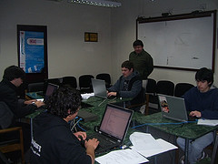
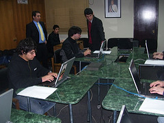
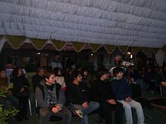

Con el fin de preparar una [nota que me solicitaron de Fayerwayer](http://www.fayerwayer.com/2008/07/olimpiadas-internacionales-de-informatica/), les hice algunas preguntas a los muchachos ganadores de la fase final de la [Olimpiada Nacional de Informática](http://www.oni.cl/).

Estas son sus respuestas y las comparte con ustedes, con el fin de que conozcan un poco más a estos muchachos. (fotografías [cortesía de la ONI en Flickr](http://www.flickr.com/photos/27507638@N08/))

**¿Cuál es tu nombre, tu edad, en que curso estás y en que colegio y ciudad estudias?**

CS: Mi nombres es : cristian andres silva lara, mi curso: 4ºto medio I del Liceo José Victorino Lastarria, estudio en : Santiago, Providencia

NL: Nicolas Emilio Lehmann Melendez, 17 años, cuarto medio colegio aleman de san felipe

VI: Mi nombre es Vicente Iglesias, tengo 16 años, y estoy en Segundo Medio en el Colegio San Ignacio El Bosque de Santiago.

JP: Juan Manuel Parraguez tengo 17 año y voy 4º Medio en el instituto san martín de curico.

**¿Cómo te enteraste de la ONI?**

CS: porque todos los dias leo fayerwayer, y como los lunes en canal 13 cable dan fayerwayertv en Estamos Conectados, yo lo veo los martes online y una de las noticias en la pagina de estamos conectados estaba la info de la ONI.

NL: En Fmat (un foro referente a la matematica) se publico un anuncio.

VI: Me enteré de la ONI leyendo el blog de UCPN.cl (la dirección es esta). Desde ahí entre a la web de la ONI y me inscribí...

JP: Lo leí por casualidad en una página de Internet.

**¿Has tenido apoyo de tu colegio para participar en este evento?**

CS: No, todo lo que hize fue por cuenta propia, yo creo que el colegio ni siquiera se entero de que yo participe, o por lo menos que existia un concurso asi para estudiantes.

NL: Para nada, todo lo he hecho en conjunto con mi familia.

VI: En mi colegio existe un grupo, llamado MediaLab, en donde se incentiva a los alumnos a desarrollar sus proyectos. Nos juntamos todos los viernes y en casi todos los recreos, así que en ese espacio pude practicar un poco para el concurso. Hay un profesor encargado casi exclusivamente en ayudarnos y guiarnos en este tipo de iniciativas, lo que es, para mi, un apoyo increíble por parte del colegio. En ese sentido estoy muy agradecido.

JP: Sí el colegio me ha dado el apoyo y las facilidades para participar en la ONI.

**¿Cómo ha sido el apoyo de tu familia?**

CS: Total, acá toda mi familia me apoyo, desde mi abuelita que no entendia mucho, hasta mi hermano que fue practicamente mi maestro en esto de programar.

NL: Muy bueno. Ellos me apoyan en todo. (Mientras no deje de estudiar para la psu).

VI: ¡La ayuda de mi familia ha sido inmensa! De partida, mis papás siempre me han apoyado, y comprendieron rápidamente que yo no era como la mayoría de los niños que disfruta jugar a la pelota, sino que, por el contrario, leer libros y hacer muchas preguntas sobre los temas más diversos (dirigidas casi siempre a ellos), así que les estaré agradecidos por siempre. Mis hermanos también, aunque sean más chicos, me apoyan en todo lo que hago, lo que es muy grato. Mi familia es muy unida, por lo que atribuyo a ellos mucho de lo que he aprendido; es esta paz que existe la me permite tener ganas de aprender y de conocer.

JP: Incondicional, siempre han estado apoyandome en todo lo que decido hacer.

**¿Qué te pareció la organización del evento? ¿Que es lo que más te sorprendió? ¿tienes alguna crítica o sugerencia?**

CS: La organizacion del evento la encontre espectacular, no dejaron ningun detalle al azar, desde que me vinieron a buscar a santiago, hasta que me vinieron a dejar, nos ofrecieron todas las comodidades posibles, y la municipalidad se porto exelente con nosotros. Lo que mas me sorprendio fue el nivel tecnologico al que esta buin, y la seguridad que otorga la ciudad, recuerdo que iba saliendo de la municipalidad y en la plaza de armas lo primero que veo es a un tipo con un macbook air sentado en una banquita, como si fuese lo mas normal del mundo, en verdad eso me dejo impresionado.No tengo ninguna critica con el evento, sugerencia, pues simplemente que se siga haciendo y que sigan por el camino del bien, seleccionando a los mejores informaticos del pais.

NL: Para una primera realización me parecio muy bien organizada. El trato que se tuvó con nosotros fue espectacular y la unica sugerencia sería que falta una mejor divulgación, pues siento que me entere por pura casualidad.

VI: La organización del evento me pareció increíble. Estaba todo muy bien preparado y previsto. Creo que el comité organizador de la ONI y la municipalidad de Buin se merecen un aplauso.
Me sorprendió, al momento de inscribirme, que fuera la Municipalidad de Buin quien organizara el evento, pero luego, en la competencia, me di cuenta del porqué: Buin es una comuna inserta en el siglo XXI,donde hay Wifi en las plazas, un sitio web estupendo (a excepción de la página de inicio, que no funciona), y es un lugar donde las iniciativas de sus habitantes son realmente tomadas en cuenta y llevadas a cabo.
Mi única sugerencia sería que hizo un poco falta de difusión, para que más gente participara.

JP: Me gustó mucho la organización y sobre todo la acogida que nos dieron, quizás una de los problemas de la oni fue la publicidad, espero que lo mejoren para la próxima olimpiada.

**¿Desde cuando que usas computadores? ¿Desde que edad navegas en internet?**

CS: Mi primer computador lo tuve en el 2000 (aca le tenian miedo al y2k, si no me equivoco ese es el virus que no recuerdo que hacia cuando el pc llegaba al año 2000) a la edad de 10 años, y bueno ese pc lo tenia conectado a internet pero por telefono.

NL: Uf computadores desde muy pequeño, debo haber tenido unos 8 años, no recuerdo que maquina era, pero el SO era windows 3.1, pero ocupaba más D.O.S. En internet partí con una conexión telefonica de 56, de esas que habia que conectarse despues de las ocho para que saliera más barato, no recuerdo que edad tenía, pero fue cuando se empezo a masificar el uso de internet en nuestro país.

VI: Uso computadores desde los siete años, más o menos, y navego en Internet desde los nueve.

JP: Desde los que tengo 8 años tuve mi primer computador, y a los 13 años Internet.

**En que lenguaje programas, y desde cuando?**

CS: Yo programo en .c desde 2 dias antes de la primera fase de la oni (21 de junio) y 1 semana antes de la fase presencial, que era cuando estaba en vacaciones de invierno,(19 de **julio**), es decir aprendi c en 7 dias, ahora yo habia tenido encontrones con el lenguaje .c en 8vo basico cuando tenia 13 años.

NL: Programo en C++ y mi historía es un poco anecdótica. Cuando era chico tuve una visión y quería aprender a programar para hacer juegos, habré estado una semana aprendiendo pascal pero despues me desanime cuando no pude usar los paquetes graficos. Así segui un tiempo sin hacer nada, hasta que aprendí HTML y luego javascript, creo que fue la epoca en que más aprendi. Ahí estuve pegado como seis meses o quizá un poco más. Despues de eso me aburrí, porque no se me ocurría una tematica para mi sitio y el año pasado retome la programción, estudié un poco de C por un fin de semana, luego me aburrí. Y este año cuando supe lo de la competencia me animé denuevo. Me conseguí un libro de c++ en internet y le dí una semana duro al asunto. Y esa sería mi historia.

VI: Partí "programando" en Flash 4 a los nueve años, en tercero básico. En cuarto básico (a los diez años) le pedí a mi papá que me comprara un libro de Visual Basic. El señor de la librería le dijo que pensaba que no era un libro para mi edad, pero él le respondió "vamos a ver que pasa", y me lo compró. En los recreos me pasaba mitad leyendo el libro, mitad jugando con mis amigos. Luego empecé a ayudar a mi papá con unos sitios web en ASP que había hecho, y entonces aprendí HTML y me atrajo automáticamente el diseño web. Ya aburrido del ASP, empecé a buscar algún lenguaje más potente y me "enamoré" de Ruby on Rails. En octavo básico aprendí C, porque siempre tuve el sueño de programar algún día un Sistema Operativo. Investigué los fundamentos de Ensamblador, pero no pude aprender nada, y, para la competencia, me dispuse a aprender C++.

JP: Pascal, hace 1 año.

**¿Que opinan tus padres sobre tu pasíón por los computadores?**

CS: Opinan que esta bien, que es la herramienta de mi futuro, aunque tambien se enojan porque llego del colegio al pc, o me levanto y lo enciendo, y a veces me quedo hasta altas horas de la madrugada en el computador.

NL: Aveces no le gusta mucho, porque dicen que paso mucho tiempo pegado al computador, mientras podría hacer algo más productivo o sano (y es verdad), pero en el fondo les gusta que me maneje un poco en este mundillo, sobre todo cuando tengo que ayudarlos a solucionar problemas.

VI: Opinan que, mientras no sea lo único que haga, esta bien.

JP: Que aveces soy algo obsesivo con el computador y dejo de lados mis deberes.

**¿Es importante que todos los niños y jóvenes tengan acceso a las TI?**

CS: Creo que todos tienen que tener acceso a las tecnologias informaticas, pero en su debido momento y con su debida madurez, recordemos que es una espada de doble filo.

NL: Por supuesto. Yo considero las TI como una herramienta para hacernos más facil la vida y cualquier persona debería tener acceso a ellas.

VI: Creo que es importantísimo que todos los niños y jóvenes tengan acceso a las tecnologías de la información, porque les permiten estar conectados con el mundo. Tenemos meternos en la cabeza que Internet no es sólo un lugar para subir fotos y chatear, sino también es la fuente de información más grande que jamás a existido en la Tierra.

JP: Sí, las tecnologías de la información ayudan al mejorar el aprendizaje.

**¿Que tal el nivel de las preguntas y problemas con que te enfrentaste en la ONI?**

CS: Debo reconocer que habian ejercicios bastante dificiles, pero creo que eso recae en que en 2 dias aprendi a programar lo basico, y en la semana de vacaciones aprendi lo demas, entonces donde yo estaba contra el tiempo aprendiendo c. creo que no aprendi lo suficiente y por eso quizas para mi fueron mas complicados los ejercicios.

NL: Aunque me costaron bastante, no creo que el nivel sea muy elevada, más bien es una falencia en mi conocimiento. Pues en esto de la programación no llevo mucho y me falta mucho que aprender, ademas de que no le dedico gran parte de mi día.

VI: En la competencia había de todo. Teníamos que resolver una relativamente fácil, y dos más complejas.

JP: Los encontré un poco difícil, pero si me hubiera preparado mejor se me habría echo mas fácil.

**¿Qué le preguntarías a los organizadores de la ONI?**

CS: si es que las volveran a realizar, y de ser asi, que cuenten con todo mi apoyo!

NL: ¿Como se hacia el problema de Petrobuin?

VI: Más que preguntarles algo, sólo me gustaría expresarles mi enorme agradecimiento por su trabajo en estas primeras olimpiadas de informática. Pero una buena pregunta, mitad en broma, mitad verdad; podría ser ¿cuándo partimos?

JP: ¿cómo encontraron el nivel de los concursantes, que expectativa tenían?

