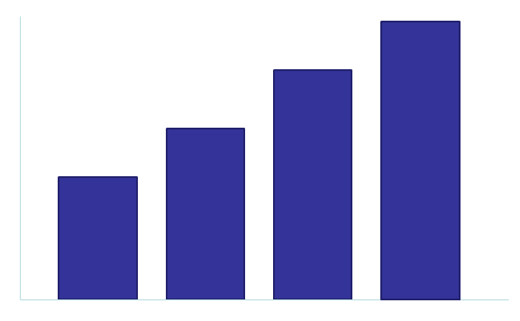
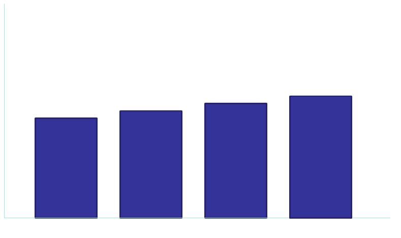
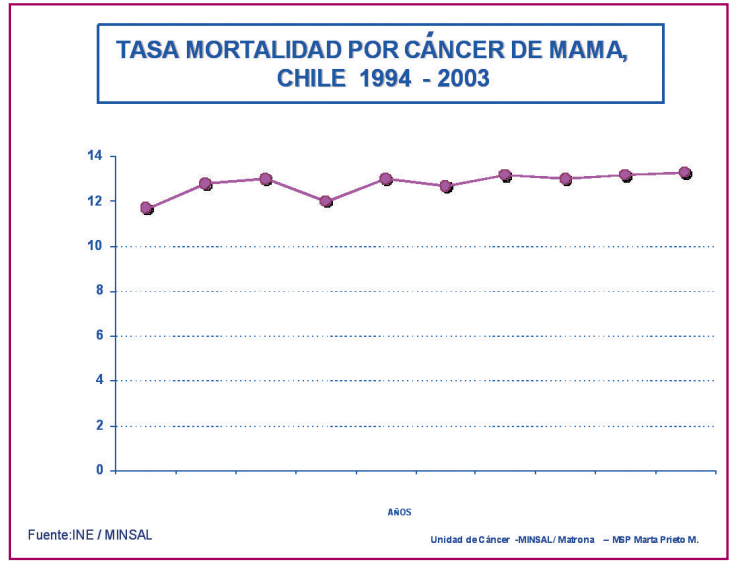
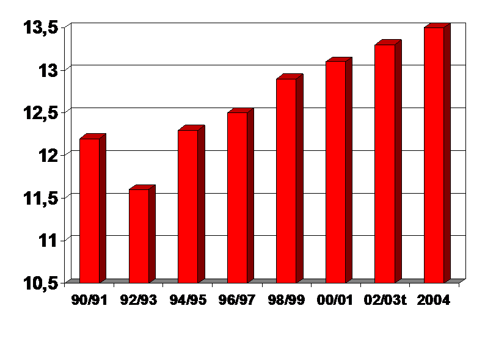

Si yo les muestro esta gráfica y les digo que representa el aumento en
la tasa de mortalidad por cancer de mamas en Chile, ¿cómo
reaccionarían?:

Y si a esto agrego que las dioxinas provocan cancer de mamas y de
próstata, entonces probablemente entren en pánico, dadas [las últimas
noticias](http://noticias.terra.com/articulo/html/act1355727.htm), y
prometan no comer nunca más una chuleta de cerdo en su vida.

Pero no deberían reaccionar así, porque este es un gráfico muy malo, de
hecho deberían por lo menos pedir que le pongan algunas etiquetas para
saber de que estamos hablando.

Bueno, acá está el gráfico, algo mejor:

¡Ah, pero esa es otra cosa!, o sea, para empezar estamos hablando de
datos de hace 5 años. Además, no sé si notaron que la escala del gráfico
está distorsionada. Hay un chiste que dice que \"para los periodistas
tres datos de cualquier cosa constituyen una tendencia\", pero estos
datos no representan tendencia alguna. ¿Cómo han sido históricamente
estos datos? y ¿qué pasa desde el 2004 en adelante?

Según el Ministerio de Salud y el Instituto Nacional de Estadísticas
([fuente](http://replay.waybackmachine.org/20080806113042/http://www.clinicalascondes.cl/area-academica/pdf/MED_17_4/SituacionEpidemiologicap_142.pdf)), la tasa de mortalidad ha sido así:

Las pido que contrásten con la gráfica presentada por el Senador Girardi
que representa los mismo datos, pero presentados de una manera distinta
(con una escala distorsionada):

Lamentablemente no tenemos datos para el 2004 en adelante, pero lo
interesante es que las proyecciones del Ministerio de Salud son a la
baja,

El tema es delicado, por cierto, y nuestra industria probablemente
tendrá que mejorar sus estándares de calidad, pero no hay que caer en el
pánico, y pensar de que tendremos una epidemia de cancer por comer
carnde cerdo.

Yo no sé cuanto afecta este tipo de noticias al mercado de la carne de
cerdo, pero considerando que en el último tiempo, dado el aumento del
costo de los alimentos, el cerdo se ha vuelto en una alternativa más
económica ante el costo de la carne de vacuno. Entonces hay que ser
claro y preciso con estos asuntos, porque afecta a mucha gente
(productores y consumidores).

La ignorancia mata, y mata de miedo. Una persona ignorante, es temerosa,
y el anumerismo es una forma de ignorancia, una persona que sabe manejar
los números, no se asustará tan fácilmente ante estas noticias, y no se
tragará noticias alarmistas tan facilmente.

Las dioxinas han estado con nosotros desde que aprendimos a usar el
fuego, y se sospecha de que pueden ser un agente cancerigeno. De hecho,
es probable que al calentar alimentos con recipientes plásticos en
nuestro microondas estemos liberando dioxinas.

Pero, ¿cuál es la probabilidad de morir de cancer por comer cerdo
envenenado por dioxina?

No tengo idea, pero el Senador Girardi tampoco, porque los estudios que
él muestra, corresponden a estudios sobre la contaminación de dioxina
debido a la exposición directa, por manipulación de pesticidas, y otras
causas. No podemos sacar conclusiones con respecto al cerdo contaminado
por dioxina.

Además, el efecto es acumulativo, pero puedes exponerte a las dioxinas
por diversos medios, no sólo por comer cerdo contaminado.

¿Vas a vivir asustado, y no comer cerdo, porque te mostraron un gráfico
mal hecho?

Mejor, relajate, y deja de calentar tu comida con envases plásticos en
el microondas, eso parece que es más peligroso
