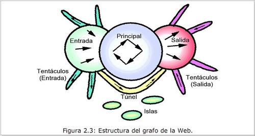

Continúo con mi lectura del libro [Cómo Funciona la Web](http://www.ciw.cl/libroWeb-NV.pdf), publicado por el [Centro de Investigación de la Web](http://www.ciw.cl/) de la Universidad de Chile.

Esta vez me voy a concentrar en la parte del libro escrita por Ricardo Baeza, "La Anatomía de la Web", un capítulo muy bueno, con mucha información y estadísticas interesantes, sobretodo cuando describe la estructura de la web chilena.

Aunque hay algunos errores menores en el capítulo, como por ejemplo, se define un terabyte como un billón de megabytes (en realidad un terabyte es un billón de bytes), los resultados expuestos son muy interesantes.

Baeza discute los distintos análisis que se han hecho en forma experimental para tratar de descubrir la estructura de la web.

Si consideramos que la estructura de la web tendrá la forma de un grafo, este representa una estructura sintetizada en la siguiente figura:

Esta estructura se extrajo del primer estudio realizado por Altavista, en 1999, considerando unas 200 millones de páginas, y unos 1.500 millones de enlaces, lo que correspondía a un 25% de la web de esa época. No tenemos estudios más nuevos, porque en realidad procesar y almacenar un grafo de este tamaño es una tarea formidable, en términos computacionales. Piensen que la web al año 2006 tenía más de 20.000 millones de páginas.

Las páginas de la izquierda (entrada) son las que referencias páginas dentro del núcleo, pero no son referenciadas de vuelta. Las de la derecha son páginas referenciadas desde el núcleo, pero sin referencias de vuelta hacia el núcleo.

Hay islas, es decir, páginas aisladas del resto. Los tentáculos son caminos sin salidas que salen desde las páginas en los extremos. Y tenemos túneles que conectan páginas de la izquierda con páginas de la derecha.

El núcleo está compuesto por unas 56 millones de páginas, a la izquierda hay 43 millones de páginas, al igual que a la derecha. En las islas tenemos unos 17 millones de páginas.

Ricardo Baeza y su equipo de investigación condujeron un estudio similar con las páginas en el dominio .cl.

Descubrieron una estructura similar. Las páginas de la izquierda corresponden a las páginas más nuevas, que no son demasiado conocidas, y que al tener éxito pasan al nucleo de la web, donde se encuentran las páginas más consolidadas. Las páginas de la derecha corresponden a páginas más antiguas, que no enlazan a las páginas del centro de la web, simplemente porque en su época esas páginas no existían.
También corresponden a páginas que no tienen enlaces externos, pero que se han preocupado de posicionarse bien mediante enlaces publicitarios. En Chile, la proporción de islas es mucho mayor que en el estudio original de Altavista.

La dinámica de formación de la web es bien violenta, de acuerdo al autor. Más de la mitad de la Web ha nacido en los últimos seis meses. De ese crecimiento, el 20% se genera a través de la replicación de sitios espejos u otro tipo de copias (incluyendo el plagio). La muerte de las páginas en internet es también alta. Se estima que la vida media de una página web es de unos tres meses.

## **La Anatomía de la Web Chilena**

El último estudio a la web chilena es del año 2006, y arrojó estos resultados:

  * La web chilena tiene 170.000 sitios, con más de 7 millones de páginas.

	
  * Un sitio promedio tiene 43 páginas, y un peso promedio de 0,304 MiB.

	
  * Hay un promedio de 1,56 referencias desde otros sitios.

	
  * Cerca de un cuarto de las páginas chilenas fueron actualizadas en el último año.

Con respecto al contenido

	
  * De todos los sitios, el 20% de los sitios más grandes contiene el 99% de la información, en la web chilena.

	
  * Cerca del 21% de los sitios web son "invisibles" a los buscadores porque utilizan tecnologías como flash y javascript.

	
  * Cerca del 5% de los enlaces ya no existe.

La tecnología usada es muy reveladora:

	
  * El 66.7% usa Apache como servidor Web, seguido de Microsoft IIS con un 32.8%.

	
  * El sistema operativo más usado es Unix, con un 48.5%, seguido por Microsoft Windows con un 38.5% y Linux con un 12%.

	
  * PHP es el generador de páginas dinámicas más usado, con un 75% de la participación.

	
  * PDF es el formato de documento electrónico más usado, con el 53%, seguido de XML con un 21%.

	
  * Los chilenos parece que somos muy amigos del open source, porque de acuerdo al estudio "Aproximadamente hay una disponibilidad del doble de **archivos** con paquetes de software para Linux que para Windows en la Web chilena".

Me gustaría saber cómo ha variado esto en estos dos últimos años, con la explosión de contenidos debido a la Web 2.0. Aunque esta información es muy interesante y reveladora.
