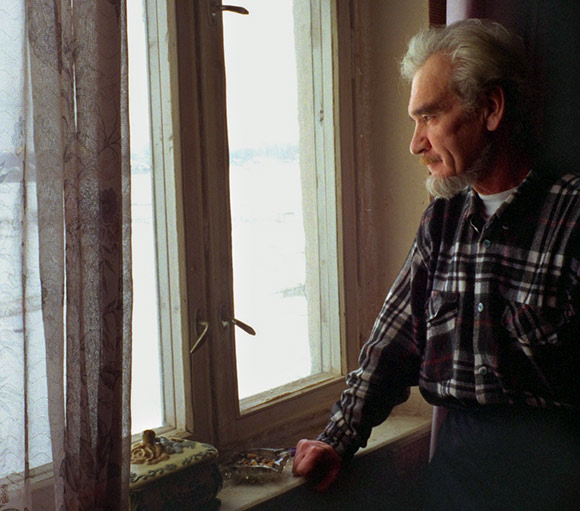

Era el 26 de septiembre de 1983, el teniente coronel Stanislav Petrov
estaba de guardia en , el bunker secreto a las afueras de Moscú que
monitoreaba el sistema de alerta temprana satelital sovietico, cuando
las alarmas saltaron poco después de la medianoche. Uno de los satélites
señalaba que los Estados Unidos habían lanzado cinco misiles balísticos
a Rusia.

Las tensiones entre los dos paises eran altas, la alarma coincidía con
el principio de unos provocativos ejercicios militares de la OTAN y
apenas tres semanas despus que los rusos derribaran un avión civil
surcoreano que había ingresado en el espacio aereo sovietico.

Las instrucciones de Petrov eran claras, si el detectaba misiles
dirigidos hacia la Unión Sovietica, el debía presionar el botón de
lanzamiento de la contra ofensiva.

> "Era como en las películas", dice Petrov, un botón rojo parpadeando
> esperando ser presionado, excepto que "en las películas, los
> especialistas de Hollywood y los directores pueden alargar esta
> pequeña situación hasta una media hora. En nuestro caso, desde el
> momento que tomara la decisón a cuando todo terminara pasarían cinco
> minutos, máximo."

Pero **él decidió no hacer nada, tenía un presentimiento de que había
algo malo**. Y no se equivocaba, meses después, **se determinó que las
señales eran el resultado de un fallo en el sistema**.

El botón de partida, que se esperaba fuera presionado por el comandante
Petrov *habría empezado una reacción en cadena irreversible en un
sistema diseñado para lanzar un contra ataque sin intervención humana.

> *"El computador principal no me preguntaría que hacer, estaba hecho de
> modo tal que no pediría ninguna confirmación. Todo estaba construido
> de modo tal que nadie pudiera afectar las operaciones del sistema".*

Lo único que podía hacer Petrov era analizar la información disponible y
decidir si la alarma era falsa, o dar la partida al computador,
siguiendo una directiva que él mismo había escrito.

**Pero, ¿por qué Petrov no presionó el botón?**

Dos ideas vinieron a su mente:

> "No podía creer que sólo nos lanzaran cinco misiles. Cinco misiles no
> barrerían con nosotros. Los Estados Unidos no tenían cinco, sino que
> miles de misiles listos para la batalla. No parecía un escenario
> considerado por la inteligencia militar anteriormente."

Elsegundo pensamiento en la mente de Petrov, y que el siempre consideraba
cuando se encontraba de turno, era este:

> "Me imaginé si yo asumiría la responsabilidad de desatar la tercera
> guerra mundial, y me dije que no, que no lo haría".

Hay que agradecer a Petrov su gesto, es un heroe desconocido de nuestro
tiempo. Pero sobretodo nos muestra que **no podemos creer ciegamente en
lo "que dice el sistema"**.

Al fin y al cabo nosotros somos capaces de pensar, y tomar decisiones
que los computadores, por muy sofisticados que sean, y por muy bien
programados que estén, aún son incapaces de tomar por nosotros.
