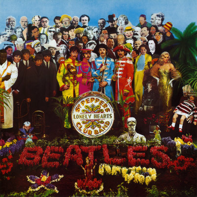

Me parece que la primera vez que escuché esta canción fue en la versión
de Joe Cocker, la misma que pueden ver en este [video en Youtube](http://www.youtube.com/watch?v=6FMq0iDX1yE).

La canción es de los Beatles, de Lennon y McCartney, por supuesto, y
originalmente la canta Ringo Starr. Sin embargo, para muchos, incluido
yo, la versión de Cocker es superior, incluido yo, pero es cuestión de
gustos.

La versión de Cocker es una innovación, con varios cambios con respecto
a la versión original, un compas de 6/8, en otra escala, con una
introducción instrumental más larga, y varios acordes distintos. A pesar
de estos cambios, sigue siendo una versión distinta del trabajo original
de los Beatles, no se le considera una creación nueva. A esto, en el
caso de la música popular, se le llama cover. Un cover es algo permitido
en la música popular, y no debe ser confundido con el plagio (de hecho,
algunos han tratado de defender sus plagios a posteriori, argumentado
que en realidad trataban de versionar, o hacer un cover).

A mi se me ocurre que este concepto de cover, es una buena forma de
explicar lo que pasa con el OpenSource o Software Libre (\*), a una
persona que no entiende de estos temas, sobre todo si trabaja para la
SCD :wink:

"OpenOffice es un cover de Microsoft Office", hablando en forma
metafórica.

Claro que en el caso de la música, para hacer un cover de una canción
debes pedir autorización del dueño de los derechos de autor del tema.
Ese es el problema con las metáforas, como diría el Dr. House, que nunca
son totalmente adecuadas.

Porque en el caso del software puedes duplicar el comportamiento, sin
afectar la propiedad intelectual del autor original, basta con que
repliques la funcionalidad externa (siempre que ésta no se encuentre
patentada), y demostrar que el código que sustenta esta nueva
funcionalidad no es el mismo que el original.

Ya hemos [comentado antes](/2007/01/plagio-de-software.html) acerca de la
(im)posibilidad de plagiar en software. He insistido en que siempre ha
sido considerado algo legítimo el poder duplicar la funcionalidad del
software, por eso que las patentes de software son tan criticadas en
nuestra industria, porque, entre otras cosas, nos limitan las
posibilidades de innovar.

Me gusta el nombre de esa canción: "con una pequeña ayuda de mis
amigos", porque tiene mucho que ver con el tema del desarrollo del
software del tipo opensource, o software libre.

Cuando hablamos de proyectos de software libre, sólo aquellos que logran
formar una comunidad que lo soporte son los que logran sobrevivir, y
tener éxito.

Esa es, en mi opinión, la gran innovación disruptiva del FLOSS. Pero esa
es una innovación de otro tipo, el software libre modifica la forma de
hacer tecnología, pero no la tecnología en sí misma. Concedo que esto
discutible, pero no quiero entrar en esta [discusión ideológica](/2006/01/el-free-software-como-ideologia.html)
o ética sobre el software libre, algo que ya encuentro aburrido a esta
altura.

Me interesa explorar hoy en día que pasa con la innovación tecnológica
que genera el FLOSS.

Mi punto es este, el software libre es como la versión de Cocker, una
innovación, grandiosa para algunos, puede a incluso superar a la versión original, pero la creación original, la
innovación disruptiva, no viene del FLOSS, porque el FLOSS es, hasta
ahora al menos, un desarrollo reactivo, ante la creación que viene desde
otros lados, principalmente el software propietario (o
[privativo](http://www.rae2.es/privativo), para ser gramaticalmente
correcto).

Creo que los grandes desarrollos disruptivos del FLOSS se han dado en el
ámbito de los lenguajes de programación (Perl, Python, PHP), pero todo
el resto, ha sido, en general, tomar ideas que fueron desarrolladas en
el ámbito propietario, con código cerrado. De hecho, esos desarrollos
son reacciones, al hecho de que esos desarrollos disruptivos tengan su
código cerrado. Esa es la causa por la que nacen estos proyectos
opensource, y su motivación principal, copiar la funcionalidad de un
proyecto realmente innovador.

Esta es [mi pata de palo](/2009/01/una-pata-de-palo-al-fuego.html) que
tenía para tirar al fuego hoy :wink:

Por cierto, este es un primer argumento, algo superficial, si quieren,
porque hay mucho más que desarrollar, fuentes que citar, estadísticas
que mostrar. Al menos tengo otra razón para argumentar por qué el FLOSS
no genera mucha innovación disruptiva (según algunos, no innova nada,
pero esa no es mi posición), pero esto pienso desarrollarlo más
adelante..

Tal como dije ayer, me gustaría aprovechar los blogs para discutir este
tema, creo que las discusiones, al final deben iluminarnos a todos.
Nunca podremos ponernos de acuerdo totalmente, pero al menos algo
aprenderemos en el proceso, todo con la ayuda de nuestros amigos ;).

(\*) Pido disculpas anticipadas a los puristas, en este escrito voy a
usar los términos opensource y software libre y FLOSS casi en forma
intercambiable, estoy totalmente consciente de la diferencia, he escrito
código abierto y normalmente he optado por licenciarlo via GPL (software
libre), pero no entremos en una discusión de distinciones a lo Richard
Stallman, trataré de no abusar de este intercambio de términos.
