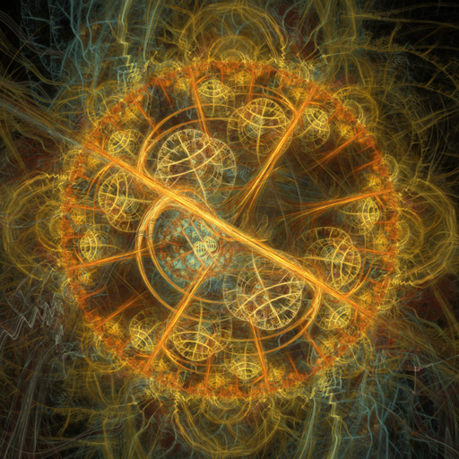
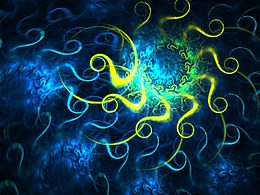
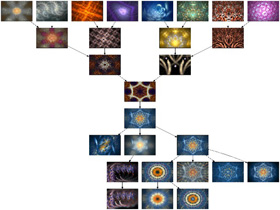
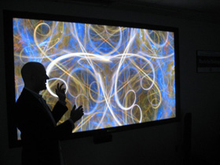
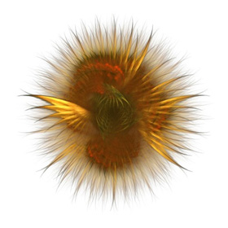

[Scott Draves](http://www.scottdraves.com/) es un artista, del mejor tipo de artistas que existen, porque [Scott Draves](http://draves.org/blog/) es un programador.

Esta es una muestra de su arte:



Las imágenes y videos de este artículo corresponden al arte generado por el trabajo de Scott Draves, son "el producto de un algoritmo evolutivo corriendo en una mente cyborg consistente en más de 60.000 computadores y personas".



En 1990 Draves presenta en su [tesis doctoral](http://draves.org/cmu-research/diss/main.html) un mecanismo de metaprogramación eficiente que permite, mediante un lenguaje de programación adhoc, crear imágenes gráficas por computadora. Este fue un primer paso para elaborar proyectos más sofisticados, como el algoritmo [Flame](http://flam3.com/), que probablemente han visto en un visualizador de multimedia, o su proyecto más ambicioso, los sueños de las ovejas eléctricas, el que podemos visualizar en este video, o pintura en movimiento:

Los sueños, corresponden al output generado por un algoritmo genético, que corre dentro de un protector de pantalla, que es [descargado](http://electricsheep.org/index.cgi?&menu=download) por voluntarios en sus computadores personales.

Cada computador contiene un rebaño de ovejas eléctricas, es decir, un conjunto de instrucciones básicas, o genes, que empiezan a evolucionar dentro de la memoria del computador.

El resultado de esta evolución, cada oveja particular, corresponde a una secuencia de imagenes que se despliega en la pantalla. Cada voluntario que participa de este proyecto, selecciona las ovejas que le resultan más agradables, y las envía a un servidor central.

Por ejemplo, esta imagen, que me recuerda mucho una pintura de Roberto Matta, corresponde al [cuadro 16 de la oveja eléctrica 135118](http://sheepserver.net/v2d6/cgi/frame.cgi?id=135118&frame=16):


Y sus [genes](http://sheepserver.net/v2d6/cgi/frame?id=135118&frame=16&genes=1), es decir, la secuencia de instrucciones que genera esta oveja comienzan con las siguientes instrucciones:

```
<get gen="202" id="135118" type="0" prog="flame" args="bits=32 jpeg=90" frame="16">
<flame time="15" size="1280 960" center="0.015578 -0.0123601" scale="816.091" rotate="0" oversample="2" filter="1" quality="500" batches="50" temporal_samples="60" background="0 0 0" brightness="22.6548" gamma="4" vibrancy="1" estimator_radius="5" estimator_minimum="0" estimator_curve="0.6">  
<xform weight="0.927541" color="0" symmetry="0.865818" spherical="0.96202" handkerchief="0.00220148" waves="0.0357786" coefs="-0.532789 -0.0319816 0.0503067 -0.486301 -0.0328148 -0.108921"/>  
<xform weight="0.059799" color="1" symmetry="0" handkerchief="0.00220148" hyperbolic="0.192404" bent="0.153923" waves="0.0357786" coefs="-0.5599 -1.46024 1.0615 -0.924253 -2.80326 3.72258"/>
```
  


Cada participante puede diseñar su propia oveja. Todo el código de Electric Sheep es opensource.

Cada oveja tiene descendencia y se emparenta con otras, conformando diversos caminos evolutivos que llevan a distintas secuencias de imágenes.



Todas estas imágenes se juntan en un servidor y van conformando una larga secuencia de imágenes en movimiento, un sueño.

El nombre Electric Sheep es una referencia a la famosa novela de Phillip K. Dick, "Do Androids Dream With Electric Sheeps?".

Scott Draves, con esto ha creado una exhibición, llamada [Dreams in High Fidelity](http://hifidreams.com/), un montaje en pantallas de alta definición (HD) de los sueños, y ha expuesto su trabajo en diversos museos y eventos. Su trabajo se expone permanentemente en el sitio web del [MOMA ](http://www.moma.org/)(Museum of Modern Art, de Nueva York).



  
Scott Dravies trabajó en investigación y desarrollo en Dreamworks (su trabajo sale acreditado en Shrek 2), y actualmente trabaja en Google en el equipo de Google Maps.



Su trabajo sigue vigente por supuesto, y es un bonito ejemplo de cómo se puede usar el poder del crowdsourcing y la nube para hacer arte.


Todas las imágenes son obra de Scott Draves, bajo licencia Creative Commons, obtenidas desde los sitios [draves.org](http://draves.org/),[electricsheep.org](http://electricsheep.org/), [hifdreams.com](http://hifidreams.com/), y [scottdraves.com](http://www.scottdraves.com/)


