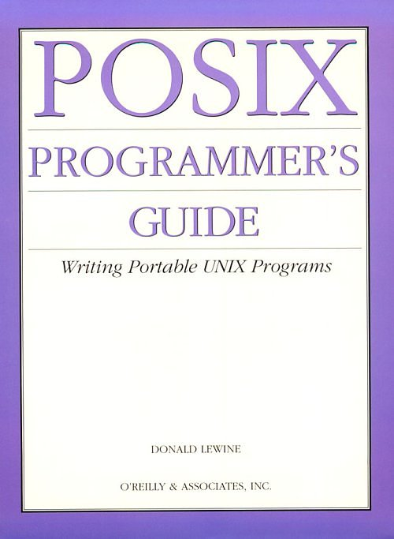
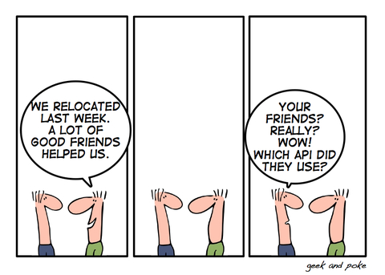

Christofer Hoff
[reclama](http://rationalsecurity.typepad.com/blog/2009/02/im-sorry-but-did-someone-redefine-open-and-interoperable-and-not-tell-me.html)
si alguien ha redefinido los términos "abierto" e "interoperable",
sin avisarle, a propósito de la siguiente afirmación:

> Singing the vcloud API standard song is very astute. It reassures all
> people already on board and climbing on board the VMware bandwagon
> that VMware is open and not looking to lock them in. Even if Microsoft
> doesn\'t join in this standardisation effort with a whole heart, it
> doesn\'t matter so long as VMware gets enough critical mass.

> Cantar la canción del estándar de la API vcloud es muy astuto.
> Tranquiliza a todos los que están a bordo del vagón de VMware porque
> VMWare es abierto, y no está buscando encerrarlos. Aún si Microsoft no
> se une a este esfuerzo de estandarización con todo su corazón, no
> importa en cuanto VM Ware obtenga suficiente masa crítica.

¡Cómo puedes afirmar que usar la API de VMWare es no cerrarse en VMWare
como proveedor (\*)!

> Standards are great, especially when they\'re yours
> -- Cristofer Hoff

[Hoff nuevamente](http://rationalsecurity.typepad.com/blog/2009/02/im-sorry-but-did-someone-redefine-open-and-interoperable-and-not-tell-me.html)

> When a vendor like VMware crafts an architecture, creates a technology
> platform, defines an API, gets providers to subscribe to offering it as
> a service and does so with the full knowledge that it REQUIRES their
> platform to really function, and THEN calls it "open" and
> "interoperable," because an API exists, it is intellectually dishonest
> and about as transparent as saran wrap to call that a "standard" to
> imply it is available regardless of platform.

> Cuando un proveedor crea una tecnología, define una API, y ofrece un
servicio que REQUIERE de su plataforma para realmente operar, y luego
llama abierto, e interoperable, a todo esto, sólo porque existe una API,
es intelectualmente deshonesto, y poco transparente.

Ese es un caso. En estos momentos, en que se está desarrollando la
industria de la nube, que no es otra cosa, que llevar a la práctica
viejas ideas, que no contaban con el soporte adecuado para
implementarlas, es claro que hay muchas intenciones de volverse en el
principal monopolista de este negocio.

Lo que hace entonces una empresa como VMWare es vendernos una píldora
roja de apertura, e interoperabilidad, cuando en realidad nos entrega
una píldora azul, y lo que quiere es establecerse como el principal
monopolista de este nuevo negocio.

Yo creo que VMWare quiere ser el
[CISCO](http://es.wikipedia.org/wiki/Cisco) de la nube, al final, toda
la infraestructura es sostenida por él, y los demás terminan quedando
atrapados en su "estándar abierto".

¿Qué es una API?

Las API no son estándares abiertos, no son parte de los principios del
código abierto. Las API no son neutrales tecnológicamente. Porque las
API son herramientas, nada más.

Veamos el caso del estándar abierto IEEE 1003, conocido como
[POSIX](http://es.wikipedia.org/wiki/POSIX) (nombre sugerido por Richard
Stallman).

POSIX es un estándar, que define una API, junto con un conjunto de
utilitarios, e interfaces de usuario para todo software que quiera ser
compatible con Unix.

La primera versión fue publicada en 1988. Uno de los grandes esfuerzos
por lograr una manera unificada de interactuar con las diferentes
varianes de Unix que competían en aquel tiempo. Comercialmente a todos
los sistemas operativos que implementaban POSIX se les empezó a llamar
sistemas operativos abiertos.

Una de las cosas interesantes, es que hasta Microsoft [Windows puede
configurarse para ser compatible con
POSIX](http://technet.microsoft.com/en-us/library/cc779522.aspx).

Mmm, van a pensar ustedes, si Windows es compatible con POSIX, entonces
¿Eduardo, estás insinuando que Microsoft Windows es un sistema operativo
abierto?

Ese es mi punto, ¿qué significa ser abierto? ¿de qué estamos hablando?

POSIX es un estándar abierto, porque nace de un organismo neutral, como
la IEEE, que pone en la mesa a todos los participantes de la industria
en ese momento, y posteriormente se unen a este estándar, o deciden
adaptarlo a su sistema, terceros, como Microsoft. Adoptar un estándar
abierto, es algo bueno, pero en otro sentido, no hace que tu producto
sea abierto.

Por otro lado, muchos proveedores de código cerrado, propietario (o
privativo), entregan, o publican APIs. La famosa API de Windows, es el
ejemplo clásico. Es lo mismo que está pasando con la API de VMWare.

Gracias a la API de Windows, publicada en los años 80 y 90, los
programadores podíamos construir aplicaciones para Windows 3.11, NT, y
XP. Microsoft garantizaba cierto nivel de compatibilidad de la API entre
una versión y otra. Pero, podía, arbitrariamente por supuesto, eliminar
ciertas funcionalidades de la API, porque son ellos los que contralan la
API de Windows.

Esto generó mucha controversia. De hecho, siempre se ha criticado a
Microsoft, porque productos como Office, tienen acceso a partes
indocumentadas de esta API, lo que constituye un factor de competencia
desleal con otros proveedores de aplicaciones para Windows.

Como verán, el hecho de que un proveedor de servicios, o aplicaciones,
publique una API no garantiza que la mantendrá en el futuro. Al
contrario, puede mejorar su posición y limitar el desarrollo de
aplicaciones, porque publicará lo que le convenga, y se guardará
aquellas porciones de funcionalidad que le permitan desarrollar un mejor
servicio.

El tener el servicio, o acceso a la API de Facebook, o de Twitter, es
bueno, y permite desarrollar un rico ecosistema de aplicaciones, pero
que se ven limitadas por la flexibilidad, o ganas del proveedor de la
API de brindar ciertos recursos.

([fuente de la imagen](http://geekandpoke.typepad.com/geekandpoke/2008/05/the-new-social.html))

Por ejemplo, tenemos una [gran brecha de seguridad en Twitter](/2009/01/para-que-necesitas-mi-clave-de-twitter.html),
producto de la manera en que está diseñada su API, y esta empresa se ha
demorado en arreglar este problema, aún existiendo soluciones hace
tiempo: OAuth.

El caso de OAuth es interesante. Esta es una API, abierta, que nació
para solucionar un problema de un servicio, twitter, pero que puede ser
aplicada en cualquier otro servicio. Al nacer desde una institución
neutral, permite asegurar que nadie intente cerrarla, o limitarla
posteriormente. Pero, cuando Twitter adopte OAuth, deberá modificar su
actual API para que opere correctamente, y de paso cerrar los problemas
de seguridad que hoy presenta. Hacer esto provocará que muchos servicios
de terceros tengan que ser reescritos, para adaptarse a este nuevo
estándar. Eso es costoso.

Publicar una API no es fácil, porque siempre se te queda algo en el
tintero, y empiezan los problemas de compatibilidad hacia atrás, las
brechas de seguridad, que hay que cerrar, etc.

Ahora tenemos una proliferación de APIs, pero eso no hace que los
servicios que publican APIs sean más abiertos. 
Las [APIs del New York Times](http://developer.nytimes.com/docs) son grandiosas, pero son propietarias. Podrían cambiar en cualquier momento, o dejar de ser
publicadas.

El que publica una API está en un dilema.

Los estándares son grandiosos, en especial cuando son tuyos, porque los
puedes cambiar, limitar, en cualquier momento.
Pero hay casos en que es más facil controlar el estándar, que en otros.

En la web, si publicas una API, debes considerar que cuando seas
exitoso, eventualmente tendrás que renunciar al contro de tu API.

Quizás por lo mismo, el creador de un servicio tenga que pensarlo mejor.

Los estándares surgen cuando una herramienta establecida, se hace tan
vital para la comunidad, que ya no puede seguir en control del que la
creó por primera vez. Una API abierta, es para el proveedor una renuncia
a su anterior monopolio, una renuncia al control que alguna vez tuvo de
la información, o de su servicio. 
Es por eso que [Dios no quiere estándares](/2008/03/dios-no-quiere-estandares.html)
:smile:

La apertura se va dando, no porque la gente publica sus API, es una
consecuencia de esto. Pero el que publica una API no está pensando,
necesariamente en los principios de apertura, como se entiende en el
código abierto. Hay muchos que publican, y controlan sus API
férreamente, y cuando se produce la presión de los clientes, por
controlar ellos la API, deciden dar vuelta atrás, o congelar, la API,
dejar de soportarla, o simplemente reinventar las reglas del juego (se
me ocurre el caso de Microsoft.Net).

Entonces, no hay que confundir las causas con las consecuencias.

El código abierto nace porque no es suficiente con contar con las APIs,
el código abierto es una postura más radical que la estandarización, la
que habla de interoperabilidad e interfaces, el código abierto exige
conocer la implementación. Porque el usuario, necesita más poder, del
que le das con la API.

[Siempre he dicho](/2005/10/el-camino-de-google.html)
que lo que importa es definir las interfaces, y los niveles de servicio,
y no necesitas conocer la implementación, como dicta el opensource o más
radicalmente, el software libre. Da lo mismo cómo se implementa una API,
si con software propietario, o con código abierto.

La [proliferación de APIs no significa el triunfo del código
abierto](/2009/03/una-api-no-es-codigo-abierto.html),
ni nada de eso. A menos que estemos hablando de otra cosa, por eso que
vuelvo a preguntar, ¿de qué estamos hablando entonces?. Al igual que
Hoff, me pregunto si alguien cambió la definición de estos términos y
nadie nos avisó.

(\*) En el sentido del vendor lock-in.
