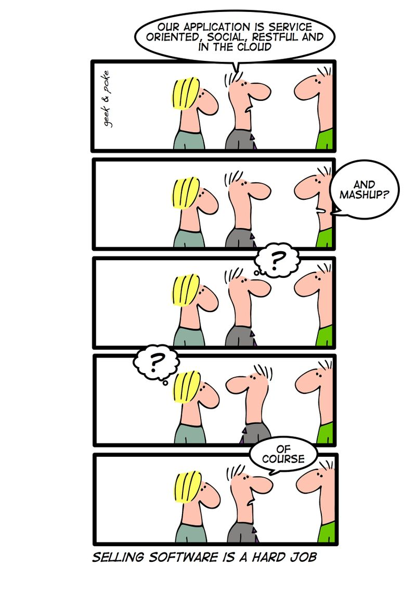
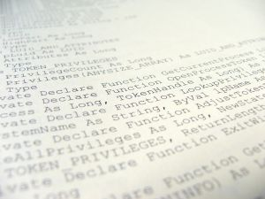
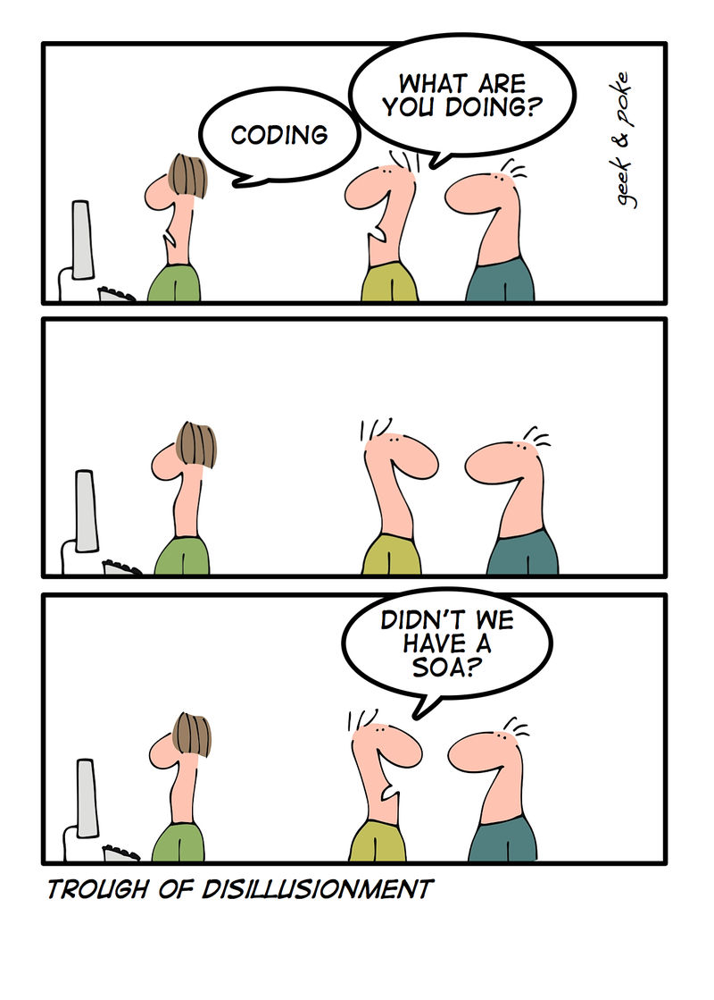

OK, hemos hablado de las APIs, sobre [lo que no son](/2009/03/de-que-estamos-hablando.html), pero no
mucho sobre lo qué son realmente, y que importancia tienen en el
desarrollo de software.

Y para que no digan que sólo nos dedicamos a criticar, vamos a aportar
con algunas ideas sobre como escribir una API.

Antes de seguir, debo decir que para mi, las interfaces REST, o las API
en el contexto de la Web 2.0, es decir, las APIque permiten hacer
Mashups, por ejemplo, no son estrictamente una API, pero esta distinción
es más bien semántica.

Pero, eso no importa mucho. Lo que sigue sirve para las APIs más
tradicionales, y también para las APIs púbicas en el contexto de
aplicaciones en la nube.

La GUI es para el usuario, la API es para el programador.

Tal como nos preocupamos de la interfaz de usuario, cuando diseñamos una
aplicación, de modo que esta sea "usable", del mismo modo, si queremos
que este sistema pueda expandir su funcionalidad, por parte de terceros,
o si queremos que estos tengan acceso a sus servicios, entonces debemos
proveer de una Interfaz para los programadores, también.

Si usted se dedica a ese esotérico arte del feng shui de la arquitectura
de información, creo que va a entender la importancia del punto
anterior. Una buena interfaz de usuario, es aquella que le facilita la
interacción con el sistema al usuario. Del mismo modo, una buena API, es
aquella que le facilita la labor al programador.

Entonces cuando diseñamos una API tenemos que ponernos desde la
perspectiva del programador. De la persona que quiere usar nuestra API
para extender las funcionalidades de nuestra aplicación, o quiere
aprovechar los servicios de nuestra aplicación, pero para integrarlos en
su propia aplicación o servicio.

¿Cuáles son los principios de diseño de una buena API?

La referencia, obligada en estos tiempos, es [esta presentación de
Joshua Bloch](http://lcsd05.cs.tamu.edu/slides/keynote.pdf), ingeniero de Google, quien nos presenta muy buenos principios de diseño de
interfaces de programación.

Lo que sigue es más o menos un resumen de su charla, con algo de mi
cosecha.

¿Estás seguro que quieres diseñar una API?

Antes de empezar, hay que tener en cuenta que es muy importante diseñar
bien nuestras APIs, por lo siguiente:

-   Las APIs terminan siendo uno de los activos más importantes para la
    compañía.
-   Los clientes invertirán fuertemente ya sea comprando tu API,
    escribiendo código para esta y aprendiéndo a usarla.
-   Con el tiempo, el costo de dejar de usar una API se puede volver
    prohibitivo.
-   Las APIs exitosas capturan clientes
-   Una mala API resulta en una sobrecarga del área de soporte externo
-   Las APIs públicas son para siempre, así que tienes sólo una
    oportunidad de hacerlas bien.
-   Las APIs terminan convirtiéndose en uno de los grandes pasivos de la
    compañía.

No es que quiera asustarlos, publicar una API es una decisión que debe
ser bien pensada.

Las características de una buena API

Bloch resume muy bien las característica de una buena API:

-   Debe ser fácil de aprender
-   Debe ser fácil de usar, incluso sin documentación
-   Debe ser dificil usarla mal
-   El código que la use debe ser fácil de leer y mantener
-   Debe ser suficientemente poderosa para satisfacer los requerimientos
-   Fácil de extender
-   Apropiada para la audiencia

El proceso de diseñar una API

¿Cómo procedemos a diseñar una API?

Primero, como siempre, hay que capturar los requerimientos, siempre con
un alto grado de excepticismo ;). Recuerda, que siempre pueden haber
mejores soluciones. Acá es importante elaborar buenos casos de uso.

Segundo, escribir una especificación, ojalá muy breve, una página es lo
ideal. Es bueno mostrar esta especificación al máximo posible de
personas. Mantener una especificación corta permite modificarla
fácilmente, tras el feedback de las personas que revisan tu
especificación. Es importante ir ganando confianza con la
especificación, y en este punto es bueno escribir algo de código, que
use la API, desarrollar casos de prueba, es importante ser lo más ágil
en este punto.

Tercero, hay que tener las expectativas claras. No se puede agradar a
todo el mundo, y por lo mismo, tienes que aceptar que es muy probable
que tu API termine desagradando a todo el mundo igualmente. Es seguro
que vas a cometer errores, sólo los años terminarán borrando estos
errores, así que debes pensar que tu API evolucionará.

Principios generales de una buena API

1.  Una API debería hacer una cosa, y hacerla bien. La funcionalidad de
    una API debe ser fácil de explicar.
2.  Una API debe ser lo más pequeña posible, pero no demasiado
3.  La implementación no debería impactar a una API. Los detalles de
    implementación confunden al usuario de una API, y por supuesto
    impiden la libertad de cambiar la implementación. Hay que tener
    cuidado de sobre especificar el comportamiento de los métodos de una
    API. Todo parámetro que se fije para sintonizar el desempeño de una
    API es sospechoso.
4.  Minimizar la accesibilidad de todo, que es otra forma de plantear el
    viejo principio de ocultamiento de la información. Recuerden a
    Parnas, alta cohesión, pero bajo acoplamiento.
5.  Los nombres importan, la API es un pequeño lenguaje. Los nombres
    deben ser, en gran medida, auto explicativos. Es importante ser
    coherente, las mismas palabras deben ser usadas en toda la API.
6.  La documentación es importante. Como dice Parnas, la reutilización
    requiere de un buen diseño una buena documentación.
7.  Considere las consecuencias en el desempeño de las decisiones de
    diseño de una API. Un buen diseño, normalmente coincide con un buen
    desempeño.
8.  Las APIs deben coexistir pacificamente con la plataforma. Es bueno
    obedecer las convenciones de nombres de la plataforma. También es
    recomendable imitar las convenciones de los lenguajes en que
    implementamos la API (con la excepción de PHP, por supuesto).

Otros aspectos a considerar:

-   No violar el principio del mínimo estupor. El usuario de una API no
    debe quedar sorprendido por el comportamiento de esta.
-   Falla rápido. Ya [hemos hablado de esto](/2008/07/deten-el-reloj-aplasta-el-bicho.html),
    las malas noticias es mejor decirlas pronto, es decir, hay que
    reportar los errores tan pronto ocurran.
-   Cuidado con sobrecargar. Hay que tener cuidado cuando sobrecargamos
    el nombre de un método, sobretodo, hay que evitar las ambiguedades.
-   Si no eres programador, pide ayuda a un programador para diseñar una
    API pública. Recuerda que las APIs son interfaces para ellos, y no
    se diseñan igual que las interfaces de usuario.
-   El diseño de API no debe ser un trabajo de una sóla persona, aunque
    escribir las especificaciones, y las ideas pueden ser de una
    persona, es bueno que te asesores por terceros, y que pruebes con
    una amplia base de usuarios.

Los chistes gráficos son cortesía de [Geek and Poke](http://geekandpoke.typepad.com/).
