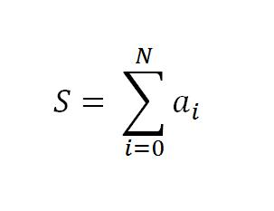

Una vez mi amigo [Pepe Flores](http://www.newtenberg.com/560/article-68138.html) dijo "los
periodistas son científicos natos que vieron cortadas sus alas en las
matemáticas del 5to básico" (\*), esta es una frase que merece una
reflexión más profunda, porque realmente hay que preguntarse que es lo
que pasa que en quinto básico se pierden tantos talentos, desviándose
hacia el lado oscuro :wink:.

Fuera de bromas, parece que algo pasa en nuestra educación que mucha
gente queda espantada con las matemáticas de por vida, estoy de acuerdo
con Pepe, y he escuchado a otros decir, que el quinto básico es un punto
crítico. Lo que es una lástima, porque las matemáticas son una parte
importante de nuestra cultura.

Aparte del evidente cambio que empiezan a sufrir los chicos a esa edad,
el principal problema en mi opinión pasa con la enseñanza de las
matemáticas.

Algo parece pasar a partir de quinto, que hace que la gente empiece a
odiar las matemáticas, esta dejan de ser misteriosas y entretenidas,
para volverse tediosas, laboriosas, y dejan de despertar interés, yo
creo que los 10 años son críticos, porque si en ese momento pierdes el
interés por las matemáticas, es difícil recuperarlo.

[Steve Yagge](http://steve-yegge.blogspot.com/) escribe, en su ahora
famosa reflexión, [Matemáticas para programadores](http://steve-yegge.blogspot.com/2006/03/math-for-programmers.html):

> 1.  Es más fácil entender las matemáticas después que has aprendido a
>     programar. De hecho, si eres un programador medianamente decente,
>     encontrarás que es bastante simple.
> 2.  Te enseñan mal las matemáticas en la escuela. Muy, muy mal. Si tu
>     mismo te enseñas las matemáticas de la forma correcta, aprenderás
>     más rápido, la retendrás más tiempo, y será más valiosa para tí
>     como programador.
> 3.  Saber un poquitito del tipo adecuado de matemáticas te habilita
>     para escribir algunos programas bastante interesantes que podrían
>     ser de otro modo demasiado difíciles. En otras palabras, las
>     matemáticas es algo que debes tomar de a poco, siempre que tengas
>     algo de tiempo libre.
> 4.  Nadie sabe todo sobre las matemáticas, ni aún el mejor de los
>     matemáticos. El campo está constantemente expandiéndose, en la
>     medida que la gente inventa nuevos formalismo para resolver sus
>     propios problemas. Y con cualquier problema matemático dado, al
>     igual que en la programación, hay más de una manera de resolverlo.
>     Puedes escoger la forma que más te guste.
> 5.  Las matemáticas es\... ummm, por favor no le digas a nadie que les
>     he dicho esto, porque no seré invitado a otra fiesta mientras
>     viva. Pero las matemáticas, bien\...., mejor susurro esto, así que
>     pongan atención: (realmente son entretenidas.)

La broma de Yegge es muy buena, porque en realidad, mucha gente cree que
las matemáticas son aburridas, y no se les ocurriría conversar sobre
este tema en alguna reunión social.

Al punto que existe una mala costumbre en nuestra sociedad, de tratar de
humanistas a todos aquellos que practiquen un conocimiento que se
encuentre totalmente ausente de cualquier traza de números o
matemáticas. Como si tener un pensamiento científico, riguroso y basado
en matemáticas te convirtiera en un alienígena, o como me dijeron una
vez, en un robot.

Yo creo que las matemáticas se pueden hacer más entretenidas, y la clave
está en lo que dice Yegge, y antes que él han insinuados grandes
expertos en educación, como [Seymour Papert](http://es.wikipedia.org/wiki/Seymour_Papert), y [Alan Kay](http://es.wikipedia.org/wiki/Alan_Kay).

> Para enseñar mejor las matemáticas, habría que enseñar primero a
> programar.

He aquí un programa: hasta cuarto básico enseñar los conceptos de
números, las aritméticas básicas y a usar adecuadamente la calculadora
para resolver problemas. Después de eso, enseñar a programar, y a través
de la programación enseñar todo lo demás.

Si usted sabe programar, no se verá intimidado ante un símbolo como
este:

porque reconocerá que esa enorme sgma corresponde a la suma de una serie
de números, y para un programador, eso se traduce en un simple e
inofensivo loop:

> suma = 0; for (int i = 0; i \<= N; i++)\
> suma += a\[i\];

Un programador sabe lo que son funciones, y será trivial enseñarle
conceptos como composición de funciones, o la regla de la cadena (que es
la manera de derivar una compsosición de funciones).

Para que vamos a hablar de geometría, que se vuelve un juego gracias a
lenguajes como [LOGO](http://logothings.wikispaces.com/), o
[SQUEAK](http://www.squeak.org/).

Por último, programar es muy entretenido, y reconfortante.

He visto a periodistas, abogados, sociólogos y educadoras de párvulos
programando, personas que confiesan que lo suyo no son las matemáticas,
son capaces de hacer programas bastante complejos.

¿Por qué no usamos eso como una herramienta para enseñar matemáticas a
nuestros niños?

Estoy seguro, que introducir SQUEAK o LOGO a niños de 10 años o más será
un aporte muy superior y efectivo que cualquier tentativa de inventar
supuestas nuevas tecnologías para la ed\
ucación (o TECs como [tan patéticamente las
llaman](http://www.lnds.net/2009/01/tec.html) nuestros genios en
educación).

Al menos en matemáticas las tecnologías en educación existen desde por
lo menos 50 años, se llaman lenguajes de programación.

(\*) Por otro lado, yo afirmo que todo lo que se necesita para ser
periodista se termina de aprender en cuarto básico.
