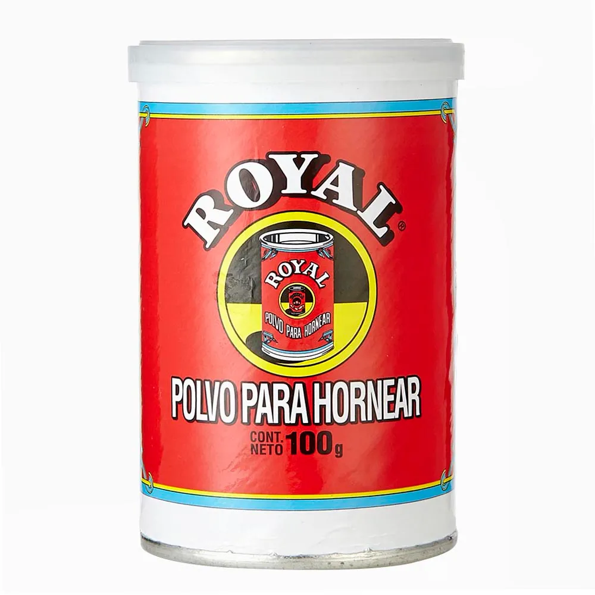

> To iterate is human, to recurse divine.\
> -- anónimo

  

> Recursividad: vease recursividad.\
> -- definición

Prueben descomprimiento este [archivo zip](http://steike.com/code/useless/zip-file-quine/droste.zip) ([acá hay un tip](http://steike.com/code/useless/zip-file-quine/) de como construir uno de estos zip recursivos).

¿Alguien recuerda el envase de Klenso? Recursivo también.

[Dubó publica](http://dubo.cl/genial/) otro ejemplo recursivo (aunque un tanto mareador) de recursividad.

  
En español lo correcto es decir recurrencia, en vez de recursividad.

[@hdur](http://twitter.com/hdur) me recuerda el tarro de Royal:

Pueden leer sobre recursividad [en este post que escribí](/2009/05/recursividad.html).

