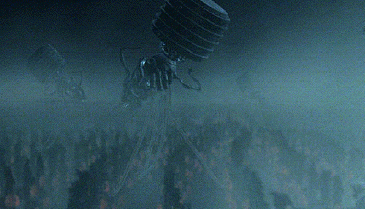

Esta es la introducción a una serie de artículos que quiero escribir,
sobre un interesante, e importante dilema que enfrentamos. Lo que sigue
es la traducción de un texto, cuyo autor voy a revelar en el segundo
artículo de esta serie.

> El desafío del nuevo ludita
>
> En primer lugar vamos a postular que los científicos logran
> desarrollar máquinas inteligentes capaces de hacer todas las cosas
> mejor de lo que los seres humanos son capaces. En ese caso
> presumiblemente todo el trabajo se llevará a cabo por vastos y muy
> organizados sistemas de máquinas y el esfuerzo humano no será
> necesario. Uno de dos casos podría ocurrir. O las máquinas son
> autorizadas a realizar todas sus trareas tomando ss propias decisiones
> sin supervisión humana, o los humanos deciden retener el control sobre
> las máquinas.

Si a las máquinas se les permite tomar sus propias decisiones, no
podemos hacer conjeturas en cuanto a los resultados, porque es imposible
adivinar cómo estas máquinas pueden comportarse. Sólo señalar que el
destino de la raza humana quedaría a merced de las máquinas. Se podría
argumentar que la raza humana nunca sería lo suficientemente tonta para
entregar toda la potencia a las máquinas. Pero no estamos sugiriendo que
la raza humana voluntariamente vaya a ceder el poder a las máquinas ni
que las máquinas tomen ese poder voluntariamente. Lo que hacemos es
sugerir que la raza humana podría fácilmente permitirse derivar a una
posición de tal dependencia en las máquinas que no tenga otra opción
práctica más que aceptar todas las decisiones de las máquinas.A medida
que la sociedad y los problemas que enfrenta son cada vez más complejos
y las máquinas cada vez más inteligentes, la gente deja que las máquinas
tomen más decisiones por ellos, simplemente porque las decisiones hechas
por la máquina traerán mejores resultados que las hechas por el hombre.
Eventualmente se puede llegar a una etapa en la que las decisiones
necesarias para mantener el sistema funcionado será de una complejidad
tal que los seres humanos serán incapaces de hacerlas inteligentemente.
En esa etapa las máquinas estarán en el control efectivo. La gente no
será capaz de desactivar las máquinas, porque será tan dependiente de
ellas que apagarlas equivaldría al suicidio.

> Por otra parte, es posible que el control humano sobre las máquinas
> pueda mantenerse. En ese caso, el hombre medio puede tener control
> sobre ciertas máquinas propias, como su automóvil o su computador
> personal, pero el control sobre los grandes sistemas de máquinas
> estarán en manos de una pequeña élite - como lo es hoy, pero con dos
> diferencias. Debido a la mejora de las técnicas la élite tendrá mayor
> control sobre las masas, y dado que el trabajo humano ya no será
> necesario las masas serán superfluas, una carga inútil en el sistema.
> Si la élite es despiadada pueden decidir simplemente exterminar a la
> masa de la humanidad. Si son más humanos, podrán utilizar la
> propaganda u otras técnicas psicológicas o biológicas para reducir la
> tasa de natalidad hasta que la masa de la humanidad se extinga,
> dejando el mundo a la élite. O, si la elite consiste en liberales de
> corazón blando, estos pueden decidir desempeñar el papel de buenos
> pastores para el resto de la raza humana. Se velará por que todas las
> necesidades materiales estén satisfechas, que todos los niños sean
> criados bajo condiciones de higiene psicológica, que toda persona
> tenga una afición sana para mantenerla ocupada, y que toda persona que
> sufre pueda tener un "tratamiento" satisfactorio para curar su
> "problema". Por supuesto, la vida será tan inútil que la gente
> tendrá que ser de manipulada biológica o psicológicamente, ya sea para
> eliminar su necesidad de ejercer su poder o habrá que "sublimar" su
> necesidad de poder con algunos pasatiempo inofensivo. Estos seres
> humanos diseñados pueden ser felices en tal sociedad, pero sin duda no
> serán libres. Quedarán reducidos a la condición de animales
> domésticos.

Por cierto, yo no soy [ludita](https://es.wikipedia.org/wiki/Ludismo), al
contrario, pero no dejó de inquietarme este texto cuando lo leí por
primera vez.

Espero que este texto sea suficientemente introductorio y les de una
idea de lo que vamos a discutir en los próximos artículos.
