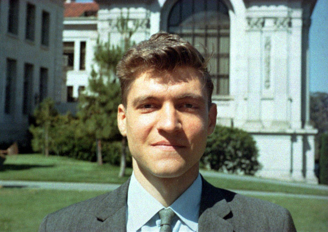
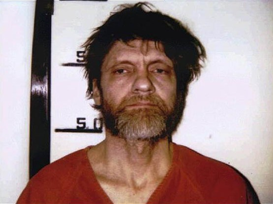

El 24 de abril de 1995, el New York Times recibe la carta del terrorista
conocido como Unabomber, indicando que el "desistiría del terrorismo"
si ese diario o el Washington Post publicaban su manifiesto, "La
sociedad industrial y su futuro".

Hasta ese momento, el Unabomber no había sido identificado por el FBI.
Este terrorista inicio sus acciones en 1978. Durante ese periodo envió
16 bombas a universidades y lineas aereas, de este modus operandi surgió
el nombre que lo hizo conocido ("UNiversity and Airline BOMber").

La decisión de publicar el Manifesto Unabomber no fue fácil, pero
permitió que su hermano David lo identificara, y llevara a su posterior
arresto en abril de 1996.

Theodore Kaczynski, era un brillante matemático, graduado en Harvard,
obtuvo su PhD en la Universidad de Michigan, especializandose en
análisis complejo, y con una tesis brillante que resolvía un complicado
problema en este campo. Posteriormente se convirtió en profesor
asistente en la Universidad de Berkeley.

A los 26 años de edad, Kaczynski decide dejar la enseñanza, y se retira
a una vida solitaria.

Esta fotografía, tomada en 1968, corresponde al joven Ted Kaczynski, de
28 años profesor asistente en Berkeley:

En el verano boreal de 1969, Kaczynski decide abandonar la vida urbana,
compra un terreno en los bosques de Montana, y construye su propia
cabaña. Aprende técnicas de sobrevivencia, y se propone vivir una vida
autónoma, con muy poco dinero, sin energía electrica, ni agua potable.

De esa época el lamenta tres cosas, su incapacidad para construir una
ballesta de caza, no haber sido capaz de elaborar sus propios mocacines
de piel de ciervo, y no haber sido capaz de hacer fuego sin
fósforos.[^1]

Su sueño de vida autónoma se frustra al encontrarse con que la sociedad
industrial termina invadiendo su espacio, al arruinar uno de sus lugares
favoritos para construir una carretera.

Es entonces que empieza a leer textos sobre sociología y filosofía
política, en especial el trabajo del filósofo [anarco-cristiano Jacques Ellul](http://flag.blackened.net/daver/anarchism/ellul/index.html).

Llega a la conclusión que es imposible reformar a la sociedad
industrial, y que el único medio de lograr un cambio es mediante la
violencia. Sobre la posibilidad de una reforma pacífica de la sociedad
industrial dice:

> "No creo que pueda hacerse. En parte debido a la tendencia humana,
> para la mayoría al menos, siempre hay excepciones, de tomar el camino
> de mínima resistencia. La gente va a tomar el camino más fácil, y
> renunciar a su automóvil, su televisor, a la electricidad, no es el
> camino de menor resistencia para la mayoría de la gente. A mi modo de
> ver, no creo que exista una manera controlada o planead de desmantelar
> el sistema industrial. Creo que la única manera de deshacerse de él,
> es si se rompe o colapsa".[^1]

Kaczynski envía su primera bomba en 1978. Dirigida a un profesor de
ingeniería de materiales, es encontrada en la Universidad de Illinois en
Chicago. El artefacto es abierto por un guardia del campus, quien se
convierte en la primera de las 26 víctima de los ataques del Unabomber.
El saldo final es de 3 muertos y 23 heridos.

Sin embargo, un incidente pudo haber sido mayor. En 1979, una de las
bombas, puesta a bordo del vuelo 444 de American Airlines, con destino
Chicago, empezó a humear, lo que obligó a un aterrizaje de emergencias.
Afortunadamente la bomba falló, de lo contrario podría haber destruido
el avión en pleno vuelo, matando a 78 personas.

En septiembre de 1996, el New York Times y el Washingto Post publican el
manifiesto del unabomber, con la idea de poder identificar a la persona
tras este escrito, y poder detener los atentados.

El FBI realmente estaba perdido en su búsqueda de este asesino. Un
perfil de 1980 calificaba al Unabomber como un hombre de inteligencia
superior al promedio, y con estudios. Hacia 1993 sostenían la hipótesis
de que se trataba de un simple mecánico de aviones.

Su hermano David inició un acercamiento gradual con la policía, después
que identificó el texto del manifiesto como obra de su hermano. Esto
llevó a la detención de Kaczynski en abril de 1996, la fotografía lo
muestra en el momento en que es fichado por la policía, después de su
arresto en su cabaña de Montana:

Comparen las imágenes del Kaczynski jovén, de 1968, y del Unabomber de
1996.

¿Qué lleva a un hombre joven e inteligente, promesa científica, genio de
las matemáticas, a este estado?

Ciertamente, la soledad es una amante cruel, y muy mala consejera.

¿Está loco Kaczynski ?

No se trata de un asesino en serie, [es mejor describirlo como un
asesino de masas](http://www.salon.com/news/1997/11/14news.html), que
afortunadamente actuaba solo. Se le diagnóstico esquizofrenia paranoide,
aunque se le encontró apto para el juicio en su contra. Aún así, su
manifesto muestra en algunos momentos una agudeza que asusta, porque
parece una posición razonable, y válida.

Dicen que los locos, después de todo, tienen la virtud de decir
verdades.

Steve Joy, fundador de Sun Microsystems, publica la revista Wired, en el
2000 un interesante artículo, [Why the future doesn´t need
us](http://www.wired.com/wired/archive/8.04/joy_pr.html) ("Por qué el
futuro no nos necesita").

En este artículo Joy cita un fragmento del manifiesto, que titula 
"[El desafío del nuevo ludita](/2009/05/el-desafio-del-nuevo-ludita.html)"
(que publiqué anteriormente).

Joy escribe que aunque las acciones de Kaczynski eran "asesinas y en mi
visión, criminalmente insanas", y aunque "tan dificil como es para mi
reconocerlo, veo algún mérito en el razonamiento de este singular
pasaje. Me siento obligado a confrontarlo".

Las ideas de Kaczynski, expuestas en su manifesto, han inspirado a los
neoluditas, y al anarco primitivismo, junto con otros grupos ecologistas
extremos.

No sé cuanto de Kaczynski está presente en los grupo anti sistema, pero
es claro que uno escucha mucho de los argumentos anti tecnología en
muchos de estos grupos y movimientos.

Al igual que Joy, me siento obligado a confrontar este pensamiento,y
para hacerlo, es importante entenderlo. Ese es el sentido de esta serie
de artículos, donde seguiremos explorando las posibles amenazas del
desarrollo tecnológico.

Quizás sea ingenuo de mi parte preguntarme estas cosas, pero después de
escuchar [la noticia de un joven anarquista que muere vícitima de un
aparato explosivo que llevaba en su mochila](http://www.cooperativa.cl/joven-fallecido-en-explosion-era-buscado-por-bombazos/prontus_nots/2009-05-22/121823.html),
no puedo dejar de preocuparme.

¿Cuantos Kaczynskis hay en nuestra sociedad?

¿Cuantos jóvenes que parten con una visión esperanzadora, y llegan a
convertirse en monstruos, a pesar de sus altos ideales?

No dejo de contemplar las dos imágenes de Kaczynski, y no dejo de
preocuparme\...

[^1]: [Entrevista a
Kaczynki](http://www.insurgentdesire.org.uk/tedk.htm), tomado del sitio
anarquista verde inglés, insurgent desire.
