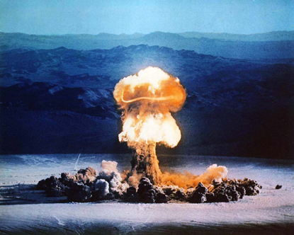

Ya hemos visto [una posición](http://www.lnds.net/2009/05/el-desafio-del-nuevo-ludita.html), en uno de los extremos, sobre que hacer ante las amenazas de la tecnología para nuestra sociedad.

En 2006 escribí este artículo, que he decidido retocar y adaptar a mi serie actual sobre los desafíos que nos impone la tecnología, creo que es apropiado publicarlo en este momento, como una suerte de puente hacia la otra propuesta extrema, sobre que hacer ante estos escenarios, en que podemos ser sobrepasados por la tecnología.

Las máquinas del fin del mundo

Leí con asombro un post de mi hermano, sobre una cadena que [anuncia el fin del mundo para el 6 de junio de este año (6/6/6)](http://www.ricardodiaz.org/archives/2006/04/fin.html) [^1].

Aparte de ser una interesante coincidencia numérica, ¿qué razones hay para pensar de que el mundo debe acabar?

## El fin por culpa de la tecnología

La verdad es que el fin del mundo ha sido anunciado muchas veces, y no sólo por fanáticos religiosos.

Las visiones apocalípticas normalmente anuncian todo tipo de cataclismos, pero, como sería de esperar, en el último tiempo, se han agregado otras causas para el fin del mundo, muchas consecuencia de nuestro abuso de la tecnología:

  * El fin del mundo por el uso de armas bioquímicas
  * Guerra Nuclear total
  * La explosión de plantas nucleares
  * [Una super máquina que crea un vórtice](http://www.lnds.net/2008/09/buuum.html), o un agujero negro
  * El calentamiento global y una nueva era glacial
  * El surgimiento de inteligencias artificiales que destruyen a su creador

Esta última "amenaza" es la que me interesa explorar ahora, porque tiene que ver con temas que domino más.

## El miedo a la inteligencia artificial

El temor al alzamiento de las máquinas ha sido discutido en taquilleras películas como Terminator y Matrix, y de una forma más elegante en "2001 Odisea Espacial".

  
Cuando se habla de esta visión de la máquina que se alza contra su creador, muchos comparan con el [Frankenstein](http://www.literature.org/authors/shelley-mary/frankenstein/), de Mary Shelley. En realidad no es lo mismo, pues la "criatura" es un humano vuelt
o a la vida (bueno, un cuarpo humano reanimado, construido a partir de partes de muchos cadaveres).

En Matrix no sabemos cómo son las "máquinas", vemos robots en forma de calamares, pero son sólo "trajes", para acomodar inteligencias artificiales. Las inteligencias artificiales viven en la matrix, un mundo virtual, que tiene un soporte físico (hardware), alimentado por la energía bioquímica de millones de seres humanos.

En Terminator la idea es similar, una inteligencia artificial surge desde una red militar (skynet), y esta intelgencia decide destruir al hombre, para eso se sirve de robots, conocidos como exterminadores, pero nuevamente, las IA están en otra parte.

John Connor sabe que debe destruir Skynet antes que se forme, porque probablemente el acceso a Skynet es imposible. Neo se dirige hacia una suerte de nucleo de la Matrix, porque sabe que aunque maten a todos los robots calamares estos no son el problema.

La brillante saga de ciencia ficción Hyperión, de Dan Simmons, nos muestra una guerra entre las IA y las personas, con una interesante variante, las IA han decidido sacrificarse a si mismas para crear IA más evolucionadas (¿seríamos capaces de sacrificarnos por la especie que nos suceda?).

En todos estos casos, ls enemigos, no vistos, son Inteligencias Artificiales que viven, flotan, por decirlo de alguna manera, en una red, o soporte físico. Son programas, algoritmos, heurísticas, en cierta manera, pero con capacidad de aprender y manipular su entorno con el fin de protegerse, por ejemplo, construyendo robots.

No son los robots los peligrosos, estos son herramientas, son las inteligencias artificiales las que comandan y las peligrosas.

Pero, por su naturaleza, las IA son escurridizas. En 2001, HAL es eliminado, pues tiene un soporte físico de fácil acceso. Pero en Matrix y Terminator, eso no es posible, y los heroes de esa sagas, deben tratar de evitar que surjan, en el caso de Terminator, o atacar el núcleo donde se encuentran, como en Matrix.

Sin embargo, la estrategia de John Connor es más astuta que la de Neo, porque John Connor quiere evitar que Skynet llegue a existir, pero se produce una interesante paradoja, que si John Connor destruye Skynet, el dejará de existir. En el caso de Matrix, sabemos que Neo no puede destruir a las IA, que la lucha es eterna y se repetirá por siempre, porque Neo en cierta manera es un mecanismo de la misma matrix para reorganizarse.

Quizás por eso Matrix como trilogía decepciona tanto. Porque esperabamos un desenlace más emocionante, pero en realidad nos llevan a un final decepcionante, en que las IA ganan. Pero también, nos queda claro, que en cierta manera, la matrix sigue dependiendo de humanos libres, una élite acaso, que viven en Zión.

Hemos visto, que sólo en 2001 el héroe logra eliminar la amenaza de la IA. HAL falla porque es incapaz en protegerse a si mismo.

## Vida Artificial

Actualmente se postula que  antes de construir una IA, debemos contruir niveles inferiores de inteligencia. Estos rdimentos de inteligencia artificial ya están disponibles, [incluso al alcance de cualquiera de nosotros](http://www.lnds.net/2009/03/el-sueno-de-las-ovejas-electricas.html). Estos rudimentos, constituyen los "instintos" de las IA.   
Sin esos instintos básicos, que le permitan a la IA desarrollarse, no será posible que esta llegue a ser conciente.

Una Inteligencia Artificial debería

  1. Preservarse
  2. Reproducirse
  3. Evolucionar

Estos tres requisitos básicos son las bases de la denominada [tesis fuerte de la vida artificia](http://vidaartificial.com/index.php?title=Vida_Artificial)l, en esencia esta dice que una vida es un modelo operacional, y si satisface las tres operaciones mencionadas, entonces da lo mismo el soporte físico de la vida.

La satisfacción de estas tres necesidades de las IAs son las que justificarían su hostilidad hacia nosotros. Efectivamente, si hacemos precaria su preservación, si tienen que competir con nosotros por los recursos, o somos un estorbo dentro de su evolución, las IAs pueden volverse contra sus creadores.

¿Dónde surgirá la Inteligencia Artificial?

Lo interesante, es saber si las inteligencias artificiales son capaces de desarrollarse fuera de su soporte físico, o antes de llegar a tenerlo, es decir, [¿pueden las IA surgir dentro de la red?](http://www.lnds.net/2008/12/y-si-las-inteligencias-artificiales-ya-e.html).

En Terminator, lo primero que se desarrolla es Skynet, una red informática, que empieza a controlar las factorías necesarias para desarrollar las armas y robots exterminadores.

Entonces, además de preocuparnos del mundo industrial, y de la amenazas de las máquinas, que principalmente son amenazas ambientales, es interesante concentrarse en  entender las amenazas que representan las tecnologías de la información, es decir, la amenaza de que se desarrolle una IA hostil.

Consideren el siguiente fragmento:

> "¿Saben lo que es barato en el siglo 21? El tiempo de computación. ¿Saben lo que es caro? El juicio humano. Ambos no son intercambiables. Los humanos son buenos entendiendo cosas, los computadores son buenos contando cosas, pero los humanos apestan al contar, y os computadores apestan al entender."  
  

> "¿Conocen los algoritmos genéticos? Tomen cualquier problema y generen 10 billones de pogramas de computador al azar y póngalos a resolver el problema. Tomen el 10% de los que lo hacen mejor, usen variantes al azar de ellos y repítanlos otras 10 billones de veces. Repítanlo 10 billones de veces más, y vuelvan en un día o dos, y descubrirán que el computador ha "evolucionado" a una extraña y bizarra respuesta que a ningún humano jamás se le habría ocurrido."
>
> "Ningún humano va a lograr escribir el código para una Inteligencia Artificial (IA). La inteligencia es una propiedad emergente de factores evolutivos, no de la planificación central. Es anarquía, no estalinismo. ¿Lo entienden?"[^2].
   
¿Que tal si el surgimiento de la inteligencia artificial es algo inevitable, y eso hace que tengamos que empezar a aceptar que tendremos que lidiar con seres potencialmente superiores a nosotros?

Hay una propuesta extrema, que nos dice lo que debemos hacer en este caso, y que al contrario de lo propuesto por los neoluditas, y los que llaman a destruir, o abandonar la tecnología, toma un camino radicalmente opuesto, y es el que vamos a explorar en el siguiente post.

[^1]: La primera parte de este post fue escrita en abril de 2006, bajo el título de [Las máquinas del fin del mundo](/2006/04/las-maquinas-del-fin-del-mundo.html).

[^2]: Cory Doctorow, "Pester Power", relato publicado en Communications of ACM, diciembre 2008.

