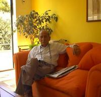

Un hombre no está completo hasta que no es padre, dice un antiguo proverbio japonés.

Ser padre no es engendrar, es mucho más que eso, ser padre es sembrar, y creo que esa es la lección de padre que aprendí de mi suegro, Pedro Venegas Yañez, quien nos dejó este domingo, a la edad de 96 años.

El Tata, como le decíamos con cariño, recitaba, hasta su avanzada edad el siguiente poema, que quiero compartir con ustedes:

> El Sembrador
>
> -- Marcos Blanco Belmonte
>
>    De aquel rincón bañado por los fulgores  
del sol que nuestro cielo triunfante llena;  
de la florida tierra donde entre flores  
se deslizó mi infancia dulce y serena;  
envuelto en los recuerdos de mi pasado,  
borroso cual lo lejos del horizonte,  
guardo el extraño ejemplo, nunca olvidado,  
del sembrador más raro que hubo en el monte.  
>  
> Aún no se si era sabio, loco o prudente  
aquel hombre que humilde traje vestía;  
sólo sé que al mirarle toda la gente  
con profundo respeto se descubría.  
Y es que acaso su gesto severo y noble  
a todos asombraba por lo arrogante:  
¡hasta los leñadores mirando al roble  
sienten las majestades de lo gigante!  
>  
> Una tarde de otoño subí a la sierra  
y al sembrador, sembrando, miré risueño;  
¡desde que existen hombres sobre la tierra  
nunca se ha trabajado con tanto empeño!  
Quise saber, curioso, lo que el demente  
sembraba en la montaña sola y bravía;  
el infeliz oyóme benignamente  
y me dijo con honda melancolía:  
--Siembro robles y pinos y sicomoros;  
quiero llenar de frondas esta ladera,  
quiero que otros disfruten de los tesoros  
que darán estas plantas cuando yo muera.  
--¿Por qué tantos afanes en la jornada  
sin buscar recompensa?-- dije. Y el loco  
murmuró, con las manos sobre la azada:  
--«Acaso tú imagines que me equivoco;  
acaso, por ser niño, te asombre mucho  
el soberano impulso que mi alma enciende;  
por los que no trabajan, trabajo y lucho;  
si el mundo no lo sabe, ¡Dios me comprende!  
»Hoy es el egoísmo torpe maestro  
a quien rendimos culto de varios modos:  
si rezamos, pedimos sólo el pan nuestro.  
¡Nunca al cielo pedimos pan para todos!  
En la propia miseria los ojos fijos,  
buscamos las riquezas que nos convienen  
y todo lo arrostramos por nuestros hijos.  
¿Es que los demás padres hijos no tienen?...  
Vivimos siendo hermanos sólo en el nombre  
y, en las guerras brutales con sed de robo,  
hay siempre un fratricida dentro del hombre,  
y el hombre para el hombre siempre es un lobo.  
»Por eso cuando al mundo, triste, contemplo,  
yo me afano y me impongo ruda tarea  
y sé que vale mucho mi pobre ejemplo  
aunque pobre y humilde parezca y sea.  
¡Hay que luchar por todos los que no luchan!  
¡Hay que pedir por todos los que no imploran!  
¡Hay que hacer que nos oigan los que no escuchan!  
¡Hay que llorar por todos los que no lloran!  
Hay que ser cual abejas que en la colmena  
fabrican para todos dulces panales.  
Hay que ser como el agua que va serena  
brindando al mundo entero frescos raudales.  
Hay que imitar al viento, que siembra flores  
lo mismo en la montaña que en la llanura,  
y hay que vivir la vida sembrando amores,  
con la vista y el alma siempre en la altura».  
Dijo el loco, y con noble melancolía  
por las breñas del monte siguió trepando,  
y al perderse en las sombras, aún repetía:  
--«¡Hay que vivir sembrando! ¡Siempre sembrando!...»
>
>   

Y para que vean que el sembrador dejó lindos frutos, les invito a [leer el homenaje](http://www.d3ne.net/?p=232) de su nieto, mi hijo..

