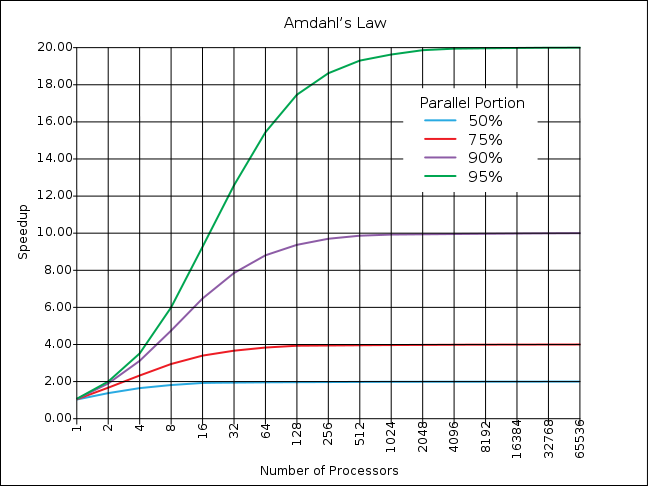

¿Cómo aumentar el desempeño de nuestros sistemas?

La respuesta a esta pregunta pasa por definir primero cómo medimos el
desempeño de nuestros sistemas. Ya hemos visto que una mala definición
de la medida de desempeño nos puede llevar a profundos errores de juicio
([¿recuerdan el problema con los kilómetros por litro de bencina?](/2009/08/enganos-numericos.html)).

Algo parecido pasa con el aumento de desempeño de nuestros sistemas de
cómputo, debido a la disponibilidad de procesadores multicore. Desde
hace un tiempo se nos viene diciendo que el truco para mejorar el
desempeño de nuestros sistemas consiste en aumentar la cantidad de
procesadores, y adoptar el paralelismo en el diseño del software que
construimos.

Si tenemos un problema que podemos paralelizar ¿cuanto mejora el
desempeño del mismo al agregar más procesadores? En otras palabras, si
un problema lo resolvíamos con 1 CPU en un tiempo T, entonces al tener
una CPU dualcore ¿deberíamos resolverlo en T/2?

 

Sabemos que no es así. Todos los que tenemos acceso a computadores
multicore hemos notado que las cosas no mejoran tanto en realidad.

Claro, mucho de nuestro software aún opera en forma secuencial. Pero
¿cuanto se gana en general en un proceso si aumentamos la cantidad de
cores? ¿Hay algún límite a nuestra capacidad de paralelizar, o el
procesamiento paralelo promete un promisorio futuro de progreso
permanente en nuestras capacidades de cómputo?

La respuesta les va a sorprender, y fue deducida por [Gene
Amdahl](http://en.wikipedia.org/wiki/Gene_Amdahl) en 1967.

## **La Ley de Amhdal**

En 1967 Amdahl propuso la siguiente observación: "la mejora obtenida en
el rendimiento de un sistema debido a la alteración de uno de sus
componentes está limitada por la fracción de tiempo que se utiliza dicho
componente".

En términos simples: "**es el algoritmo el que decide la mejora de
velocidad, no el número de procesadores**"[^1].

Si del tiempo total de un sistema una proporción P del mismo se puede
paralelizar, y esta parte se puede acelerar en un factor S, entonces la
mejora total obtenida sera: 1 / ((1-P)+P/S) [^2].

Es fácil ver que si S tiende a infinito, la mejora tiende a 1/(1-P).

Por ejemplo, supongamos que tenemos un problema y que un 30% del
algoritmo puede ser paralelizado, mientras el 70% restante sigue siendo
secuencial, la ley de Amhdal dice que al paralelizar al máximo el
programa la nueva versión será 1/(1 -0.30) = 1.4285 veces más rápida que
la versión no paralelizada.

La ley de Amhdal sigue un patrón de rendimientos decrecientes, si
graficamos esta ley obtenemos lo siguiente:

Hay que hacer notar que esta ley sólo considera el efecto de agregar más
procesadores, si además agregamos el acceso al bus de datos, la
sincronización y otros factores, el efecto es mayor.

## La falsa esperanza de la Ley de Moore

Por años muchos desarrolladores de software han descansado en la
reconfortante promesa de la [Ley de Moore](https://es.wikipedia.org/wiki/Ley_de_Moore), que dice que
aproximadamente cada 18 meses se duplica el número de transistores en un
circuito integrado.

Una esperanza expresada en la forma de un mito, de acuerdo a Alan
Kay[^3]: "El mito de que no importa cual sea tu arquitectura de
proceso, la Ley de Moore se encargará de todo".

Si los procesadores aumentan su capacidad cada 18 meses, entonces la
velocidad de los mismos se duplica también, ¿no es cierto?

Pero la velocidad de los procesadores depende de la frecuencia del reloj
interno que estos usan. El problema que al aumentar la velocidad del
reloj aparecen problemas técnicos complejos (a mayor velocidad aumenta
la disipación de calor, y se pierde la sincronía de los datos). Para
solventar estos problemas los diseñadores de microprocesadores han
decidido adoptar otras estrategias. El desarrollo de los procesadores
multi core es una consecuencia de estas limitaciones técnicas.

La idea es que se puede obtener un mejor desempeño paralelizando tareas,
sin tener que aumentar la velocidad del reloj del procesador. Con esto
los desarrolladores de procesadores pueden seguir aprovechando la Ley de
Moore, construyendo cada 18 meses procesadores con mayor capacidad de
procesamiento.

El problema es que antes los desarrolladores de software aprovechábamos
la mayor velocidad de los procesadores para compensar los problemas de
desempeño de nuestros algoritmos o diseños.

Con frecuencias de reloj que se mantienen casi iguales durante el
tiempo, ya no podemos esperar ayuda de la Ley de Moore, la esperanza se
derrumba.

La propuesta que viene desde el hardware es simple: **paralelizar**.

¡Cómo si fuera tan sencillo!

La Ley de Amhdal nos dice que no importa la cantidad de procesadores (o
cores) con que dispongamos, la ganancia está limitada por aquella parte
del algoritmo que no se puede paralelizar.

Esto nos da otra perspectiva
sobre [la supuesta crisis del multicore](/2008/11/esta-en-crisis-el-desarrollo-de-software.html)

Ahora disponemos de más procesadores, pero como hemos visto, contar con
más núcleos en nuestros procesadores tiene un límite.

Se está investigando profusamente sobre cómo usar los multicore que nos
entregan estos procesadores nuevos, hay detrás de esto motivaciones
económicas, de negocio. Compañías como Intel están financiando programas
de investigación que permitan aprovechar las nuevas capacidad de
paralelización con que contamos.

Pero como hemos visto, las verdaderas ganancias están por otro lado:
crear mejores algoritmos.

El desafío, como siempre, está en el lado del software, no del hardware.

Este tema se sigue discutiendo en:

[El Problema de Parelelizar 2](/blog/2009/09/el-problema-de-paralelizar-2.html)

[El Problema de Paralelizar 3](/blog/2009/09/el-problema-de-paralelizar-3.html)

## Referencias:

[^1]: Wikipedia: [La ley de Amhdal](httpss://es.wikipedia.org/wiki/Ley_de_Amdahl).

[^2]: [Deducción de la Ley de Amhdal](https://jpscarpa.googlepages.com/leydeamdahl).

[^3]: [A conversation with Alan Kay](https://queue.acm.org/detail.cfm?id=1039523).
