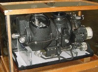
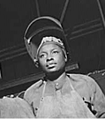

La Segunda Guerra Mundial esta llena de historias de mujeres que trabajaron tomando el rol de los hombres, que se encontraban combatiendo. Esta es una de esas.

En 1940 Alemania era el país lider en óptica, con fábricas como la de [Carl Zeiss](http://en.wikipedia.org/wiki/Carl_Zeiss_AG)en Jena and of [Ernst Leitz](http://en.wikipedia.org/wiki/Ernst_Leitz) en Wetzlar. No había nada mejor fuera de Alemania, y esto era crucial para desarrollar instrumentos ópticos usados, por ejemplo, en los bombardeos de precisión. Es por esto que el ejercito alemán consideraba a la óptica como uno de sus recursos estratégicos.

En 1940 los militares alemanes consideraban que a los aliados les tomaría una generación preparar "artesanos ópticos" capaces de producir los visores de bombardeo de alta calidad como los de elos.

A principios de 1940 Estados Unidos contaba con un prototipo de visor de bombardeo de calidad, el "Norden", desarrollado por el ingeniero holandés Carl Norden. Lo malo es que no contaban con una industria óptica que pemitiera producir los miles de visores necesarios para las necesidades de la guerra.

De acuerdo a [Peter Drucker](http://es.wikipedia.org/wiki/Peter_Drucker), en esa época el jefe de la divisón Cadillac de General Motors, Nicholas Dreystadt aceptó el contrato de defensa para la producción en serie del visor de bombardeo Norden. Todo el mundo sabía que esta labor requería de mecánicos con un alto grado de habilidad. Durante la guerra no había gente para emplear, menos mecánicos de alto nivel.

Este es el relato en las palabras de  Drucker:

> La única mano de obra que se encontraba disponible en Detroit eran viejas prostitutas negras. Ante el horror de todos Nick Dreystadt contrató a 2.000 de ellas. "Pero contraten a sus cabronas también", dijo. "Ellas saben como administrar a las mujeres". Muy pocas de estas mujeres podían leer y el trabajo requería seguir largas instrucciones. "No tenemos tiempo para enseñarles a leer", dijo Nick, "y pocas aprenderán de todas maneras." Así que fue al mesón de trabajo y por si mismo construyó una docena de visores. Cuando supo como hacerlo, tomó una cámara y filmó el proceso. Montó los cuadros de la película separadamente en un proyector y los sincronizó con un diagrama de flujo. en el cual una luz roja se encendía para mostrarle a la operadora lo que ya había hecho, una luz verde para indicarle lo que tenía que hacer a continuación, y una amarilla para mostrarle lo que tenía que revisar antes de tomar el siguiente paso. Este es el procedimiento estándar actual para un proceso masivo de ensamblado; fue Dreystady quien lo inventó. En pocas semanas estas operarias analfabetas y no calificadas fueron produciendo un mejor trabajo que los mecánicos altamante calificados habían hecho antes.

Lamentablemente esta historia no tuvo un final feliz, al finalizar la guerra, Dreystadt tuvo que enfrentarse al poder de los sindicatos, y tuvo que despedir a todas las mujeres que trabajaron en la planta de construcción de visores Norden.

