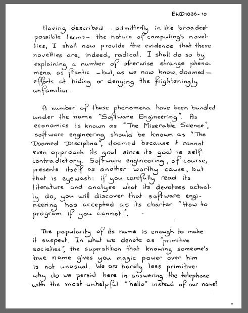

Pienso que uno de los mejores argumentos en contra de la noción de
crisis de software fue dada indirectamente por 
[Edsger W. Dijkstra](http://www.lnds.net/2009/07/calidad-correccion-y-elegancia-una-entre.html),
en su charla de 1988 "[ON THE CRUELTY OF REALLY TEACHING COMPUTIN
SCIENCE](http://www.cs.utexas.edu/users/EWD/ewd10xx/EWD1036.PDF)"

> Cierta cantidad de estos fenómenos han sido agrupados bajo el nombre
> de "Ingeniería de Software". Así como la economía es conocida como
> "La Ciencia Miserable",\* la ingeniería de software debería ser
> conocida como "La Disciplina Condenada"**, condenada porque ni
> siquiera puede acercarse a su meta, dado que la misma es en sí misma
> contradictoria. La ingeniería de software, por supuesto, se presenta a
> sí misma como otra causa valiosa, pero es un colirio: si lee
> cuidadosamente su literatura y analiza lo que realmente hacen quienes
> se avocan a ella, descubrirá que la ingeniería de software ha adoptado
> como su estatuto \*"Cómo programar si usted no puede"**.
>
> \...

> La práctica está impregnada de la confortable ilusión de que los
> programas son simplemente dispositivos como cualquier otro, la única
> diferencia que se admite es que su fabricación pueden requerir un
> nuevo tipo de expertos, a saber: programadores. Desde allí hay sólo un
> pequeño paso hasta medir la "productividad del programador" en
> términos de la "cantidad de líneas producidas por mes". Esta es una
> unidad de medida muy costosa, porque anima a escribir código insípido,
> pero hoy estoy menos interesado en qué tan tonta es una unidad, aún
> desde un punto de vista puramente empresarial. Mi punto hoy es que, si
> deseamos contar líneas de código, no deberíamos verlas como "líneas
> producidas", sino como "líneas gastadas": el sentido común actual
> es tan tonto como contabilizar esa cuenta del lado erróneo del
> balance.
>
> Además de la noción de productividad, también el control de calidad
> sigue estando distorsionado por la confortable ilusión de que funciona
> con otros aparatos como lo hace con los programas. Han pasado ya dos
> décadas desde que se señaló que el testing de programas puede
> convincentemente demostrar la presencia de errores, pero nunca puede
> demostrar su ausencia. Después de citar devotamente este comentario
> bien publicitado, el ingeniero de software vuelve al orden del día y
> continúa refinando sus estrategias de testing, tal como el alquimista
> de antaño, quien continuaba refinando sus purificaciones
> crisocósmicas.
>
> Un profundo malentendido es luego revelado por el término
> "mantenimiento de software", como resultado del cual muchas personas
> siguen creyendo que los programas -e inclusive los mismísimos
> lenguajes de programación- están sujetos a desgaste y ruptura. Su auto
> también necesita mantenimiento, ¿no es así? Es famosa la historia de
> la empresa petrolera que creía que sus programas PASCAL no durarían
> tanto como sus programas FORTRAN "porque PASCAL no estaba
> mantenido".
>
> En el mismo sentido debo llamar la atención sobre la sorprendente
> facilidad con que se ha aceptado la sugerencia de que los males de la
> producción de software de deben, en gran medida, a la falta de
> "herramientas de programación" apropiadas. (Pronto aparecería la
> frase "banco de trabajo del programador".) Nuevamente, la chatura de
> la analogía subyacente se debe a la Edad Media. Las confrontaciones
> con las insípidas "herramientas" del tipo de "animación de
> algoritmos" no ha suavizado mi juicio; por el contrario, ha
> confirmado mi sospecha inicial de que estamos tratando principalmente
> con otra dimensión del negocio del aceite de serpientes.

> [Texto completo en castellano](http://www.smaldone.com.ar/documentos/ewd/sobre_la_crueldad.html)
> disponible en el sitio de [Javier Smaldone](http://www.smaldone.com.ar/).

Lo que no se entiende aún es que el desarrollo de software no es como la
construcción de objetos, y esta naturaleza fundamentalmente distinta es
la que lleva a errores al tratar de definir el éxito o fracaso de un
proyecto de desarrollo de software.

