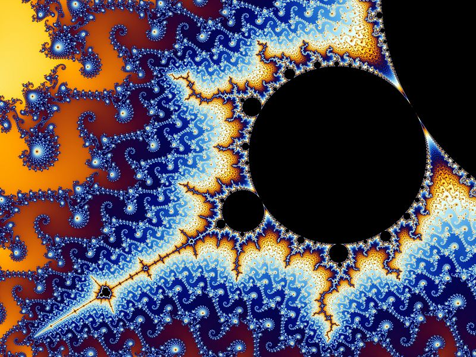

Cuando decimos que algo es **complejo** queremos sugerir que es el
resultado inevitable de combinar los elementos, y que esto no implica
una falta o un fallo, como cuando decimos que "una receta es
compleja".

Por otro lado, **complicado** lo aplicamos a lo que presenta gran
dificultad para entender, resolver o explicar, por ejemplo "un
complicado proceso judicial".


Miren esta imagen:



Indudablemente esta es una imagen compleja. Si no la conocen, esta
imagen corresponde al famoso [Conjunto de
Mandelbrot](http://es.wikipedia.org/wiki/Conjunto_de_Mandelbrot), un
fractal, una figura geométrica que tiene la particular propiedad de la
autosimilaridad, si hicieramos un zoom en algunas de las partes de la
imagen obtendríamos imágenes tan hermosas y complejas como esta. Pueden
verificar lo que digo viendo [este video en
youtube](http://www.youtube.com/watch?v=gEw8xpb1aRA), que explora el
conjunto de Mandelbrot.

Claramente es una imagen bastante compleja, con infinitos detalles.

Y sin embargo, los matemáticos nos dicen que la información contenida
en la imagen de arriba es esencialmente cero.

El conjunto de Mandelbrot, que da origen a la imagen de arriba, y al
video que les señalé, se puede expresar en menos de 140 caracteres (en
un tweet de 48 caracteres):

*M*= C**{z: | (z+(z+(z+(\...+(z+z**2**)**2**\...)**2**)**2**)**2**)**2 \> 2}


Esa es una expresión complicada para una persona que no sepa mucha
matemática. Pero no es muy compleja, de hecho un programa que calcule el
conjunto de Mandelbrot no toma más de unas 50 lineas de código
(dependiendo del lenguaje)[^*].

La imagen original de arriba tiene 800 x 600 pixeles, cada pixel tiene
24 bits de información, es decir, si almacenaramos la imagen en un
archivo tendría 11.520.000 bits. Sin embargo el progarma, escrito en C,
que describa esa imagen podría ocupar unos 64.000 bits.

El matemático ruso Kolmogorov inventó el concepto de Complejidad
Descriptiva, o Entropía Algoritmica para tratar de medir los recursos
computacionales necesarios para describir un objeto.

Por ejemplo, consideren estos dos cadenas de letras ([tomado de
wikipedia](http://en.wikipedia.org/wiki/Kolmogorov_complexity#Chaitin.27s_incompleteness_theorem)):

```
    abababababababababababababababababababababababababababababababab

    4c1j5b2p0cv4w1x8rx2y39umgw5q85s7uraqbjfdppa0q7nieieqe9noc4cvafzf
```

Ambas tienen el mismo largo, 64 caracteres, sin embargo, la primera
cadena se puede expresar como: "ab 32 veces", con sólo 11 caracteres.
Sin embargo, para la segunda cadena pareciera no haber otra forma más
corta que escribirla directamente.

Kolmogorov diría que la primera cadena es menos compleja que la segunda.

Ahora, volvamos al conjunto de Mandelbrot. Resulta que el programa que
permite calcular los puntos del conjunto tiene un parámetro, que indica
la cantidad de iteraciones necesarias para determinar el siguiente pixel
a dibujar. Resulta que si elegimos dibujar un segmento más detallado del
conjunto de Mandelbrot, es decir, hacer un zoom, este parámetro debe ser
mayor, lo que implica que el computador consume más tiempo y recursos
para generar el detalle de una parte más interna del conjunto.
Claramente, la definición de complejidad algoritmica, tomada como el
largo del programa no parece reflejar adecuadamente el uso real de la
CPU en este problema.

La pregunta es, si esta definición de complejidad es adecuada. Porque de
acuerdo a la noción de Kolmogorov el conjunto de Mandelbrot no es una
cosa compleja, y ya hemos visto que en términos de gasto computacional
(gasto de energía, y de tiempo de proceso) no pareciera ser simple.

Por otro lado, un objeto aleatorio, como la cadena
"4c1j5b2p0cv4w1x8rx2y39umgw5q85s7uraqbjfdppa0q7nieieqe9noc4cvafzf",
tienen una complejidad de Kolmogorov altisima (o máxima) pero no es una
cosa muy interesante de estudiar.

Un televisor mostrando sólo ruido estático no es muy interesante, al
final sólo es simple ruido, pero ese ruido aleatorio es complejo en
términos informáticos, si seguimos la idea de Kolmogorov.

Esta noción de complejidad no es satisfactoria, y hay mucho esfuerzo de
investigación por encontrar una definición matemática de complejidad que
capture nuestras nociones intuitivas de complejidad.

Los quiero invitar a explorar el estudio de la complejidad, algo que,
como veremos en los próximos artículos, ha sido una tarea bastante
complicada. :)

Notas:

[^*]: para complicar las cosas en la expresión z son números complejos
(no pude evitarlo, disculpen ;)
