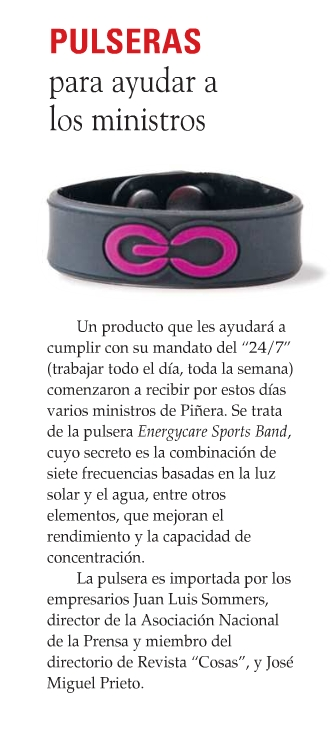

 
> Hace un par de años nos quejábamos [del analfabetismo digital de un
> ministro](/blog/2008/05/el-analfabetismo-digital-del-ministro.html),
> ahora parece que estamos ante una situación peor. Leo en [el blog de
> Luis Ramirez](http://luisramirez.cl/blog/?p=3109) esta perla:

¿No les preocupa que nuestras autoridades caigan en estas muestras de
ignorancia?

Y antes que me salgan con la explicación, seudo científica, de las
propiedades de las 7 frecuencias en el holograma de la pulserita famosa,
permítanme transcribir esta explicación, tomada de 
[este post](http://cnho.wordpress.com/2009/11/16/pulseras-power-balance-mas-charlataneria-pseudocientifica/)
sobre los fundamentos seudo científicos de este aparatito mágico:

> ¿Estos señores de Power Balance saben que demonios es una frecuencia?.
> Según ellos, parece que la "frecuencia" es algún tipo de emisión
> beneficiosa, algo así como una "energía", pero más moderna. Algo que
> además se puede "incrustar" en un holograma, ahí es nada\...
>
> Pues va a ser que no. La "frecuencia" no es ninguna emisión
> ultratecnológica. La frecuencia simplemente es una magnitud física,
> que señala la tasa de repetición de un fenómeno en una unidad de
> tiempo. Así, podemos decir que la frecuencia cardiaca de un humano
> sano es de 60 a 80 pulsaciones por minuto, que meteoritos de un metro
> de diámetro chocan contra la Tierra con una frecuencia de uno al año o
> que el motor de un vehículo se mueve a 4.000 revoluciones por minuto.
>
> La fórmula general para calcular la frecuencia de un evento consiste
> en medir el tiempo entre dos repeticiones y hallar su inverso:

> De esta forma, si un evento se repite cada 0,5 segundos, su frecuencia
> será 1/0,5 = 2 ciclos por segundo.
>
> \...
>
> En el caso de las ondas (como las ondas en el agua, aire o la
> radiación electromagnética), la frecuencia es el número de
> oscilaciones (vibraciones completas) que efectúa cualquier partícula,
> del medio perturbado por donde se propaga la onda, en un segundo. Una
> vibración rápida corresponde a una frecuencia elevada, mientras que
> una vibración lenta corresponde a una frecuencia baja.

> ¿Que significa entonces eso de "incrustar una frecuencia"? Pues
> evidentemente, una total incorrección, por no decir un completo
> disparate, equivalente a "incrustar una longitud" o "incrustar un
> volumen". Cuando decimos que algo "emite una frecuencia", en
> realidad lo que se emite es una radiación, un sonido o una vibración
> de cualquier tipo, la cual tendrá unas características determinadas:
> una amplitud, una longitud de onda y una **frecuencia**.
>
> Por eso, no se pueden emitir o grabar frecuencias "a secas", de
> igual forma que no se pueden emitir o grabar longitudes o volúmenes
> "a secas".

Niños ¡aprendan ciencia, así no los engañarán con toda esta
charlatanería!

La verdad es que estas pulseras y los que las venden deberían ser
denunciados por fraudes a las autoridades\... no wait!
