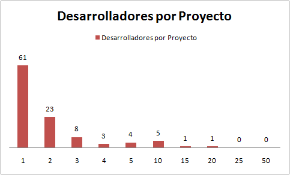
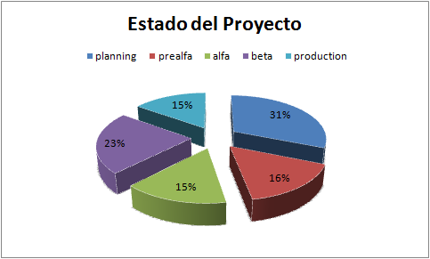
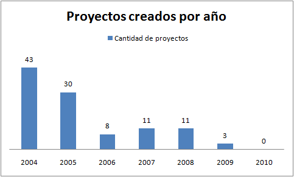
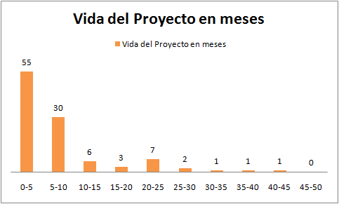

"Talk is cheap, show me the code" (hablar es barato, muéstrame el
código) [dice Linus Torvalds](http://lkml.org/lkml/2000/8/25/132).

Recientemente Marco Zúñiga ha levantado un desafío, un [test de blancura
para la comunidad open source
chilena](http://blog.maz.cl/2010/09/test-acido.html), la idea es poner a
prueba lo que dice Linus Torvalds, si en realidad estas comunidades
pasan [del discurso a la acción](/blog/2010/09/lo-que-cuenta-es-la-accion-no-las-palabras.html).

Resulta que hace unas semanas atrás decidí investigar los repositorios
open source que tenemos en el país, principalmente motivado por un
[curioso incidente](http://groups.google.com/group/liberaciondigital/browse_thread/thread/bc1398b6f9524682/?pli=1)
ocurrido con el sitio ChileForge (más antecedentes
[acá](http://www.malware.cl/?p=7364)). Así que decidí revisar que es lo
que había pasado con esta comunidad, y emprendí un  análisis del
repositorio ChileForge, A continuación comparto con ustedes el
resultado. Creo que es un buen antecedente para aportar al debate sobre
la viabilidad del open source en Chile, o al menos para los que están
interesados en cobrarle la cena a Marco, ya sabrán donde no buscar ;)

Descripción del Sitio, tomada desde su home page:

> *"ChileForge es un proyecto impulsado por el \_*Departamento de
> Ciencia de la Computación de la Pontificia Universidad Católica de
> Chile, que busca aportar a la difusión y desarrollo de software en
> Chile, bajo el modelo Open Source."\_
>
> Fecha Cierre de este análisis: 16 de septiembre de 2010

**Resumen**: el 52% de los proyectos ha liberado algún producto, lo que
no garantiza que sea algo usable. El promedio de desarrolladores por
proyectos es de 2.2. Desde hace 6 meses que no hay actividad en el
sitio. Sólo 1 proyecto muestra actividad en el último año, sólo 2
proyectos muestran actividad en los últimos dos años.

Antecedentes:

**Usuarios Registrados**: 1.096

**Proyectos Registrados**: 193

**Proyectos Catalogados**: 106

El análisis se continuó sobre la base de los 106 proyectos catalogados.

**Desarrolladores**: la idea es ver la participación por proyecto, para
determinar que tan comunitarios son los proyectos.

-   Total de Desarrolladores: 235

-   Tamaño promedio del equipo: 2.22 \[desarrolladores / proyecto\]

-   El 58% de los proyectos tienen sólo 1 miembro

-   El 22% de los proyectos tienes sólo 2 miembros

-   La distrubución de desarrolladores por proyecto es la siguiente:

Este gráfico muestra la distribución:

El eje vertical es la cantidad de proyectos, el horizontal es la
cantidad de desarrolladores (miembros) inscritos en cada proyecto.

Los dos proyectos con más usuarios son:

-   Sistema Centro Médico 2005
    ([http://chileforge.cl/projects/tec](http://chileforge.cl/projects/tec/))
    con 16 miembros, creado el 7 de abril de 2005, y cuyo único archivo
    liberado corresponde a una clase en PHP para enviar mensajes usando
    SMTP (importada de una versión anterior del proyecto
    [PHPMailer](http://sourceforge.net/projects/phpmailer/) en
    sourceforge).

-   Rizoma (<http://chileforge.cl/projects/rizoma/>), tiene 15 miembros
    registros, pero es un proyecto que decidió migrar a
    [Savannah](http://savannah.nongnu.org/p/rizoma), al parecer por
    problemas de soporte con ChileForge. Este proyecto al parecer sigue
    vivo (tienen un [blog](http://www.rizoma.cl) donde informan que la
    versión 1.0 fue liberada para la FLISoL Santiago 2009).

**Madurez de los Proyectos**

El sitio permite catalogar los proyectos según el grado de madurez del
proyecto, los estados posibles son: Planning (etapa de planificación),
pre alfa (supongo que en este estado habrá algún prototipo), alfa (una
primera versión sin mucha depuración), beta (con algunos errores, los
usuarios ya empiezan a usarlo), production/stable (el proyecto ya está
en producción), y mature (maduro, es decir, ya el producto se sostiene
sólo y se aplican mantenciones, o se planifica nuevas versiones). La
distribución se resume en el siguiente gráfico:

La clasificación es dudosa, por ejemplo, hay proyectos que han liberado
código, que se ve bastante usable, pero aparecen como en etapa planning.
En un caso ([xanubis](http://chileforge.cl/projects/xanubis/)), el
proyecto aparece catalogado como Production/Stable, sin embargo no ha
liberado ningún archivo, y sólo tiene un mensaje que dice _"Ya casi
comenzamos el Proyecto Xanubis"_.

Lo interesante es ver cuantos proyectos han liberado algún producto
(archivos descargables). Para esto contamos aquellos proyectos que
tenían disponible algún archivo para descargar. Sólo el 52% ha liberado
algún producto. Pero, insisto que la calidad de estos entregables es
dudosa, habría que descargar los archivos y analizarlos para dar un
diagnóstico más preciso de la madurez de los proyectos, de lo poco que
revise, puedo decir que casi siempre eran archivos que estaban en su
primera versión, o simplemente algunos archivos anexos (como el caso
mencionado arriba).

**Control de versiones**: 7  proyectos (7%) no tienen control de
versiones de ningún tipo, 86 proyectos (81%) tienen configurado CVS,
pero los repositorios juntan telarañas, pues nunca se han usado. De los
que quedan (13), el uso es mínimo, con no más de 2 o 3 commits por
proyecto. En este punto donde más se nota la inmadurez técnica de la
comunidad ChileForge.

**Actividad**

El 41% (43) de los proyectos se crearon el año 2004, el 28% en 2005. La
siguiente es la distribución:

Para medir el tiempo de vida del proyecto medimos la cantidad de días
desde que fue creado el proyecto, hasta que fue liberado la versión más
reciente de cualquier entregable del proyecto. Por ejemplo, el proyecto
de mayor tiempo de vida (reqadmin), fue inscrito el 30 de mayo de 2005,
ha liberado 6 archivos, el último corresponde a la versión 0.4 beta con
fecha 8 de junio de 2008, entre la fecha de inscripción y el último beta
han pasado 1.105 días (37 meses).

Usando este criterio, el tiempo de vida promedio es de 7,6 meses, la
mediana es de 4.5 meses. La distribución del tiempo de vida de los
proyectos se muestra en este gráfico (expresada en meses):

La altura de las barras representa la cantidad de proyectos que caen en
el rango. Los rangos son de 5 meses. Por ejemplo, la primera barra
indica que 55 proyectos tienen una vida de entre 0 a 5 meses.

El otro parámetro es ver cuanta actividad ha tenido el proyecto en los
últimos meses, en este caso lo que medimos es la fecha del último
producto liberado (el mismo parámetro usado para medir la "vida" del
proyecto). En este punto los datos son desalentadores:

-   Actividad en los últimos 6 meses:  ningún proyecto presenta
    actividad.

-   Actividad en el último año: 1 proyecto

-   Actividad en los últimos 2 años: 2 proyectos

Si medimos las noticias publicadas en portada tenemos que:

-   Hay 1 noticia de 2010, informando que se ha recuperado el dominio
    Chileforge.cl

-   Una noticia en 2009

-   28 mensajes en 2008

**Conclusiones**

ChileForge es  una comunidad con muy poca actividad en los últimos años,
si bien en sus inicios (2004) mostró un gran impulso, con el tiempo fue
decayendo su uso, al grado que este año estuvo varios meses inactivo.

Para ser una comunidad de 6 años, el grado de inactividad es un mal
indicador. Consideren que las comunidades open source tienen un alto
grado de participación y actividad
([Sourceforge](http://sourceforge.net/), [GitHub](http://github.com/),
incluso [CodePlex](http://www.codeplex.com/), el repositorio open source
de Microsoft).

¿Qué es lo que pasa con ChileForge? ¿Será que los usuarios prefieren
_hostear_ sus proyectos en los repositorios internacionales? ¿Falta de
difusión? ¿O serán otras causas más profundas las que explican esta
falta de actividad? Los invito a debatir este caso.

De todas maneras, les prometo que el próximo año voy a repetir este
ejercicio, y vamos a revisar nuevamente el estado de esta comunidad.
