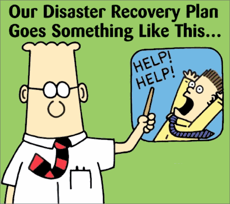

 Escuché en la radio que la ONEMI cuenta con teléfonos satelitales en las
principales ciudades, pero que las baterías estaban descargadas, o no
tenían baterías de repuestos.

En Juan Fernández [una niña de 12 años tocó un gong](http://www.google.com/hostednews/epa/article/ALeqM5iDOMz9QI_lpMpxs8xDCgXBBys_GA),
de 80 centimetros de díametros, para alertar a los habitantes de la isla
de la llegada del tsunami. Sí, ¡el sistema de alarma de tsunami de Juan
Fernández es un gong de 80 cms. de diametro!

Pareciera que el plan de recuperación de desastres de nuestro país es
algo como esta famosa caricatura:

Al parecer un problema de redacción, una discusión casi semántica se
mantiene entre la Armada y la ONEMI al usar el potencial en las
comunicaciones entre estas instituciones sobre el tsunami: "podría
haber maremoto" habría sido la frase usada.

En situaciones de emergencia el lenguaje debe ser directo, sin
ambiguedades.

Además no basta con escribir bonitos planes y protocolos de emergencia
si nunca se prueban.

El nuestro es un país sísmico, con una larga costa, es ridículo que no
tengamos una cultura de prepararnos para este tipo de desastres.

En el ámbito de la infraestructura de comunicaciones y energía,
claramente tenemos grandes falencias.

La seguridad ciudadana, ha sufrido por la demora en el despliegue de las
fuerzas de orden, y por el mal manejo informativo de los medios.

En esta época en que estamos hiperconectados, con muchos medios de
comunicación, y redes sociales, que permiten que cualquiera difunda
información, la cantidad de ruido puede aumentar peligrosamente, ante
eso es importante que las autoridades manejen mejor la información. No
basta con tener un ministro que se presente ante las cámaras de TV. Si
la gente usa redes sociales, estas deben estar cubiertas por cuentas
oficiales del gobierno, ignoro si existe un twitter de la ONEMI, pero
debería haber un twitter por cada ministerio por las instituciones que
actúan en estas situaciones. Además deberían tener una cuenta en
facebook oficial. Las redes sociales son un nuevo medio de comunicación
que requiere atención, porque son muy vulnerables al rumor y la
desinformación.

Esperemos que aprendamos de esto, y sepamos mejorar nuestro plan
nacional de recuperación ante desastres.
