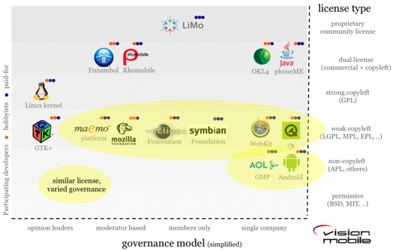

En 2009 Andreas Constantinou cuestionó la noción de opensource en su
artículo "[Open is the new closed"](http://www.visionmobile.com/blog/2009/08/open-is-the-new-closed/)
(lo abierto es lo nuevo cerrado), al analizar en detalle un hecho que
hemos comentado antes, que no basta con liberar el código, el control de
cómo se desarrolla un producto de software abierto es tan o más
importante que contar con el código fuente.

La palabra abierto aparece como algo positivo, pasa con ella lo mismo
que con la palabra transparencia, ambas son bonitas palabras que denotan
buenas intenciones. Todos prometen apertura, transparencia, hasta crean
comisiones y publican en su sitio web una página con información
transparente, pero en el fondo no se cumple lo que todos esperamos
cuando se habla transparencia. La palabra misma carece de sentido y nos
sentimos engañados.

Con el software abierto, el opensource, y con el software libre pasa
algo parecido, con el tiempo nos damos cuenta que no son tan libres, ni
son tan abiertos.

Porque si miramos los grandes proyectos, los proyectos exitosos de
software libre, tienen detrás el apoyo de grandes empresas, o
conglomerados de empresas con intereses bien específicos de control de
estos productos, así que son libres en la medida que los auspiciadores
se lo permitan.

Consideremos el caso de Java o de MySQL, que parecen estar amenazados en
estos momentos al estar en el control de un sólo gran sponsor, como
Oracle.

Es muy justo que pensemos que el futuro de estos proyectos se ve
amenazado cuando su control, su gobierno (governance) ha caido en manos
de una empresa que funciona en forma bastante agresiva en el mercado.

Han habido problemas con IBM y las patentes que prometió no usar contra
la comunidad opensource en el momento que ha visto amenazado su negocio
en los mainframes.

La razón de estos problemas, es que las licencias open source sólo
cuentan la mitad e la historia, como bien apunta Constantinou.

Las licencias gobiernan el control del código fuente. Pero en la
industria móvil, por ejemplo, el código fuente y los productos son dos
cosas muy diferentes. Por ejemplo, aunque puedes jugar con el código
fuente de Android, ¿sabes si están visibles las últimas actualizaciones
al código? ¿Quién decide que va en el último release de
Symbian? Puedes crear tu propio browser basado en WebKit, pero ¿por qué
cuesta tanto que tus contribuciones al código fuente lleguen a la cima
del árbol?

La otra mitad de la historia del opensource es el modelo de gobierno del
proyecto, el governance model, del que habla Constantinou.

Todo proyecto opensource debe tener un modelo de gobierno. El mismo
kernel de linux, tiene un proceso para decidir qué va a la rama
principal del fuente.

Eso lo ha mapeado la empresa de Constantinou, [vision
mobile](http://www.visionmobile.com/), en este gráfico:

El eje vertical representa el tipo de licencia, desde las más
permisivas, hasta las más propietarias (todas son licencias de código
abierto). El eje horizontal muestra una variable del modelo de gobierno,
que tiene que ver con el control de la rama principal del código y si
esta es controlada por individuos, moderadores, un club cerrado o una
compañía específica. Por ejemplo, en el caso del kernel de linux, el
control lo ejecutan un grupo de lideres de opinión (Torvalds y sus
tenientes), en el caso de Java y Android, hay una sóla compañía que
decide lo que va finalmente en la rama central del código.

En el mapa junto a cada proyecto aparecen unos puntos de colores que nos
dicen que proporción de los desarrolladores de estos proyectos son
pagados por trabajar en ellos, por ejemplo, en el kernel de linux 2/3
son pagados (es decir, 2/3 de los desarrolladores del kernel de linux
reciben un sueldo para dedicarse a contribuir en este proyecto).

Qué interesante es este mapa, es muy revelador.

Lo que descubrió Constantinou es que:

-   Las licencias open source (la letra grande que cubre el control de
    los fuentes) son ampliamente usadas, convergen y son bien entendidas

-   El modelo de gobierno (la letra chica que controla el producto) son
    propietarias, divergen y se entienden muy poco.

Esto es importante, porque si no se nos revela la forma en que se
gobierna el desarrollo de un producto, por muy abierto que esté su
código, lo más probable que su modelo de desarrollo, de gobierno sea
totalmente cerrado, y en el fondo, estamos siendo engañados, en realidad
lo abierto está cerrado, y no es una paradoja.
