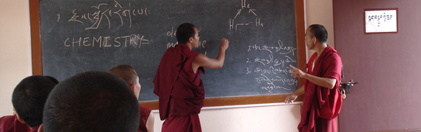

Mientras buscaba imágenes de monjes tibetanos para acompañar el relato
que [publiqué hoy en akarrú](https://www.akarru.com/blog/2010/05/23/los-nueve-mil-millones-de-nombres-de-dios/),
me topé con el sitio [Science For Monks](http://scienceformonks.org/),
una iniciativa impulsada por el Dalai Lama, para instruir en ciencias a
los monjes tibetanos.

El programa continúa la linea iniciada por el Dalai Lama su diálogo con
científicos modernos. Recuerdo el libro de Francisco Varela: **"Dormir,
Soñar, Morir"**, que recoge una de las conferencias iniciales de debate
entre budismo y ciencia. Una de las cosas que más me llamó la atención
fue que le preguntaron al Dalai Lama si era posible que un alma se re
encarnara en una máquina, a lo que respondió, que si la máquina era
capaz de albergar conciencia, el budismo no descartaba esa posibilidad.

Es interesante esta iniciativa, los monjes se preparan en ciencia, y
ayudan a difundirla en sus comunidades.

Me imaginos que Francisco Varela estaría feliz de ver esta imagen:

