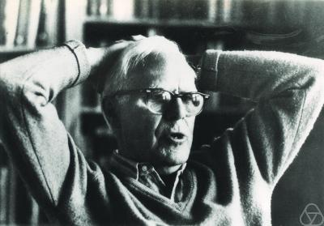

 
Martin Gardner falleció ayer a la edad de 96 años. Para los que no lo
conocen, Gardner fue un gran divulgador cientifico, famoso por su
columna sobre matemáticas recreativas publicadas en la revista
Scientific
American.

Su principal aporte fue su lucha permanente en contra de los fraudes
seudo científicos. [James Randi](/blog/2010/03/james-randi-una-leccion-de-escepticismo.html)
le dedica [un sentido homenaje en su blog](http://www.randi.org/site/index.php/swift-blog/995-my-world-is-a-little-darker.html).
Sin duda es una gran pérdida para la divulgación de la ciencia y los
movimientos escépticos.

Los dejo con un video, de un capítulo de 
"[La Naturaleza de las Cosas](http://www.cbc.ca/documentaries/natureofthings/)" (el programa de televisión que inspiró el nombre de este blog, donde [David
Suzuki](http://www.davidsuzuki.org/) nos muestra el mundo de Gardner, y
su importancia para la divulgación de la ciencia, las matemáticas y
pensamiento racional:


[The Nature of Things / Martin Gardner](http://vimeo.com/7176521) from
[Wagner Brenner](http://vimeo.com/wbrenner) on
[Vimeo](http://vimeo.com).
